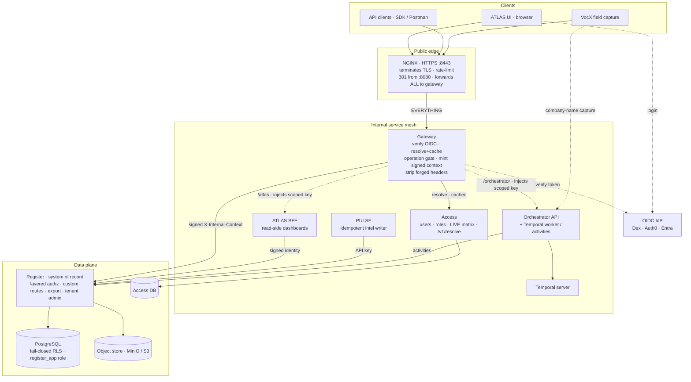
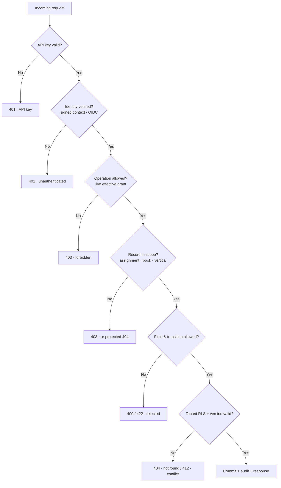
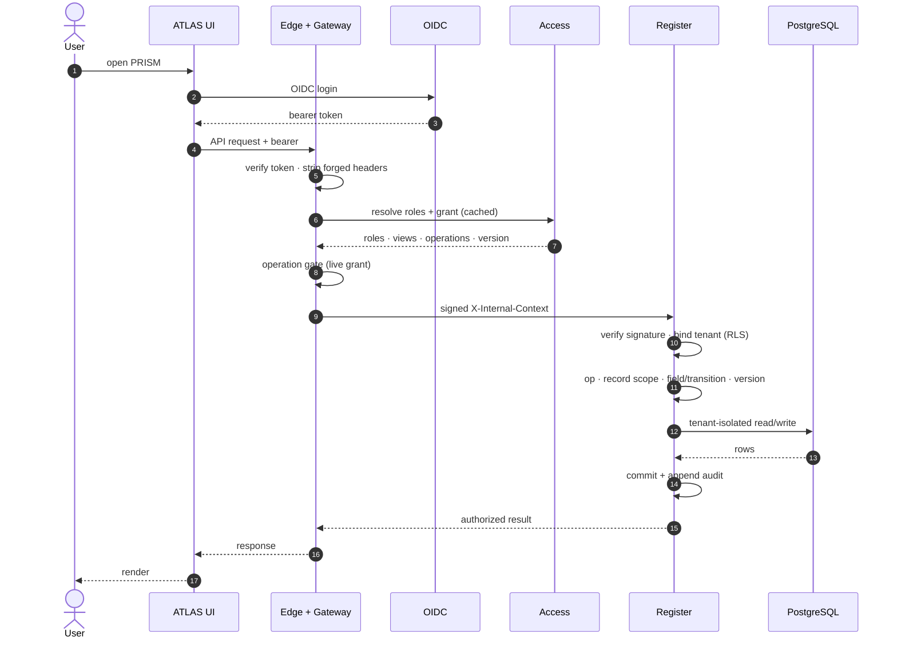
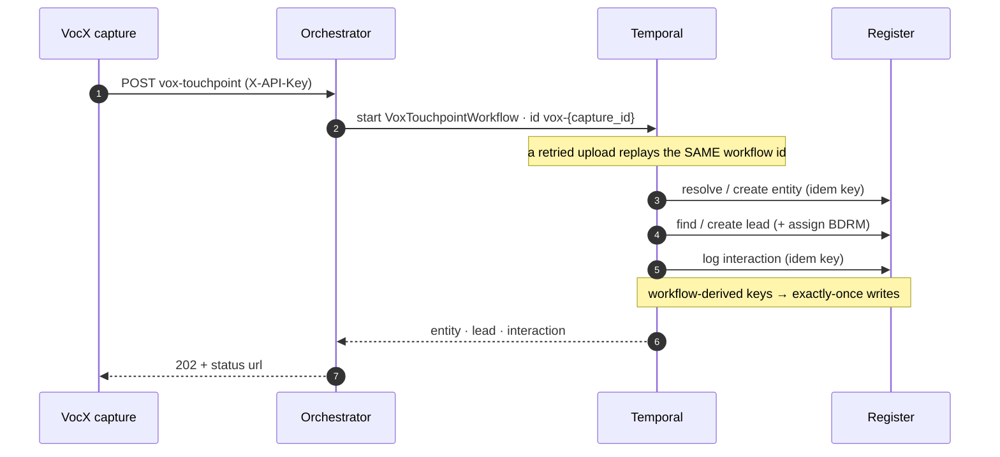
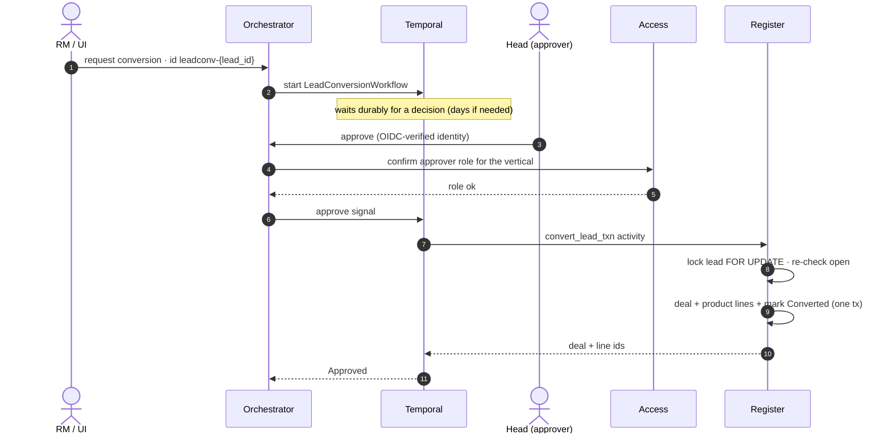
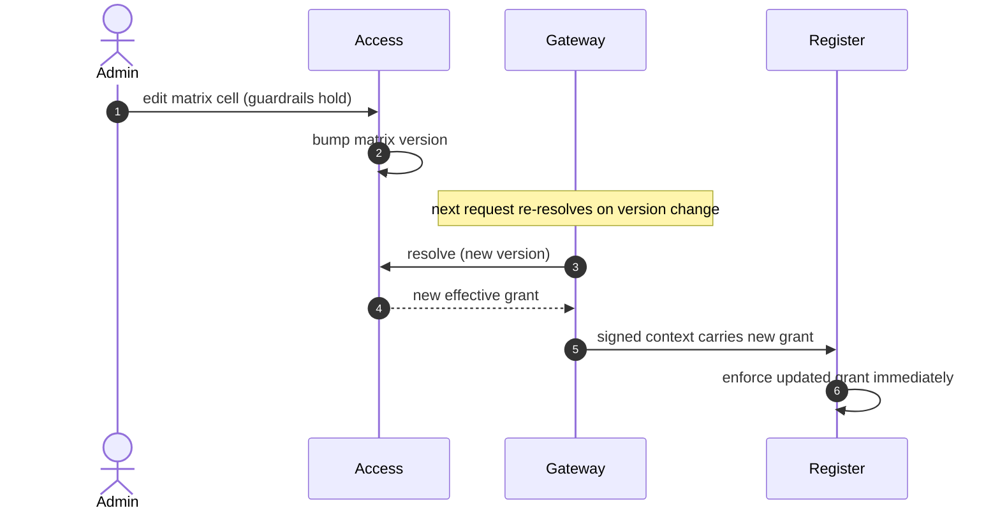
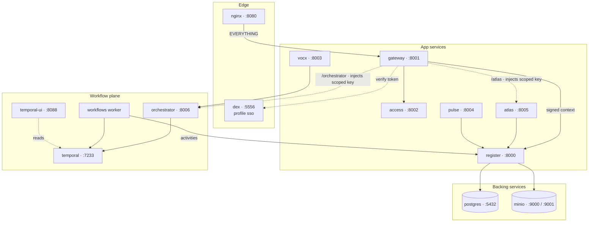
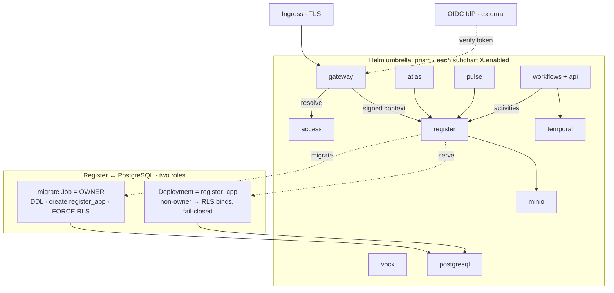
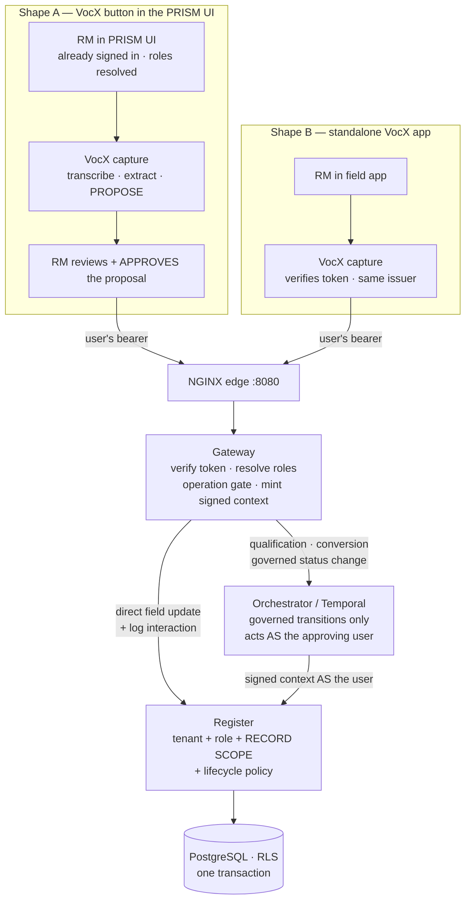

# PRISM — Architecture &amp; Call Flows

The climate-finance operating platform as built: a signed-identity gateway in front of a
tenant-isolated system of record, with durable workflows for field capture and
human-approved conversions.

- **Services:** Register (system of record), Access (identity + live RBAC matrix), Gateway
  (edge authz), ATLAS (read-side BFF), PULSE (news radar), VocX (field capture), Workflows
  (Orchestrator API + Temporal worker).
- **Stack:** FastAPI · Python 3.12 · SQLAlchemy async · PostgreSQL (fail-closed RLS) ·
  Temporal · MinIO/S3 · OIDC.

---

## 1. Component view — three trust boundaries, one system of record

Every request enters at the public edge, is authenticated and authorized at the **Gateway**
against the **Access** service's live matrix, then crosses into the data plane carrying a
**signed internal context**. The **Register** is the only writer of the book; Postgres
enforces tenant isolation underneath it.

---

## 2. Request authorization — the write ladder

Authorization is layered, and each rung has a distinct failure code. The first rungs are
enforced at the Gateway (from the **live** matrix) and re-verified in the Register; the
data-adjacent rungs — record scope, field/transition, and tenant isolation — live next to
the data.

---

## 3. Call flows

### Flow A — Authenticated read / write

Identity comes from the OIDC token; the Register enforces the live grant carried in the
gateway-signed context and isolates the query by tenant.

### Flow B — VOX field capture → durable workflow

A company-name capture with no resolved id runs as a Temporal workflow keyed on the capture
id, so a retried upload replays the same writes — exactly-once.

### Flow C — Lead conversion with human approval

The workflow waits durably for a Head's decision; the approver's identity is OIDC-verified
and role-checked before the Register applies the conversion in one locked transaction — no
orphan deal can survive a mid-apply failure.

### Flow D — Live RBAC change, no redeploy

Because the signed context carries the effective grant, an Admin's matrix edit in Access is
enforced by the Register on the very next request. One source of truth.

---

## 4. Key mechanisms

| Mechanism | What it buys |
|---|---|
| **Signed context** (`evam_backend_core.internal_token`) | Short-lived JWT carries identity + the live effective grant; tamper-evident, expiring, tenant-bound — no static-secret forgery. |
| **Fail-closed RLS** (migration `0005`) | Postgres denies every row when the tenant GUC is unset; the app connects as a **non-owner role** (`register_app`) so RLS actually binds. |
| **Exactly-once** | Workflow-derived idempotency keys + stable workflow ids make retried captures and conversions replay, never duplicate. |
| **Optimistic locking** | Every row is versioned; a stale write returns **412** instead of a silent lost update. Conversion also takes a `FOR UPDATE` row lock. |
| **Central scope** (`app.authz.scope`) | One evaluator answers "is this row mine?" — assignment ∪ own book ∪ team ∪ vertical default — for list, GET, and write alike. |
| **Append-only audit** | Every mutation writes an audit row; the timeline and dossier compose from immutable interaction records. |

---

## 5. Deployment topology

The same images ship two ways: a single Docker Compose stack for dev/demo, and a Helm
umbrella whose subcharts each toggle with an `enabled` flag. The identity signing secret is
shared gateway↔Register, and Postgres runs with **two roles** — the migration Job as owner,
the runtime as the non-owner `register_app` so RLS actually binds.

### Docker Compose — dev / demo

Every service is reachable on a dev port; production traffic enters only through NGINX. The
`sso` profile adds Dex and flips OIDC on.

### Helm umbrella — Kubernetes / production

Ten subcharts (`postgresql`, `register`, `access`, `gateway`, `minio`, `temporal`, `vocx`,
`pulse`, `atlas`, `workflows`) under one release, each gated by `X.enabled`.
`values-prod.yaml` turns on OIDC + `requireAuth`, `enforceRbac`, fail-closed RLS, the signed
context, and the separate tenant-admin key. Secrets are per-chart and never in values.

In production, set `postgresql.enabled=false` / `minio.enabled=false` and point at managed
Postgres + S3; the bundled charts are for a self-contained install.

> Rendered, theme-aware version of these diagrams: publish `docs/ARCHITECTURE.md` locally, or
> see the shared artifact deck. Green rungs of the ladder are enforced at the gateway and
> re-verified at the Register; data-adjacent rungs live next to the data.

---

## 6. VocX identity — capture runs as the USER, never as a service

VocX is **a capture surface, not an authority**. It is reached one of two ways, and the
authorization story must be identical in both:

- **Shape A — a button inside the PRISM UI.** The user is already signed in, so the browser
  session already holds the verified token and the resolved roles. Nothing new has to be
  invented: the call carries the user's bearer exactly like any other PRISM action.
- **Shape B — a standalone field app.** The user signs in to that app against the **same OIDC
  issuer / audience**, and VocX verifies the incoming token and forwards the verified identity.

### The decision is the USER's role — per action, per record

| VocX outcome | Operation checked | Register behaviour |
|---|---|---|
| New company + new lead | `create_client` + `add_lead` | Create both, then log the interaction — one transaction |
| Existing company, new lead | `add_lead` | Allowed within the caller's tenant + scope |
| Update an existing lead | `edit_lead` (**S** for BDRM) | Allowed only for a lead **in that RM's scope**; another RM's lead → **403** |
| Log interaction only | `log_interaction` (**S** for BDRM) | Requires access to the linked company/lead |
| Qualification / conversion / governed status change | transition-specific roles | **Must** go through the Orchestrator/Temporal workflow; a direct `PATCH` is refused |

Because Shape A already has the signed-in user, the RM-scope example works naturally:
VocX matches a lead **assigned to that RM** → update proceeds; it matches **another RM's**
lead → the Register returns 403 and the workflow must request reassignment or an authorized
approval; it matches **no lead** → creation proceeds only if the caller holds `add_lead`.

### The rule

> **VocX proposes. The user approves. The Register decides and writes.**

Neither VocX nor Temporal may write user-originated data under an unrestricted service
identity. They propagate the **original user identity, tenant, roles, correlation id and
idempotency key**; the Register makes the final authorization decision and owns the
transaction. A named service principal (`SERVICE_GRANTS`) is legitimate **only for unattended
work** — PULSE news scans, system reconciliation — never as a stand-in for a person.

### Implementation status (be precise about this)

| Requirement | State |
|---|---|
| Human calls: tenant + role + record scope + lifecycle enforced at the Register | **Done** — signed internal context, `_ensure_subject_scope`, RLS, policy engine |
| Governed transitions confined to workflows (direct status `PATCH` fail-closed) | **Done** — `ALLOWED_TRANSITIONS`; conversion only via `/convert` |
| Correlation id + idempotency key propagated on every Register call | **Done** — `evam-register-client` sends `X-Request-ID` + `Idempotency-Key` |
| Orchestrator acts **as the approving user** for governed operations | **Done for CP/CS + handover** (`_register_post_as` mints the user's signed context) |
| VocX forwards the verified user identity to the Register | **GAP** — VocX writes as `svc_vox`; the user is not propagated, so record scope cannot bind |
| VocX touchpoint has an explicit user review/approve step before the write | **GAP** — only conversion has an approval gate today |

Closing the two gaps is a contained change, because Shape A means the identity is already in
hand at the moment of the call: carry the caller's verified identity into the workflow input,
have the activity mint the signed context **for that user** (the same
`mint_internal_context` the gateway and orchestrator already use) instead of using the bare
service key, and add the review/approve signal to the touchpoint workflow. `svc_vox` then
keeps only genuinely unattended grants.
