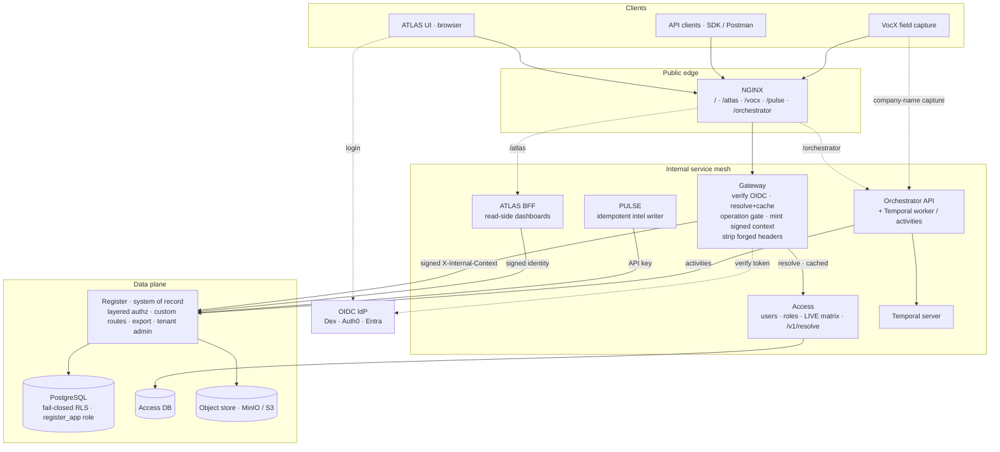
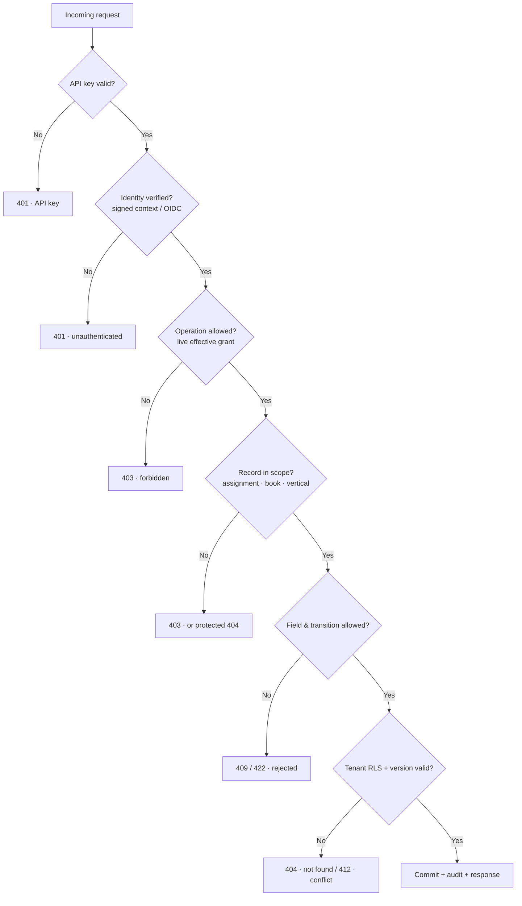
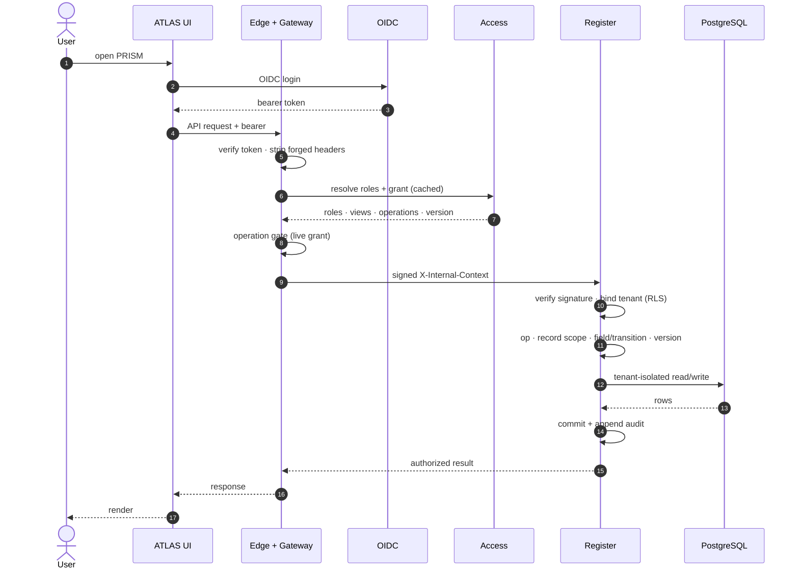
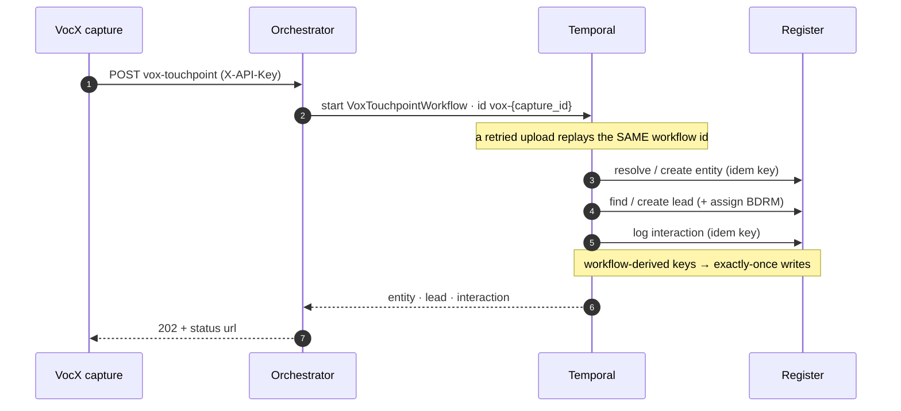
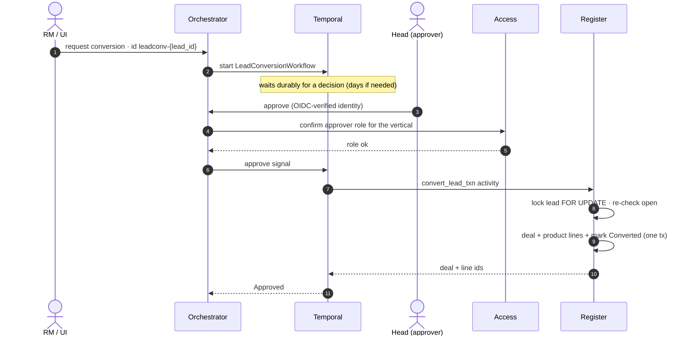
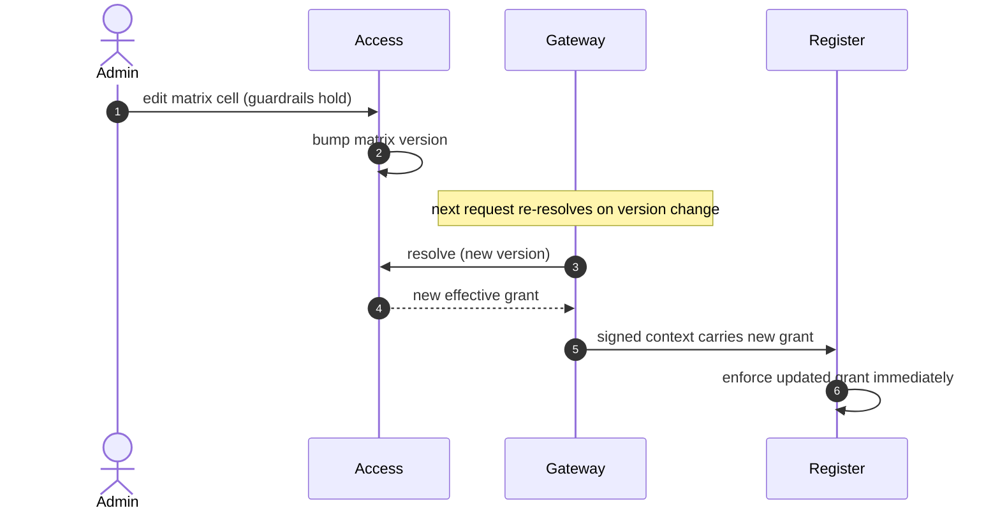

# PRISM — Architecture &amp; Call Flows

The climate-finance operating platform as built: a signed-identity gateway in front of a
tenant-isolated system of record, with durable workflows for field capture and
human-approved conversions.

- **Services:** Register (system of record), Access (identity + live RBAC matrix), Gateway
  (edge authz), ATLAS (read-side BFF), PULSE (news radar), VocX (field capture), Workflows
  (Orchestrator API + Temporal worker).
- **Stack:** FastAPI · Python 3.12 · SQLAlchemy async · PostgreSQL (fail-closed RLS) ·
  Temporal · MinIO/S3 · OIDC.

---

## 1. Component view — three trust boundaries, one system of record

Every request enters at the public edge, is authenticated and authorized at the **Gateway**
against the **Access** service's live matrix, then crosses into the data plane carrying a
**signed internal context**. The **Register** is the only writer of the book; Postgres
enforces tenant isolation underneath it.

---

## 2. Request authorization — the write ladder

Authorization is layered, and each rung has a distinct failure code. The first rungs are
enforced at the Gateway (from the **live** matrix) and re-verified in the Register; the
data-adjacent rungs — record scope, field/transition, and tenant isolation — live next to
the data.

---

## 3. Call flows

### Flow A — Authenticated read / write

Identity comes from the OIDC token; the Register enforces the live grant carried in the
gateway-signed context and isolates the query by tenant.

### Flow B — VOX field capture → durable workflow

A company-name capture with no resolved id runs as a Temporal workflow keyed on the capture
id, so a retried upload replays the same writes — exactly-once.

### Flow C — Lead conversion with human approval

The workflow waits durably for a Head's decision; the approver's identity is OIDC-verified
and role-checked before the Register applies the conversion in one locked transaction — no
orphan deal can survive a mid-apply failure.

### Flow D — Live RBAC change, no redeploy

Because the signed context carries the effective grant, an Admin's matrix edit in Access is
enforced by the Register on the very next request. One source of truth.

---

## 4. Key mechanisms

| Mechanism | What it buys |
|---|---|
| **Signed context** (`evam_backend_core.internal_token`) | Short-lived JWT carries identity + the live effective grant; tamper-evident, expiring, tenant-bound — no static-secret forgery. |
| **Fail-closed RLS** (migration `0005`) | Postgres denies every row when the tenant GUC is unset; the app connects as a **non-owner role** (`register_app`) so RLS actually binds. |
| **Exactly-once** | Workflow-derived idempotency keys + stable workflow ids make retried captures and conversions replay, never duplicate. |
| **Optimistic locking** | Every row is versioned; a stale write returns **412** instead of a silent lost update. Conversion also takes a `FOR UPDATE` row lock. |
| **Central scope** (`app.authz.scope`) | One evaluator answers "is this row mine?" — assignment ∪ own book ∪ team ∪ vertical default — for list, GET, and write alike. |
| **Append-only audit** | Every mutation writes an audit row; the timeline and dossier compose from immutable interaction records. |

> Rendered, theme-aware version of these diagrams: publish `docs/ARCHITECTURE.md` locally, or
> see the shared artifact deck. Green rungs of the ladder are enforced at the gateway and
> re-verified at the Register; data-adjacent rungs live next to the data.
