# PRISM — Master E2E Flow: people, machines, states, and wiring

The complete picture in three views: **(1) connectivity** — what talks to what;
**(2) the journey** — every actor's actions in sequence, human and machine;
**(3) state machines** — every register's states with WHO/WHAT causes each transition
(extracted from the live policy core, not drawn from memory). Companions:
`UI_E2E_FLOW.md` (button-level flowchart), `UI_INTEGRATION_GUIDE.md` (mechanics),
`ATLAS_UI_FIELD_MAP.md` (field bindings).

---

## 1 · Connectivity — what talks to what

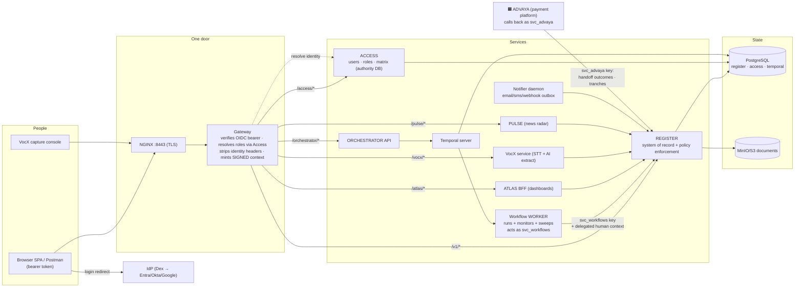

Trust rules the UI inherits: the browser only ever holds a bearer token (no service
keys); the gateway is the only identity authority; `svc_*` lanes are machine-only; the
Register re-verifies everything regardless of what the UI showed.

---

## 2 · The journey — who does what, in order

🧍 = a person clicks · ⚙ = a machine acts on its own · every message is a real endpoint.

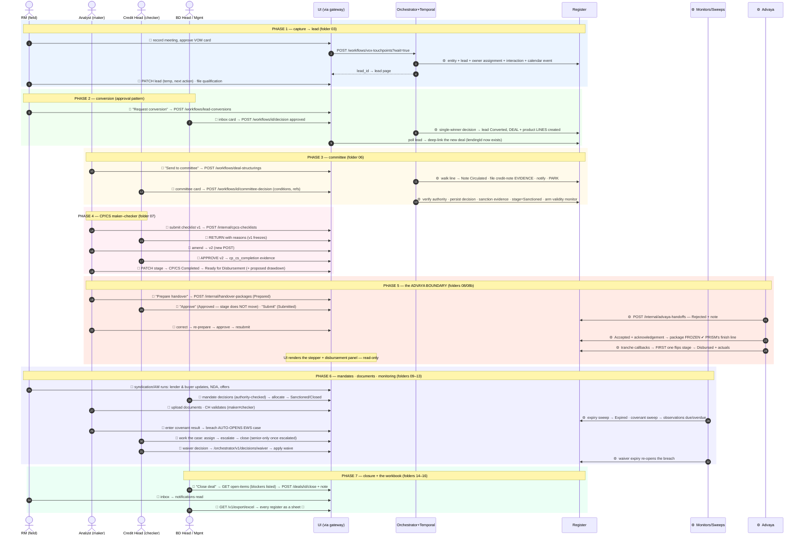

---

## 3 · State machines — every transition, with its cause

Edge label = **who/what** moves it and **how**. Unlabelled edges are ordinary human
PATCHes through the UI (policy still checks role + sequence). These are generated from
the live `ALLOWED_TRANSITIONS` — the server refuses anything not drawn here.

### Lead (`status`)

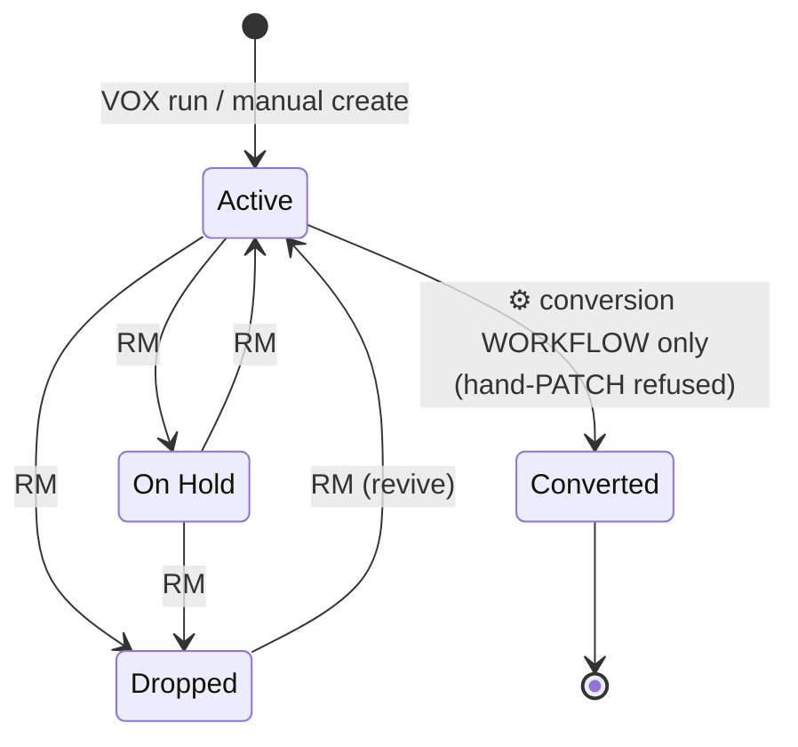

### Deal (`stage` — the commercial funnel)

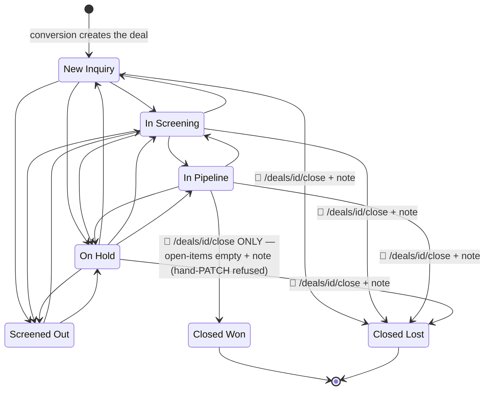

### Lending line (`stage` — the credit pipeline)

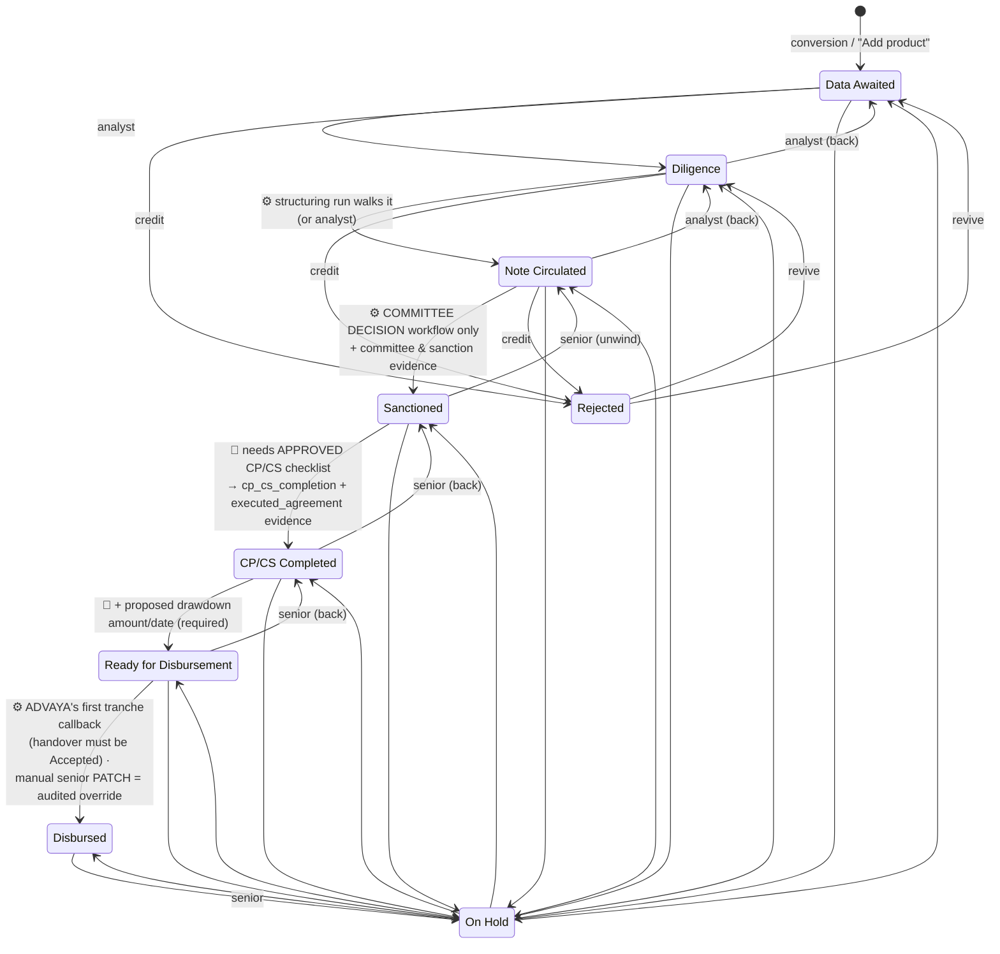

### Advaya handover package (`status`)

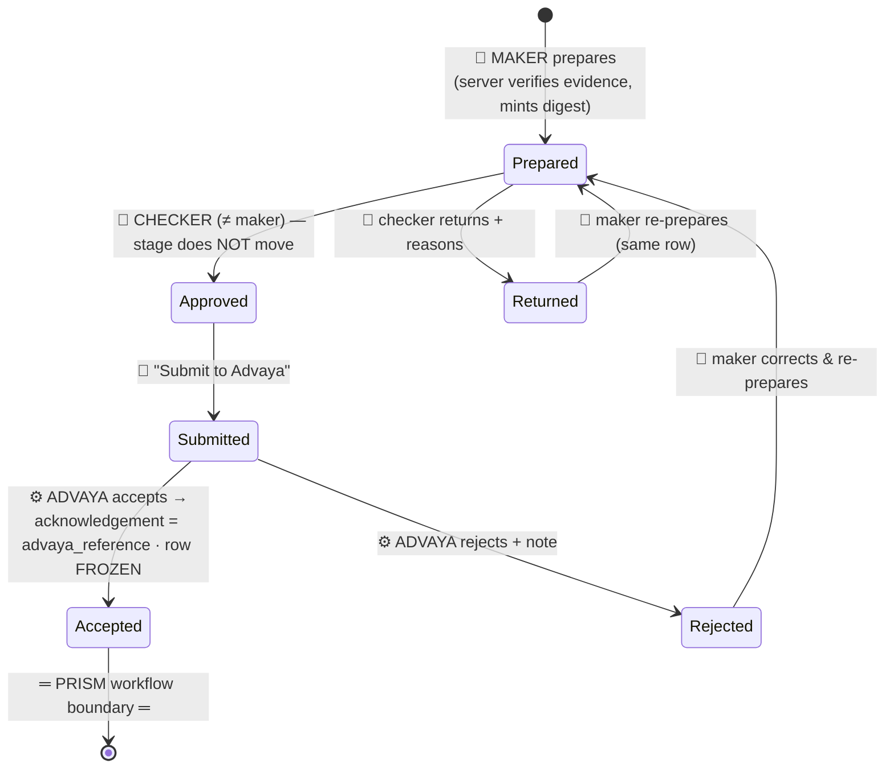

### Syndication mandate (`status`)

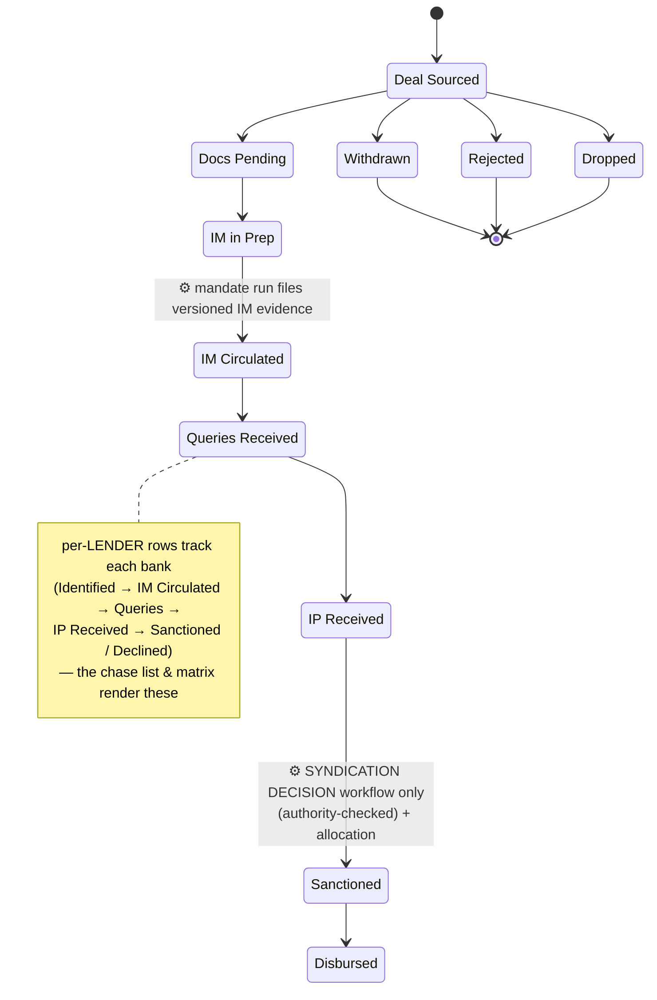

*(Backward hops and On Hold exist as in the policy dump; terminals Withdrawn/Rejected/
Dropped are frozen. Any non-terminal may also go On Hold and back.)*

### Asset Monetisation mandate (`status`)

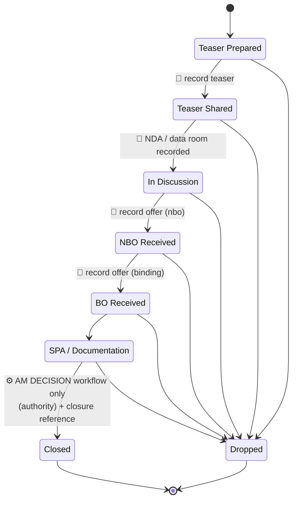

### EWS case (`status`) · Document (`status`) · Calendar event

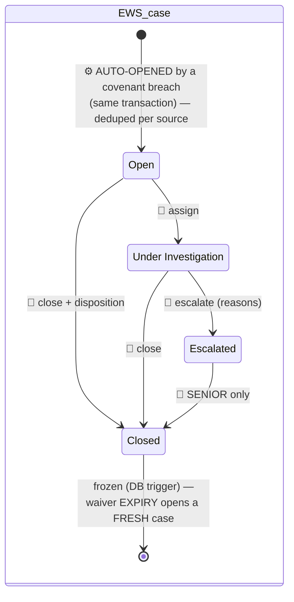

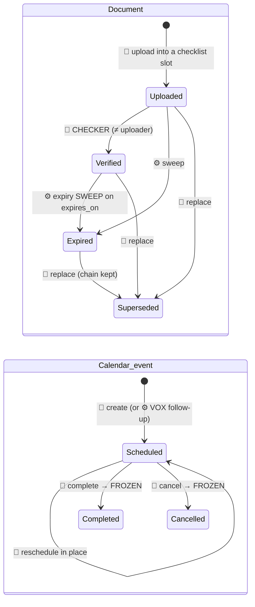

### Covenant observation (the recurring loop)

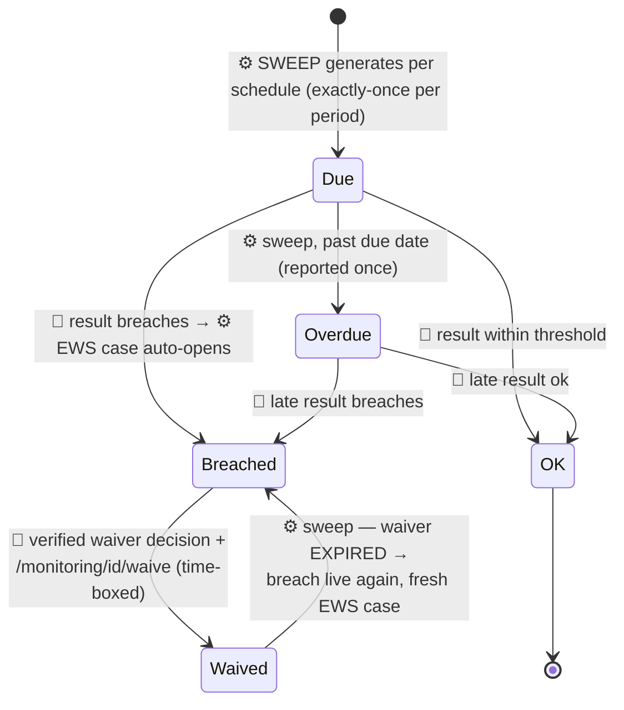

---

## 4 · Reading this as a team

* **People rows** in §2 are the application's screens; **⚙ rows** are things the UI only
  ever *renders* (timelines, badges, panels).
* Every labelled edge in §3 that names a workflow or a machine is a **disabled control**
  in the UI — the state moves, but never from a dropdown.
* The Postman collection executes §2 top-to-bottom and proves every guard in §3; when a
  screen and this document disagree, run the folder — the collection is the law.
