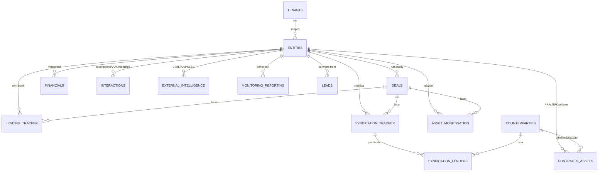

# Register — Data Model

The Register is **entity-centric, tenant-aware, product-aware and versioned** — the four
commitments PRISM's architecture doc makes about its single source of truth. This
document describes the schema those commitments produce.

## The three structural properties (implemented once, everywhere)

Every business table inherits a common tail of columns (see `app/db/base.py`):

| Column | Purpose |
| --- | --- |
| `id` (uuid) | Primary key, `gen_random_uuid()` |
| `tenant_id` (uuid) | **Tenant-aware.** Default tenant is Evam; row-level-security policies scope every read/write. |
| `version` (int) | **Versioned / optimistic concurrency.** Bumped on every update; a racing writer that used a stale version gets `409`. |
| `created_at`, `updated_at` | Timestamps; `updated_at` maintained by a DB trigger. |
| `created_by`, `updated_by` | Actor attribution. |
| `deleted_at` | **Soft delete** — nothing in the source of truth is hard-deleted by accident. |

Additionally:
- **Product-aware**: `deals.product_type` plus the three business flags
  (`is_lending`, `is_syndication`, `is_asset_mon`) — a deal can be in all three at once.
- **Versioned financials**: `financials` carries its *own* `version_no` + `is_current`,
  an append-only provenance history distinct from the row-level optimistic `version`.

## Entity-relationship overview

## Tables

### PRISM 7 master tables

| # | Table | Holds |
| --- | --- | --- |
| 1 | `entities` | Companies, promoters, directors, related parties. CIN-anchored where possible. The spine everything links to. |
| 2 | `deals` | One entity → many deals. Product type + Lending/Syndication/Asset-Mon flags, RM/analyst, lifecycle dates. |
| 3 | `financials` | Time-series, **versioned** (`version_no`, `is_current`). Audited/provisional/projection/CMA/AA/GST, with a JSONB spread + convenience metrics. |
| 4 | `contracts_assets` | PPAs, EPC, O&M, offtake, project SPVs, security charges — the climate-specific extension. |
| 5 | `interactions` | Touchpoints — every interaction (manual or VOX): calls, meetings, emails, site visits, IC notes — with transcript, GPS, language, attendees. The architecture calls this "Touchpoints"; the UI/VOX call it "interactions" — one table. See the ATLAS-ops row below for its polymorphic subject + lender behaviour. |
| 6 | `external_intelligence` | CIBIL/AA/MCA/Probe42/GST pulls, PULSE RED/AMBER/GREEN hits, court cases, benchmarks, comparables. |
| 7 | `monitoring_reporting` | Borrower conduct vs obligations: covenant timeliness, security-creation timeline, behavioural score. Feeds IRG. |

### ATLAS operational tables (real data today)

| Table | Holds |
| --- | --- |
| `leads` | Pre-deal pipeline (ATLAS Leads). Converts into an entity + deal. |
| `lending_tracker` | Own-book lending facet with stage history (JSONB). |
| `syndication_tracker` | Syndication/Mobilise facet with status history. |
| `syndication_lenders` | Per-lender posture within a syndication (nested rows). |
| `asset_monetisation` | Recycle/asset-monetisation facet. |
| `counterparties` | Lenders, investors, offtakers registry. |
| `people` | Evam team directory (RM/Analyst/Ops/Management/Admin). |
| `interactions` | **User-interaction timeline** — every call/meeting/email/note (manual or from VOX) logged chronologically against any record via a polymorphic `subject_type`+`subject_id` (Lead/Deal/Entity/Counterparty/Lending/Syndication/AssetMonetisation, = ATLAS `refType`/`refId`). Denormalises `entity_id`/`deal_id` so entity/deal timelines aggregate across trackers; rolls the latest onto a lead's `last_interaction_date`/`next_action`; and for a syndication interaction with a lender + direction, updates that lender's response/chased date. |

### System tables

| Table | Holds |
| --- | --- |
| `tenants` | Tenant registry (default: EVAM). |
| `ref_values` | Controlled vocabularies; served at `/v1/ref` so front-ends fetch dropdowns from the Register. |
| `idempotency_keys` | Dedupe store for retried `POST`s (keyed by `Idempotency-Key`). |
| `audit_log` | Append-only trail of every mutation. |

## Concurrency & integrity guarantees

- **Optimistic locking** on every table (`version` via SQLAlchemy `version_id_col`)
  makes lost updates impossible; clients pass `If-Match: "<version>"`.
- **Idempotency keys** dedupe retried creates.
- **DB-enforced integrity**: unique constraints (tenant+code, tenant+tracker_no, …),
  foreign keys with sensible `ON DELETE` (RESTRICT for entities behind deals; CASCADE
  for children like syndication lenders), and a **partial unique index** guaranteeing at
  most one `is_current` financial per (entity, statement_type, period_end).
- **Versioned financials** use a transaction-scoped **advisory lock** on
  (entity, statement_type, period_end) so concurrent submissions serialise on that key
  alone — distinct sequential `version_no`s, exactly one current, no table-wide lock.
- **Timeouts** (`statement_timeout`, `lock_timeout`, `idle_in_transaction_session_timeout`)
  ensure a stuck query self-terminates rather than holding locks into a deadlock.
- **Row-level security** policies are present on every tenant table (defence in depth);
  enable enforcement with a non-owner role + `FORCE ROW LEVEL SECURITY` when going
  multi-tenant.

All of these are covered by `tests/test_concurrency.py`.
