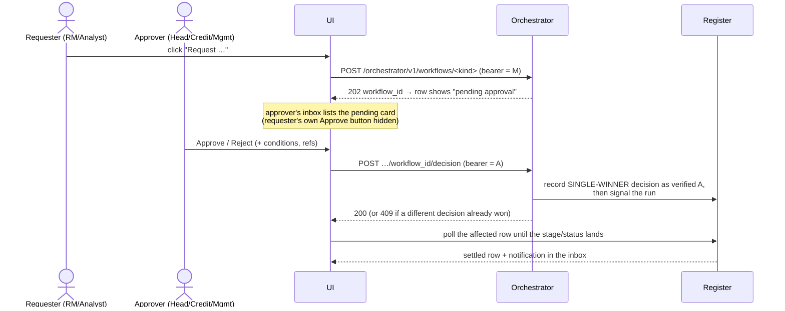

# PRISM — the E2E flow as one diagram (UI ⇄ backend)

The whole journey the `PRISM_E2E_Full` Postman collection executes, drawn for the UI
implementer: **which button calls which API, what the backend does next, and where the
flow goes — through to the exported workbook.** Companion prose: `UI_INTEGRATION_GUIDE.md`
(mechanics) and `ATLAS_UI_FIELD_MAP.md` (field bindings).

**Legend** — 🟦 human button (calls the API shown) · 🟪 approver action (different person,
verified identity) · ⬜ backend does this automatically · 🟧 machine/Advaya lane (never a
UI control; the UI only renders its effect) · 🟥 guard (the UI disables this; the server
refuses it) · 🟩 milestone/terminal.

```mermaid
flowchart TD

subgraph S0["0 · SESSION"]
  A0["🟦 Login (OIDC redirect → bearer token)"]
  A1["⬜ GET /v1/me → roles, views, operations, assignments"]
  A2["⬜ GET /v1/ref → every dropdown vocabulary"]
  A0 --> A1 --> A2
end

subgraph S1["1 · VOX FIELD CAPTURE"]
  B0["🟦 RM records / types the meeting note (VocX console)"]
  B1["⬜ STT + AI extraction → review card (bullets, next meeting)"]
  B2["🟦 'Approve capture' → POST /orchestrator/v1/workflows/vox-touchpoints?wait=true"]
  B3["⬜ ONE durable run: resolve company → create entity + lead<br/>→ assign RM as owner → log full interaction → calendar event"]
  B4{"⬜ ambiguous company / several leads?"}
  B5["🟦 picker dialog → …/confirm-company or …/select-lead"]
  B6["⬜ result: lead_id + interaction_id → UI deep-links to the lead"]
  B0 --> B1 --> B2 --> B3 --> B4
  B4 -- "no" --> B6
  B4 -- "yes (run parks)" --> B5 --> B6
end

subgraph S2["2 · LEAD → DEAL (approval pattern #1)"]
  C0["🟦 inline edits → PATCH /v1/leads/id (temp, next action, notes)"]
  C1["🟦 'File qualification' → POST /orchestrator/v1/workflows/lead-qualifications"]
  C2["⬜ mints lead_qualification EVIDENCE → chip on the lead"]
  C3["🟥 status dropdown never offers 'Converted'"]
  C4["🟦 'Request conversion' → POST /orchestrator/v1/workflows/lead-conversions"]
  C5["🟪 approver inbox (BD Head/Mgmt) → POST …/wf/decision approved:true"]
  C6["🟥 requester's own Approve button hidden (self-approval refused)"]
  C7["⬜ lead → Converted, deal CREATED (converted_deal_id) → deal page"]
  C0 --> C1 --> C2 --> C4 --> C5 --> C7
end

subgraph S3["3 · COMMITTEE (approval pattern #2)"]
  D0["🟦 'Send to committee' → POST /orchestrator/v1/workflows/deal-structurings"]
  D1["🟪 Credit Head card: conditions + validity + sanction ref →<br/>POST …/wf/committee-decision"]
  D2["🟥 lending stage select excludes 'Sanctioned' (hand-PATCH refused)"]
  D3["⬜ poll lending row → stage = Sanctioned; evidence chips:<br/>committee approval + sanction letter"]
  D0 --> D1 --> D3
end

subgraph S4["4 · CP/CS (maker–checker #1)"]
  E0["🟦 MAKER 'Submit checklist v1' → POST /v1/internal/cpcs-checklists"]
  E1["🟪 CHECKER 'Return with reasons' → POST …/id/return (v1 FREEZES)"]
  E2["🟦 MAKER 'Amend & resubmit' → new POST, checklist_version 2"]
  E3["🟪 CHECKER 'Approve' → POST …/id2/approve (self-approval refused)"]
  E4["⬜ approve handler files cp_cs_completion evidence citing v2"]
  E5["🟦 PATCH lending stage → 'CP/CS Completed' then<br/>'Ready for Disbursement' + proposed amount/date (required)"]
  E0 --> E1 --> E2 --> E3 --> E4 --> E5
end

subgraph S5["5 · ADVAYA HANDOVER — PRISM'S FINISH LINE"]
  F0["🟦 MAKER 'Prepare handover' → POST /v1/internal/handover-packages<br/>(server verifies evidence, generates manifest + digest)"]
  F1["🟪 CHECKER 'Approve handover' → …/lending_id/approve<br/>⬜ package Approved — STAGE DOES NOT MOVE"]
  F2["🟦 'Submit to Advaya' → …/lending_id/submit → Submitted"]
  F3{"🟧 Advaya validates<br/>(callback on svc_advaya lane:<br/>POST /v1/internal/advaya-handoffs)"}
  F4["⬜ package REJECTED + note → UI re-enables 'Prepare handover'"]
  F5["🟩 package ACCEPTED — frozen by DB trigger,<br/>acknowledgement stored as advaya_reference<br/>═══ PRISM WORKFLOW BOUNDARY ═══"]
  F6["⬜ UI renders the stepper read-only:<br/>Prepared → Approved → Submitted → Accepted"]
  F0 --> F1 --> F2 --> F3
  F3 -- "reject" --> F4 --> F0
  F3 -- "accept" --> F5 --> F6
end

subgraph S6["6 · ADVAYA'S SIDE (simulation folder 08b — display only)"]
  G0["🟧 tranche callbacks → POST /v1/internal/lending/id/tranches<br/>(refused until Accepted)"]
  G1["⬜ FIRST tranche flips stage → Disbursed + writes actuals<br/>(disbursed_amount, disbursement_date)"]
  G2["⬜ UI: read-only disbursement panel — tranches, total vs ceiling,<br/>'Disbursed by Advaya callback' in stage history"]
  G0 --> G1 --> G2
end

subgraph S7["7 · SYNDICATION + ASSET MONETISATION (same approval pattern)"]
  H0["🟦 start mandate run → POST /orchestrator/v1/workflows/syndications | asset-monetisations"]
  H1["🟦 chase-list actions → …/wf/lender-update · buyer-update · record-nda · record-offer"]
  H2["🟪 authority decision → …/wf/syndication-decision | am-decision<br/>(🟥 RM's approve refused) → allocate → poll Sanctioned / Closed"]
  H0 --> H1 --> H2
end

subgraph S8["8 · DOCUMENTS · CALENDAR · COVENANTS · EWS"]
  I0["🟦 upload into checklist slot → POST /v1/documents<br/>🟪 validate (maker≠checker) · ⬜ expiry sweep flips Expired · replace → Superseded chain"]
  I1["🟦 calendar create/reschedule → POST/PATCH /v1/calendar-events<br/>⬜ completed/cancelled events freeze"]
  I2["🟦 Credit defines covenant → POST /v1/covenants<br/>🟧 sweep generates observations on schedule"]
  I3["🟦 enter result → POST /v1/monitoring/id/result<br/>⬜ breach AUTO-OPENS the EWS case"]
  I4["🟦 EWS: assign / note / escalate / close<br/>(🟥 escalated case: close is senior-only)"]
  I5["🟪 'Record waiver decision' → POST /orchestrator/v1/decisions/waiver<br/>🟦 'Apply waiver' → POST /v1/monitoring/id/waive decision_ref<br/>⬜ expiry re-opens the breach via the sweep"]
  I2 --> I3 --> I4 --> I5
end

subgraph S9["9 · CLOSURE + THE WORKBOOK"]
  J0["🟦 'Close deal' dialog → GET /v1/deals/id/open-items<br/>lists blockers; confirm disabled until empty"]
  J1["🟦 confirm (note REQUIRED) → POST /v1/deals/id/close outcome:won"]
  J2["🟥 PATCH to 'Closed Won' by hand refused · reopen refused<br/>(operational LOAN closure is Advaya's, never a PRISM button)"]
  J3["🟦 bell/inbox → GET /v1/notifications · mark read"]
  J4["🟩 'Export to Excel' → GET /v1/export/excel<br/>every register = a sheet; the spreadsheet is an OUTPUT"]
  J0 --> J1 --> J4
  J3 --> J4
end

S0 --> S1 --> S2 --> S3 --> S4 --> S5
S5 --> S6 --> S7
S5 -.->|"skipping 08b: PRISM is complete at Accepted,<br/>but deal closure stays blocked (line not terminal)"| S9
S7 --> S8 --> S9
```



---

## The two interaction patterns everything reuses

### A. The approval pattern (conversion, committee, syndication, AM, waiver)



### B. The maker–checker pattern (CP/CS, handover, document validation)

```mermaid
sequenceDiagram
  actor M as Maker
  actor C as Checker (different person)
  participant UI
  participant REG as Register (via gateway)
  M->>UI: prepare/submit (v1)
  UI->>REG: POST create (bearer = M) → recorded as initiated_by
  C->>UI: review
  alt return / reject
    UI->>REG: POST …/return note (bearer = C) → v1 FREEZES
    M->>UI: amend → new POST as v2 (never PATCH v1)
  else approve
    UI->>REG: POST …/approve (bearer = C)
    Note over REG: same person as maker → 422 refused;<br/>UI hides the button for the maker
  end
```

**Reading the diagram as a build plan:** every 🟦/🟪 node is a button + handler; every ⬜
is state the UI re-renders after settle; every 🟧 is a timeline/panel fed by callbacks;
every 🟥 is a disabled control whose tooltip explains why. The Postman collection runs
this exact graph top to bottom — when a screen misbehaves, find its node, run its folder.
