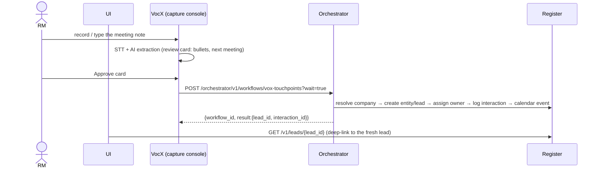

# PRISM — UI Implementer's End-to-End Guide

How the frontend links to the backend, from sign-in to the Excel export. Written against
the live APIs and the `PRISM_E2E_Full` Postman collection (which is the executable
version of this document — every button described here has a request there, in run
order). Field-level column bindings live in `ATLAS_UI_FIELD_MAP.md`; this document is
about **sequence and triggering**.

---

## 1. The one door, and who you are

Everything the browser calls goes through **one origin**: `https://<host>:8443` (NGINX →
gateway). The gateway routes by prefix:

| Prefix | Service | The UI uses it for |
|---|---|---|
| `/v1/*` | Register | all business reads/writes (the system of record) |
| `/orchestrator/v1/*` | Workflows | anything that needs authority: approvals, conversions, governed runs |
| `/atlas/v1/*` | ATLAS BFF | dashboard / today / pipeline / entity-360 aggregations |
| `/access/v1/*` | Access | user & role governance screens (admin only) |
| `/vocx/*` | VocX | voice capture |

Serve the SPA from the same origin — the edge now has a ready slot: drop the build
into `deploy/ui/` and it's served at `https://<host>:8443/ui/` (`/` redirects there;
SPA deep links fall back to index.html). Same origin as every API ⇒ CORS never exists,
from any browser on any machine. A UI hosted on a *different* origin (separate static
host, `localhost:5173` dev server) is also supported: allow it with
`GATEWAY_CORS_ORIGINS` (comma-separated; Helm `gateway.corsOrigins`) — bearer-header
auth means no cookies, so an allowed origin still needs a valid token on every call.
Sign-in works with Dex or Google either way; the Google specifics (multi-issuer env +
Authorized JavaScript origins) are in `deploy/ui/README.md`.

**Auth.** Production posture: OIDC. The SPA runs the standard authorization-code flow
against the IdP (Dex locally; Entra/Okta/Google later), attaches `Authorization: Bearer
<token>` to every call, and *never* sends identity headers — the gateway derives who you
are from the verified token and stamps a signed context downstream. Dev posture (no
issuer): the gateway trusts `X-User-Email`, which is how the collection runs without
sign-in. Build the UI against the bearer model; the dev fallback costs you nothing.

**Bootstrapping a session.** After login call `GET /v1/me` (gateway composition):

```json
{ "id": "...", "email": "...", "roles": ["Credit Head"],
  "views": {"lending": "FULL", ...}, "operations": {"approve_stage_change": "FULL", ...},
  "matrix_version": 7, "assignments": [ ...bare array of my assignment rows... ] }
```

This is the UI's **authorization mirror**: menus, tabs, and buttons render from `views`
and `operations`. It is cosmetic — the server enforces everything again — but it is what
keeps refusals from ever being the user's first hint.

**Dropdown vocabularies** come from `GET /v1/ref` (sectors, stages, statuses,
temperatures, interaction types…). Never hard-code an enum.

---

## 2. Universal mechanics (apply to every screen)

* **Envelope**: list endpoints return `{"items": [...], "next_cursor": "..."} `; pass
  `cursor` back for the next page. (One exception: `GET /v1/assignments` returns a bare
  array.) Row detail endpoints return the row object.
* **Errors** are uniform: `{"error": {"type", "title", "status", "detail",
  "request_id", "errors": [...]}}`. Render `detail` as the toast; `errors[]` carries
  field-level validation (`loc` → highlight the input). A `422 extra_forbidden` means the
  UI sent a field the schema doesn't have — that's a frontend bug, not user error. Log
  `request_id` with every error report; it joins the server logs.
* **Writes**: send only the fields the user actually set — everything except each
  resource's anchor fields is optional (`EntityCreate` needs `code`+`legal_name`, a lead
  needs `company`, trackers need `entity_id`; see the OpenAPI). Send a client-generated
  `Idempotency-Key` UUID header on creates so a retried request can't double-insert.
* **Concurrency**: every row carries `version`. A conflicting concurrent edit returns
  `409` — refetch, merge, retry; never blind-overwrite.
* **Refusals are UI states.** Any transition the server refuses for role/state reasons
  should have been disabled in the UI (from `/v1/me` + row state). The refusal responses
  in the collection (`…REFUSED` requests) enumerate exactly which controls to disable:
  self-approval, hand-typed governance stages (`Sanctioned`, `Disbursed`, `Converted`,
  `Closed Won/Lost`), closing a blocked deal, maker validating their own document.
* **Async settle.** Approvals and workflow actions return before every register write
  lands. Pattern: fire the action → mark the row "settling" → poll the affected row
  (1–2s interval, the collection's WAIT requests show the loop) **or** rely on the
  in-app inbox (`GET /v1/notifications?recipient=me`) — workflows push completion
  notifications there. Badge the bell from its unread count.
* **MACHINE LANE never appears in the UI.** Sweeps, tranches, Advaya handoffs, the
  decisions store, `/v1/internal/*` — service-to-service only. The UI *displays* their
  effects (statuses, timelines), never offers them as actions.

---

## 3. The journey, screen by screen

Each step: **Screen → Trigger → Call(s) → Render**. Folder numbers refer to the
collection.

### 3.1 Field capture — voice to lead (folders 03, VocX)

The RM speaks; PRISM creates company + lead + owner + interaction in one durable run.



* **Trigger**: the RM approving the VOM review card (or a UI "Log touchpoint" form
  submitting the same payload).
* **Ambiguity is a UI moment**: if the run parks "awaiting company confirmation", the
  status endpoint exposes the candidates; render a picker and signal the choice back
  (`/orchestrator/v1/workflows/{id}/confirm-company`). Same for lead selection.
* **Render after**: lead page shows `rm` (owner), the interaction in the timeline, the
  follow-up in the calendar.

### 3.2 Working the lead (folders 03–04)

* **Screen**: lead detail + grid. **Edits**: inline `PATCH /v1/leads/{id}` (temperature,
  next action, notes…). Plain field edits — no workflow.
* **Qualification**: button **"File qualification"** →
  `POST /orchestrator/v1/workflows/lead-qualifications` (evidence-backed; the run mints a
  `lead_qualification` evidence row). Render the evidence chip from `GET /v1/evidence`.
* **Disabled control**: status dropdown never offers `Converted` — conversion is an
  approval flow, below.

### 3.3 Convert lead → deal (folder 05) — the approval pattern

This is the canonical **request → approve** shape every governance action reuses.

* RM clicks **"Request conversion"** → `POST /orchestrator/v1/workflows/lead-conversions`
  `{lead_id, requested_by}` → returns `workflow_id`. Row shows "conversion requested".
* The approver's **inbox** (BD Head / Management) lists pending items (from
  notifications + the workflow status). Their card has Approve/Reject →
  `POST /orchestrator/v1/workflows/{workflow_id}/decision {approved: true, by}`.
  * The **same person who requested cannot approve** — the orchestrator refuses; the UI
    hides the buttons for the requester.
* UI polls the lead until `status == "Converted"`, then reads `converted_deal_id` and
  deep-links to the new deal. Render the decision on the deal's governance tab.

**Losing the 202 response is fine — never store or construct workflow ids.** At any
later point (page reload, the approver arriving from their inbox), rediscover the run
server-side:

```
GET /orchestrator/v1/workflows?kind=lead-conversion&subject_id={lead_id}
```

→ `{count, current, runs[]}` — every attempt newest-first (retries after a rejection
get `-r2, -r3, …` ids; the server knows that rule so you don't have to), each with
`status`, live `stage`, and ready-made `status_url` / `approve_url` / `reject_url`
(or `decision_url` for kinds with a dedicated decision route). `current` is the
attempt a decision can still land on. Kinds: `lead-conversion`, `lead-qualification`,
`deal-structuring`, `document-collection`, `syndication`, `asset-monetisation`,
`advaya-handover`, `ews-case`. Same read protection as the status route: initiator
or approver-role holders.

**The Today tab / approver landing list** is one call:

```
GET /orchestrator/v1/workflows/pending          (optional &kind=lead-conversion)
```

→ `{count, pending[]}` — every run in the tenant currently parked on an approval,
across all subjects, oldest first; each row has `kind`, `subject_id`,
`requested_by`, the waiting `stage`, `started_at`, and the same ready-made action
URLs as the lookup. In the production posture the list is scoped to the verticals
the caller holds an approver role for (an RM sees an empty list; a Credit Head
sees committee + handover; Management sees everything) — so the UI can render it
for any user without role logic of its own. Decision authority is still enforced
at the POST.

### 3.4 Committee approval (folder 06 — your screenshot)

* **Analyst**: deal workspace button **"Send to committee"** →
  `POST /orchestrator/v1/workflows/deal-structurings` (per-facility). Store `workflow_id`.
* **Credit Head inbox**: pending committee card → form (approve/reject per facility,
  conditions, validity days, sanction reference) →
  `POST /orchestrator/v1/workflows/{workflow_id}/committee-decision`.
* **Settle**: poll the lending line until `stage == "Sanctioned"`. The **deal** funnel
  stage does not change here — render deal stage and facility stage as separate chips.
* **Governance tab**: `GET /v1/evidence?subject_type=Lending&subject_id=…` — committee
  approval + sanction letter chips with references.
* **Disabled control**: the lending stage select excludes `Sanctioned` (server refuses a
  hand-PATCH; the collection's first request in the folder proves it).

### 3.5 CP/CS maker–checker (folder 07)

* **Maker (analyst)**: CP/CS checklist screen → **"Submit checklist"** →
  `POST /v1/internal/cpcs-checklists` *via gateway with the user's identity* (internal
  path, human authority — the gateway routes it; only service-key lanes are barred from
  the UI). Checker **returns** v1 with reasons → maker edits → v2 → checker
  **approves** (`…/approve`). Render the version history and the return notes.
* Approval mints the `cp_cs_completion` evidence; the stage select now allows
  `CP/CS Completed` → `Ready for Disbursement` (with proposed drawdown amount/date —
  required fields on that PATCH).

### 3.6 Advaya handover (folder 08) — PRISM's finish line

```
Prepared ──approve──▶ Approved ──submit──▶ Submitted ──Advaya──▶ Accepted ✔ (frozen)
   ▲                                                    │
   └──────────── re-prepare (maker) ◀────── Rejected ◀──┘
```

* **Maker**: lending workspace → **"Prepare handover"** (executed-doc refs, delivery,
  recipient) → `POST /v1/internal/handover-packages`.
* **Checker** (different person — hide the button for the maker): **"Approve handover"**
  → `…/{lending_id}/approve`. **Stage does not move.**
* **"Submit to Advaya"** → `…/{lending_id}/submit`.
* **Advaya's answer arrives on its own** (service callback). The UI only *renders* the
  package timeline — `GET /v1/lending/{id}/handover-package` — as a status stepper:
  Prepared → Approved → Submitted → **Accepted** (show `advaya_reference`) or
  **Rejected** (show the note; re-enable "Prepare handover" for the correction loop).
* **This is PRISM's success endpoint.** Disbursement is not a button anywhere.

### 3.7 Advaya's events (folder 08b — display only)

Tranches arrive as callbacks; the first one flips the line to `Disbursed` and fills
`disbursed_amount` / `disbursement_date`. UI: a read-only **Disbursement panel** on the
lending row (tranches list, total vs ceiling, "fully disbursed" tick) — rendered from
the row itself; the tranche detail endpoint is machine-lane. Show stage history's
`source: "advaya-disbursement"` entry as "Disbursed by Advaya callback".

### 3.8 Syndication & Asset Monetisation mandates (folders 09–10)

Same approval pattern as 3.3/3.4: start the mandate run (button) → lender/buyer rows
tracked (`POST /orchestrator/…/{workflow_id}/lender-update` / `buyer-update` — UI: the
chase-list actions from the v19 prototype) → NDA/offers recorded → authority-checked
decision → allocation → poll to `Sanctioned` / `Closed`. Hand-typed terminal statuses
are refused; the mandate status select excludes them.

### 3.9 Documents (folder 11)

* Upload into checklist slots (`POST /v1/documents`, slot/section from
  `GET /v1/document-checklist`). **Validate** is checker-only and maker≠checker —
  disable for the uploader. Expiry is server-driven (a sweep flips `Expired`); replacing
  creates the `Superseded` chain — render as version history.

### 3.10 Calendar (folder 12)

`POST/PATCH /v1/calendar-events` from the calendar screen; completed/cancelled events
freeze (server trigger) — render terminal events read-only.

### 3.11 Covenants & EWS (folder 13)

* **Credit defines a covenant** (form → `POST /v1/covenants`). Observations are
  generated by the machine sweep — never a UI action.
* **Results screen**: due observations list (`GET /v1/monitoring?record_type=Covenant`);
  entering a value → `POST /v1/monitoring/{id}/result` — a breach auto-opens the EWS
  case; deep-link to it.
* **EWS case page**: assign / note / escalate / close buttons →
  `/v1/ews-cases/{id}/...`; close is senior-only once escalated (hide accordingly).
* **Waiver**: senior credit records the decision —
  `POST /orchestrator/v1/decisions/waiver` (reference, observation, validity days) —
  then **"Apply waiver"** on the observation → `POST /v1/monitoring/{id}/waive`
  `{decision_ref}`. Render `waiver_valid_until`; when it lapses the sweep re-opens the
  breach — the UI just re-renders.

### 3.12 Deal closure (folder 14)

* **"Close deal"** opens a dialog that FIRST calls `GET /v1/deals/{id}/open-items` and
  lists the blockers (open EWS, breached covenants, non-terminal lines). Only when empty
  does the confirm button enable → `POST /v1/deals/{id}/close {outcome, note}` (note
  mandatory — required field in the dialog). This is the **commercial** closure;
  operational loan closure is Advaya's and never a PRISM button.

### 3.13 Inbox & export (folders 15–16)

* **Bell/inbox**: `GET /v1/notifications` (+ `POST /v1/notifications/{id}/read`).
* **"Export to Excel"**: `GET /v1/export/excel` (content-disposition download) — the
  whole book, one sheet per register, view-scoped to the caller. `GET /v1/export/counts`
  powers an admin "what's in the register" widget.

### 3.14 Activity tab (Activity Log + Audit trail) & the Today tab

Both sub-tabs render from **`GET /v1/audit`** (Admin-only), filterable by
`resource_type`, `resource_id`, `actor`, `action`, `since`, `until`, `limit`. Every row
now carries what the screen needs without joins:

* `changes.values` — before→after per changed field (`{"stage": {"from": "Data
  Awaited", "to": "Diligence"}}`) → the Audit trail's Detail column and the Activity
  Log's "Moved X's lending stage A → B" sentence.
* `changes.label` — the row's human name (`PIONEER`, `L-0001`) → the Company/Code
  columns, no per-row lookup.
* **Area chips** = a static map from `resource_type` (lending_trackers → Lending,
  entities → Clients, session → Session; `actor` = system/import → System).
* **Session rows**: after a successful login the UI calls
  `POST /v1/session-events {"event": "signin"}` once (optionally `signout`) — that
  writes the caller's own audited row; sign-ins otherwise happen at the IdP and would
  be invisible. Stat chips (N activities / today / people / companies) are counts over
  the fetched rows.

**Prototype-parity recipe** (one fetch, two renderers):

1. On tab open `GET /v1/audit?limit=500` (Admin bearer; gate the tab on `views.audit`
   from `/v1/me` — the server 403s anyway, the check keeps the nav honest).
2. Map each row to a view-model: `area` = `session` → Session; actor `system`/`svc_*`
   → System; else a static `resource_type` map (lending_trackers → Lending, entities →
   Clients, …). `code` = `changes.label`; detail pairs = `changes.values`.
3. **Audit trail** renders the view-model verbatim; Detail = each `values` entry as
   `from → to`, falling back to the `fields` name list for pre-upgrade rows.
4. **Activity Log** renders a sentence per row keyed on (resource_type, action), with
   `values.stage`/`values.status` specialised ("Moved {label}'s lending stage {from} →
   {to}"); Session/System rows get their fixed sentences.
5. Chips = counts over the fetched array (total / at ≥ midnight / distinct actors /
   distinct labels); pills = client-side `area` filter (or server-side
   `?resource_type=`); Who column resolves actor e-mail → "Name (Role)" via a cached
   `GET /v1/people` map; CSV/PDF export = serialize the current filtered view.
6. After a successful login the UI calls `POST /v1/session-events {"event":"signin"}`
   ONCE per session (sessionStorage guard; optional `signout` on logout). Everything
   else appears automatically — auditing rides inside every write transaction.

The **Today tab's red/amber triage** is served by `GET /atlas/v1/today`:
`stage_bottlenecks.{red,amber}` (BN-02 — lending lines stuck in a working stage, with
`days_in_stage`, `pending_with`, `analyst`; longest-stuck first) plus
`attention_counts` for the "21 red, 195 amber" headline, alongside the existing
`leads_due`, `lender_chases`, `monitoring_due`. Thresholds are deployment config
(`ATLAS_STAGE_AMBER_DAYS`/`ATLAS_STAGE_RED_DAYS`, default 14/30), narrowable per
request with `?amber_days=&red_days=`.

---

## 4. Dashboards (ATLAS BFF)

`GET /atlas/v1/dashboard`, `/today`, `/pipeline/{vertical}`,
`/entities/{id}/summary` — aggregated, role-scoped reads for the home/dash/today
screens. The v19 prototype's richer analytics (velocity, scorecards, attention rules)
compute from register data; as the frontend firms up, promote the hot ones into BFF
endpoints rather than shipping whole registers to the browser.

## 5. The ten-line mental model

1. Screens load via GETs; grids bind columns per `ATLAS_UI_FIELD_MAP.md`.
2. Ordinary edits PATCH the row; send only what changed; handle 409 by refetch.
3. Governance = request → approver inbox → decision, always through the orchestrator,
   identity always from the login token, requester ≠ approver.
4. Governance stages are never options in a dropdown.
5. After any workflow action: settle via poll or inbox, never block the UI.
6. Evidence/decision chips render the audit trail; they are read-only.
7. Maker–checker pairs (CP/CS, handover, document validation): hide the second step
   from whoever did the first.
8. Advaya: PRISM ends at Accepted; everything after is a read-only timeline.
9. Machine lanes and `/v1/internal/*` service endpoints are not UI surface (internal
   *human* endpoints like handover prepare/approve ARE — the test is "does a person
   click it").
10. `/v1/me` decides what to show; the server decides what happens.
