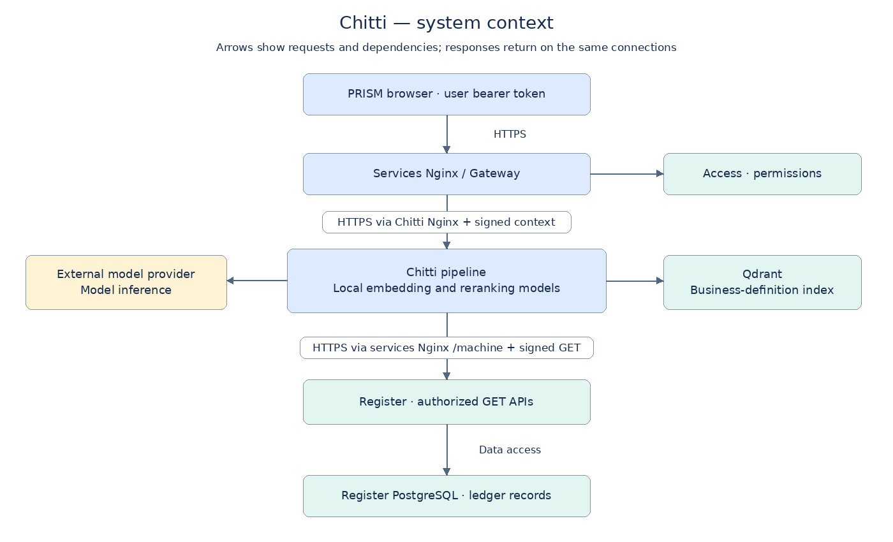
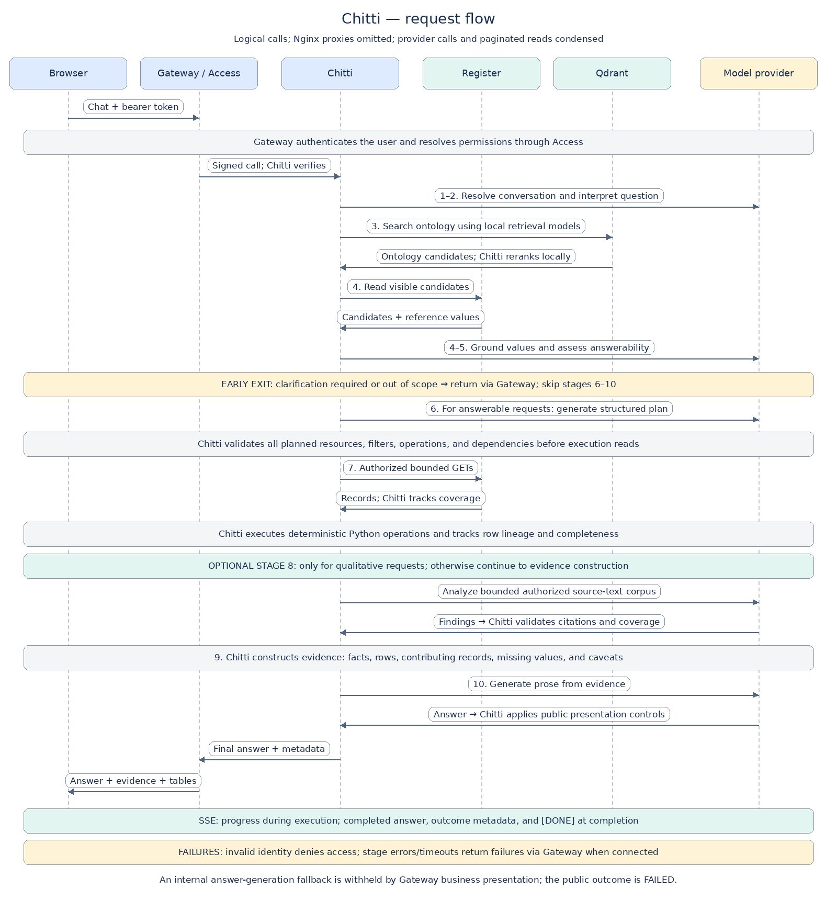
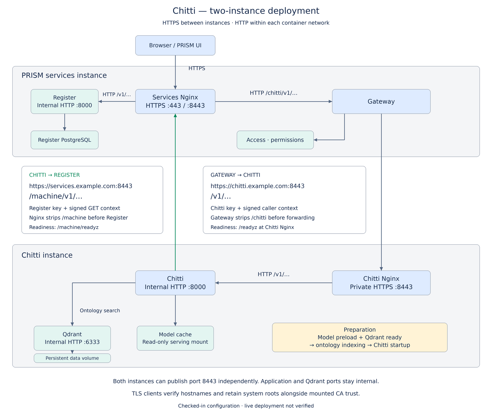

# Chitti Chatbot — Technical Architecture

| Document attribute | Value |
| --- | --- |
| Audience | Engineers, architects, security reviewers, and operations teams |
| Scope | Native PRISM chat, Chitti service, and its identity, data, model, and deployment dependencies |
| Reviewed | 24 September 2026 |
| Source baseline | Deployment/client review: `791719e`, `76e6019`, `f3035c5` and current checkout |
| Deployment status | Describes the checked-in configuration; live production deployment is not verified |

## 1. Overview

Chitti is PRISM’s conversational analytics service. Users ask questions about leads, commercial deals, lending, syndication, lender submissions, and asset monetisation through the native PRISM website. Chitti returns business-facing answers, evidence references, and supported record tables.

The architecture combines a typed language-model pipeline with deterministic Python operations and delegated Register reads. Register remains the authoritative source of business records and access enforcement. Chitti owns question interpretation, business-definition retrieval, planning, calculations, and answer presentation.

Five principles govern the design:

1. **Read-only data access.** Chitti reads through approved Register API resources. It has no direct ledger database connection and exposes no ledger mutation capability.
2. **Caller-specific authorization.** Every business-data read carries the requesting user’s verified identity and policy context.
3. **Versioned business meaning.** A checked-in ontology defines supported concepts and semantics; its searchable index lives in Qdrant.
4. **Validated execution.** Models produce structured interpretations and plans. Python validates and executes a fixed operation catalogue.
5. **Explicit evidence and coverage.** Answers distinguish available evidence, missing data, and results bounded by traversal or corpus limits.

## 2. System context and responsibilities

Arrows show request/dependency direction; responses return along the same connections. The browser reaches Chitti through Gateway. Internal credentials remain on the server.

| Component | Responsibility |
| --- | --- |
| PRISM chat UI | Compose messages, send conversation history, display progress, answers, evidence, and tables; cancel requests |
| Browser conversation memory | Preserve one conversation per tab and login in sessionStorage |
| Services Nginx | Browser HTTPS entry point; routes chat to Gateway and `/machine` to Register |
| Chitti Nginx | Private HTTPS entry point; proxies to Chitti over container-network HTTP |
| Gateway | Authenticate the user, resolve access, inject signed context and Chitti credentials, enforce proxy budgets, forward streaming responses |
| Access | Resolve platform user membership and effective permissions |
| Chitti API | Validate chat requests, resolve delegated identity, run the pipeline, format JSON/SSE responses |
| Pipeline and model stages | Orchestrate typed stages, retrieve meaning, validate model outputs, track outcomes |
| Register adapter and executor | Validate resources and filters, retrieve bounded datasets, execute calculations, retain lineage |
| Semantic retrieval | Load pinned local models; search and rerank ontology passages from Qdrant |
| Register | Enforce data visibility and serve current business records through governed APIs |
| External model provider | Run Chitti’s configured model stages through an OpenAI-compatible endpoint |

Chitti is a Python/FastAPI service. Pydantic defines the stage contracts, the asynchronous Register client supplies data, and the OpenAI client invokes the configured provider. Compatibility describes the chat interface; clients do not control Chitti’s internal stage prompts or execution tools.

## 3. End-to-end request flow

The diagram shows logical call order and omits both Nginx proxies (see deployment topology); repeated provider calls and paginated reads are condensed. Clarification and out-of-scope outcomes return before planning. Qualitative analysis runs only when requested. Progress events are emitted throughout execution. Grounding itself reads Register before query-plan execution: it needs authorized candidate identities, entities, and reference values to interpret names and controlled vocabulary.

### 3.1 Pipeline stages

| Stage | Mechanism | Output and control |
| --- | --- | --- |
| 1. Conversation resolution | Model | Resolve follow-up references and preserve relevant intent in a standalone request |
| 2. Question interpretation | Model | Identify requested shape, business terms, literals, grouping, ranking, relationships, and unresolved wording |
| 3. Semantic retrieval | Local models + Qdrant | Retrieve ontology passages and focused semantic matches for grounding and planning |
| 4. Value grounding | Register reads + model | Match wording to supported fields, meanings, reference labels, and caller-visible candidates; record ambiguity |
| 5. Answerability | Model + typed validation | Produce `ANSWERABLE`, `CLARIFICATION_REQUIRED`, or `OUT_OF_SCOPE`; an answerable outcome requires a `VerifiedQuestion` |
| 6. Query planning | Model + executor validation | Produce a `QueryPlan` with named reads, supported operations, dependencies, and result shapes |
| 7. Execution | Python + Register | Fetch authorized datasets and execute validated operations; track lineage, field origins, and completeness |
| 8. Qualitative analysis, when requested | Bounded corpus + model + citation validation | Analyze supported source text and attach validated source support and coverage |
| 9. Evidence construction | Python | Assemble facts, rows, contributing records, read windows, missing-value counts, and caveats |
| 10. Answer generation | Model, then Python presentation | Generate prose from evidence; Python separately builds business-safe tables from execution results |

A clarification or out-of-scope result stops before query planning. A failed stage produces a request-correlated failure. The implementation contains a limited internal fallback that can render validated evidence after answer-generation failure. Gateway’s business presentation withholds that fallback, returning a retry message with a failed outcome and no evidence or tables.

Model outputs are checked against typed schemas and semantic constraints. Structured-output handling includes a repair attempt for invalid output. This reduces malformed plans but does not prove that the model has interpreted every business question correctly.

### 3.2 Illustrative question

For “Show lending deals assigned to Priya in a particular stage,” Chitti resolves the person and stage against visible Register candidates and business definitions, establishes the appropriate relationship between lending and deals, and prepares supported reads and filters. Python executes the plan and retains the contributing record identities. The UI receives prose and eligible business columns, with coverage information if a limit prevents a complete result.

This example describes the processing pattern; the exact reads depend on the verified question and ontology. Ambiguous names should lead to clarification.

## 4. Business definitions and semantic retrieval

The checked-in ontology provides business definitions, field and resource semantics, relationship guidance, invariants, and source claims used to ground interpretation and planning.

Retrieval combines:

1. Dense semantic search using `BAAI/bge-small-en-v1.5` with 384-dimensional vectors.
2. Sparse lexical search using `Qdrant/bm25`.
3. Reciprocal-rank fusion to combine candidate rankings.
4. Reranking using `Xenova/ms-marco-MiniLM-L-6-v2`.
5. Focused queries and audience-specific selection for grounding and planning.

These are the checked-in Compose choices. All three model revisions are pinned in deployment configuration. The default candidate budgets are 40 dense, 40 sparse, and 40 fused candidates, with grounding and planning rerank limits of 24 and 12 respectively.

Qdrant stores the ontology index. Business records are fetched live from Register; importing ledger records does not require re-embedding. Startup verifies the collection against the ontology version, content identity, and expected point identities. A mismatched index fails initialization rather than silently serving different definitions.

## 5. Data access and deterministic execution

### 5.1 Governed API boundary

The Register adapter defines an allowlist of resources, searchable fields, and supported filters. It covers entities, people, counterparties, leads, deals, lending, syndication, lender submissions, and asset monetisation. Current reference values are read using `AsyncRegisterClient.ref()` from Register’s `/v1/ref` endpoint (externally `/machine/v1/ref`). The Chitti adapter retains its own `RegisterAccess.reference_values()` wrapper; it calls `client.ref()`.

The executor validates the entire planned read set before scheduling execution reads. Independent reads execute concurrently; dependent reads wait for the datasets needed to resolve their filters. Invalid resources, filters, dependencies, or operations are rejected. Grounding reads may already have occurred by this point.

Some controlled-value and literal filters are applied locally after conservative normalization to preserve supported legacy labels or literal equality. These reads remain paginated and bounded, so local filtering cannot establish full coverage when traversal stops early.

### 5.2 Operation catalogue

Supported Python operations include filtering, joins, projection, sorting, limiting, ranking, grouping, counting, distinct counting, missing-value counting, sum, average, minimum, maximum, set union, and set intersection.

The plan is a structured description of these operations. Chitti does not execute model-generated SQL or arbitrary Python. Row lineage and field origins flow through execution so calculations and public tables can be tied to contributing sources.

### 5.3 Completeness and consistency

Each read records its time window, page count, record count, and whether more pages remain. Result evidence includes missing-value coverage and propagates incomplete reads into caveats and partial outcomes.

“Complete” means complete within the caller’s authorized data scope and the supported query semantics. It does not mean the user can see the whole organization’s book or that every source field is populated.

Multiple resources and pages are read through separate API calls. Chitti does not establish a transactionally consistent snapshot across the full conversation request; records can change between reads. Evidence timestamps describe the retrieval window.

## 6. Identity and security boundaries

1. The browser submits its user bearer token to Gateway.
2. Gateway authenticates the user and resolves effective permissions through Access. It strips untrusted internal identity and presentation headers.
3. Gateway adds its Chitti service credential and a signed `X-Internal-Context`, bound to the downstream HTTP method and path.
4. Chitti verifies the signature and route binding, and checks tenant consistency when an `X-Tenant` header is supplied.
5. For each Register call, Chitti creates a fresh context bound to the exact Register `GET` path, preserving user, tenant, roles, reporting scope, effective permissions, and policy metadata.
6. Register applies its authorization and configured database row-level security controls to the delegated identity.

The `svc_chitti` Register credential has no independent ledger read or write grants. The context-minting function rejects methods other than `GET`. The language model is outside the authorization decision path: a proposed plan cannot expand the caller’s grants.

Production Chitti configuration requires delegation and rejects debug identity, disabled delegation, and diagnostic early stopping when the pipeline is enabled. Gateway, Chitti, and Register must use compatible signing configuration. Actual Register database-role and row-level-security posture must be verified against the deployed services configuration.

The external model endpoint receives questions, relevant conversation content, grounding candidates, and selected ledger/evidence content as required by each stage. Local retrieval-model serving is offline; answer-model inference requires outbound provider connectivity. Provider data handling and log retention are deployment governance responsibilities.

## 7. Evidence and public presentation

Internal `ResultEvidence` contains the verified question, scalar facts, result rows, contributing record identities, retrieval windows, metric completeness, qualitative findings, scope, timestamps, and caveats.

Qualitative analysis uses lending remarks and the latest lender chase/reply notes. These notes are snapshots, not a complete conversation history. The corpus is bounded, and generated findings must cite authorized source material. Citation validation checks the source reference, field, and exact excerpt; it does not independently prove that a finding follows logically from the cited text. Missing source text and truncated coverage remain explicit; absence of remarks does not establish absence of a business issue.

Gateway selects the business presentation format using a server-controlled header. The final response exposes the support request ID, outcome, completeness, safe evidence labels, and eligible tables. Its metadata excludes internal execution traces and raw database identifiers. Generated prose containing schema-style names, UUIDs, code blocks, or tables is withheld with a retry response. This presentation filter supplements access enforcement.

SSE progress events expose the pipeline’s description text unchanged. They omit structured stage/model details but do not apply the final-answer text filter; progress descriptions can therefore contain technical terms. Public presentation is not a general redaction guarantee for every streamed string.

Structured `chitti.tables` are built directly from validated results using allowlisted business labels and source fields. They preserve eligible result rows independently of the prose model’s five-row sample. Serialized row items share a 600,000-byte budget across results; table metadata and the rest of the response are additional. Each result is capped at 2,000 table rows, and cell text is shortened. Displayed tables report their total result count so the UI can label omitted rows. A result with no eligible columns or no retained rows is not emitted as a table. Navigation uses validated deal group codes.

## 8. API, streaming, and conversation state

| Route | Consumer | Behavior |
| --- | --- | --- |
| `GET /chitti/v1/models` | Browser/client through Gateway | Discover the public model, default `prism-chitti` |
| `POST /chitti/v1/chat/completions` | Browser/client through Gateway | Submit messages; receive JSON or Server-Sent Events (SSE) |
| `GET /v1/models` | Internal Chitti interface | Requires the Chitti service key; this route does not resolve delegated identity or read ledger records |
| `POST /v1/chat/completions` | Internal Chitti interface | Requires the Chitti service key and verified delegated context for the production pipeline |
| `GET /healthz` | Internal health monitoring | Process liveness |
| `GET /readyz` | Internal health monitoring | Pipeline initialization status and live dependency checks |

Both Gateway routes require an authenticated, active user even though Chitti’s internal model-discovery route only checks the service key. Chat requests require the configured public model ID and a non-empty message list containing a user message. OpenAI-style generation controls are accepted for client compatibility but are not forwarded to stage calls; Chitti controls stage configuration internally.

For `stream: true`, the service sends an initial assistant-role chunk, progress events while the pipeline runs, the completed answer content, a final metadata chunk, and `[DONE]`. It does not forward provider token generation live. Clients should inspect Chitti’s outcome rather than assume that an established HTTP stream means the answer succeeded.

Gateway disables response caching and buffering for the proxy response and retains its concurrency slot for the response lifetime. Disconnect handling closes the upstream stream and cancels outstanding pipeline work.

The UI stores one conversation in tab-local sessionStorage, scoped to the current login. Navigation and refresh restore it. New conversation, sign-out, and user/tenant changes clear it. Relevant history is sent with subsequent requests; Chitti has no server-side conversation database.

## 9. Deployment and storage

**Configured topology — live deployment not verified.** The checked-in Compose topology separates the PRISM services project from the Chitti project. They run on two different machines/instances, communicating through private/LAN addresses.

Gateway connects to Chitti’s Nginx HTTPS listener (default host port 8443). Chitti reads Register through the services Nginx HTTPS `/machine/v1/` route, with `/machine/readyz` for readiness. Both clients verify TLS using mounted trust certificates in addition to system roots, with hostname verification enabled. Chitti, Register, and Qdrant have no published application ports in the split deployment. Browser traffic reaches Gateway through the services Nginx; Gateway supplies signed caller delegation.

### 9.1 Routes and transport boundaries

| Caller → destination | Transport and route | Destination handling |
| --- | --- | --- |
| Browser → services Nginx | HTTPS `/chitti/v1/models` or `/chitti/v1/chat/completions` | Internal HTTP to Gateway; keeps `/chitti` prefix |
| Gateway → Chitti Nginx | HTTPS `https://chitti.example.com:8443/v1/…` | Gateway strips `/chitti` and signs the downstream method/path; Nginx preserves the path and identity headers |
| Chitti Nginx → Chitti | Internal HTTP `http://chitti:8000/v1/…` | Service-key and delegated-context verification |
| Chitti → services Nginx | HTTPS `https://services.example.com:8443/machine/v1/…` | Nginx strips `/machine` and forwards internally to `http://register:8000/v1/…` |
| Chitti → Qdrant | Internal HTTP `http://qdrant:6333` | Ontology retrieval within the Chitti project |

For example, Chitti signs `GET /v1/ref`, sends it to `/machine/v1/ref`, and Register verifies the rewritten `/v1/ref` path. The `/machine/v1/` route allows reads (`GET`, with Nginx also allowing `HEAD`); the more specific `/machine/v1/internal/` route has separate write-capable behavior for other services. Chitti’s allowlist and context minting restrict its business-data calls to `GET`.

Chitti’s application port 8000 and Qdrant are internal only. The former direct Chitti host port 8003 is no longer published. The services overlay explicitly removes Register’s host port mappings with `ports: !reset []`; container-network HTTP to Register remains available. These statements describe these components, not every port published by the wider services stack.

### 9.2 Configuration and certificates

Use the standalone `deploy/compose/docker-compose.chitti.yml` for Chitti; do not merge it with the platform base. On the services instance, merge `docker-compose.services.yml` last, after `docker-compose.yml` and `docker-compose.prod-posture.yml`. Use Compose with support for `!reset`. The checked-in `.env.chitti.example` and `.env.example` are templates; the following values use generic domains that must resolve from the calling containers to the appropriate private/LAN interfaces.

| Instance | Setting | Example / meaning |
| --- | --- | --- |
| Services | `GATEWAY_CHITTI_URL` | `https://chitti.example.com:8443` (no `/chitti` suffix) |
| Services | `GATEWAY_CHITTI_CA_FILE` | Host trust file, e.g. `/etc/prism/chitti-ca.crt`; mounted read-only at that path in Gateway; overlay sets `GATEWAY_UPSTREAM_CA_FILE` to the container path |
| Chitti | `CHITTI_BIND_IP` | Chitti instance’s private/LAN IP; required host binding |
| Chitti | `CHITTI_HTTPS_PORT` | `8443` by default, mapped to Chitti Nginx container port 443 |
| Chitti | `CHITTI_REGISTER_BASE_URL` | `https://services.example.com:8443/machine`; include `/machine`, omit `/v1` |
| Chitti | `CHITTI_REGISTER_CA_FILE` | Host Register/services-Nginx trust certificate, default `/etc/chitti/tls.crt`; always mounted at `/etc/chitti/tls.crt` in Chitti |
| Chitti | `CHITTI_TLS_CERT_FILE` | Host server certificate `/etc/chitti/chitti.crt`; mounted into Chitti Nginx at `/etc/nginx/certs/tls.crt` |
| Chitti | `CHITTI_TLS_KEY_FILE` | Host server private key `/etc/chitti/chitti.key`; mounted into Chitti Nginx at `/etc/nginx/certs/tls.key` |

The Register trust certificate is distinct from Chitti’s server certificate/key. Gateway trusts the issuer of Chitti’s server certificate; Chitti trusts the issuer of the services Nginx certificate. Certificate SANs must match the respective URL hostnames (an IP URL requires a matching IP SAN). A custom CA augments system certificate roots in both clients; verification is never disabled. Missing or invalid trust files are errors, not a fallback to unverified TLS. Chitti readiness uses the same Register trust configuration as its data client. All certificate bind mounts above are read-only and require existing host files.

Use two distinct service credentials: `CHITTI_GATEWAY_KEY` is supplied to Gateway as `GATEWAY_CHITTI_API_KEY` and accepted by Chitti through `CHITTI_API_KEYS`; `SVC_CHITTI_KEY` supplies Chitti’s `CHITTI_REGISTER_API_KEY` and the corresponding Register service identity. Match each across the two instances. Reuse the existing shared `INTERNAL_SIGNING_SECRET` with compatible signing settings across Gateway, Chitti, and Register; do not rotate it as part of adding Chitti. Chitti Compose enforces production delegation with debug identity disabled.

### 9.3 Two-instance deployment

On separate hosts, Chitti Nginx can use private port 8443 while services Nginx uses its own host’s HTTPS port. The services base Compose publishes standard HTTPS (default 443) and a legacy 8443 mapping; either can serve `/machine` if the URL selects the actual reachable listener. Limit inter-host reachability to the required HTTPS listeners and retain outbound model-provider connectivity.

The supported deployment here always uses separate machines/instances. Do not combine the projects on one host. Container `localhost` addresses refer to that container, and Compose service names do not resolve across the two instances. Configure certificate hostnames that resolve from the calling containers to the other instance’s reachable private/LAN IP. Each instance can publish port 8443 independently.

### 9.4 Startup and persistence

Startup order is Qdrant availability and model preload, followed by ontology indexing, then Chitti serving. The preload job downloads pinned retrieval artifacts and writes a verification manifest. Serving mounts the prepared model cache read-only and operates those retrieval models offline.

| Data | Owner / location | Lifecycle |
| --- | --- | --- |
| Authoritative business records | Register database | Platform backup, recovery, and access policies |
| Ontology source | Git | Reviewed and versioned with application source |
| Ontology vectors | `chitti_qdrant_data` | Rebuildable from ontology and pinned model artifacts |
| Retrieval model artifacts | `chitti_model_cache` | Reusable pinned artifacts with manifest verification |
| Conversation history | Browser sessionStorage | Tab/login-scoped; no server-side chat persistence |
| Request datasets and evidence | Chitti process memory | Request execution state |
| Operational logs | Compose journald configuration | Host retention and forwarding policy |

Compose gives Chitti 2 CPUs/4 GiB and Qdrant 1 CPU/2 GiB. Serving uses a read-only root filesystem, dropped capabilities, and `no-new-privileges`. These are configured budgets, not measured capacity guarantees.

Optional Helm support provides Chitti/Qdrant workloads, preparation jobs, existing-Secret references, internal services, NetworkPolicies, probes, and persistent volumes. Artifact identifiers isolate model caches and ontology prefixes for reuse and rollback. Kubernetes-specific storage and network enforcement require environment validation.

## 10. Operating limits, health, and failure behavior

The following values are configuration defaults or checked-in implementation limits, not throughput commitments.

| Control | Current value and scope |
| --- | --- |
| Gateway concurrent Chitti requests | 4 per Gateway process; saturation returns `429` |
| Gateway request body | 131,072 bytes; excess returns `413` |
| Gateway request/stream deadline | 310 seconds |
| Chitti pipeline request deadline | 240 seconds |
| Provider timeout / SDK retries | 60 seconds / 2 retries, within the overall request deadline |
| Register read timeout | 30 seconds |
| Register page size / traversal | 200 records per page; at most 10 pages per read |
| Record cap | 2,000 accepted records per `RegisterAccess.read` invocation; despite the setting name `max_records_per_request`, this is not a single budget shared by all grounding and execution reads |
| Planned read count | At most 8 reads in a query plan by default |
| Intermediate result bound | Default 16,000 rows per operation output; exceeding it fails execution |
| Qualitative corpus | 500 source-field entries, each identified by resource, record ID, and field; 4,000 characters per field; 100,000 total characters. One business record can contribute multiple entries |

Readiness verifies initialized pipeline state, the Qdrant collection’s availability, and Register’s readiness. It exposes runtime source and ontology identities plus retrieval configuration for diagnosis. It does not make a paid provider inference call, so readiness does not establish provider availability or answer quality. Initialization failure leaves the pipeline unavailable; after fixing initialization dependencies, restart Chitti. Live dependency outages after successful initialization can recover through subsequent readiness checks.

Use these checks in the target environment after configuration; they are verification guidance, not evidence of a live deployment:

1. From the services instance, request `https://chitti.example.com:8443/readyz` with the Chitti trust certificate, for example `curl --fail --cacert /etc/prism/chitti-ca.crt https://chitti.example.com:8443/readyz`. This covers Chitti Nginx TLS and the application’s dependency readiness; `/healthz` checks only liveness.
2. From the Chitti instance, request `curl --fail --cacert /etc/chitti/tls.crt https://services.example.com:8443/machine/readyz`. Services Nginx rewrites this to Register’s `/readyz`. The bare services `/readyz` probes Gateway only and does not establish Chitti or Register readiness.
3. Check Chitti’s Compose health status: its probe runs **inside the Chitti container**, using `http://127.0.0.1:8000/readyz`. That internal HTTP URL is intentional and does not require a host application-port mapping. A healthy container does not by itself verify Gateway’s TLS connection to Chitti Nginx.
4. Through the signed-in browser, check model discovery and a permitted business question at `/chitti/v1/…`. Readiness calls are unauthenticated and do not test service credentials, delegated data access, or provider inference. A successful chat is needed to verify that full chain, including streaming.

Both Nginx chat routes disable proxy buffering/cache, limit bodies to 128 KiB, and allow 325-second proxy read/send timeouts around Gateway’s 310-second deadline. Chitti Nginx forwards `/v1/`, `/healthz`, and `/readyz`; other paths return `404`. It starts after the application container starts, not after application readiness succeeds.

| Condition | Observable behavior |
| --- | --- |
| Invalid or absent required identity | Request denied before authorized ledger access |
| Ambiguous or unsupported question | Clarification or out-of-scope outcome when identified by answerability |
| Traversal/corpus cap reached | Partial result with coverage and caveats where execution can complete |
| Invalid model output or plan | Stage failure after applicable validation/repair handling |
| Provider or execution failure | Failed outcome, support request ID, and safe public message |
| Pipeline deadline exceeded | Timeout failure; streaming closes with final failure metadata and `[DONE]` |
| Gateway upstream unavailable or timed out before streaming begins | `502` or `504`; a failure after streaming begins can terminate the stream |
| Client disconnect | Upstream response closed and in-flight work cancelled |

Request IDs correlate API responses, Register reads, and stage-failure logs such as `pipeline_stage_failed` and `pipeline_model_output_invalid`. Compose disables full pipeline payload logging and retrieval traces. Register-read logs still include caller, query, and filter fields; operational logs therefore need appropriate access and retention controls.

Ontology changes require re-indexing. Retrieval-model revision changes require cache preparation before indexing. Preserve model-cache and Qdrant volumes during normal upgrades. The service README provides refresh and verification procedures; the Helm artifact-isolation approach supports retained-version rollback.

## 11. Tradeoffs and known limitations

| Architectural choice | Benefit | Consequence |
| --- | --- | --- |
| Live Register reads | Reuses authoritative data and user access rules | Availability and latency depend on Register; no cross-resource snapshot guarantee |
| Ontology retrieval | Versioned definitions and inspectable semantic sources | Ontology coverage, retrieval quality, and artifact freshness affect answers |
| Typed multi-stage models | Explicit intermediate contracts and stage-level diagnosis | Multiple provider calls add latency and cost; valid output can still encode an incorrect interpretation |
| Python operation allowlist | Bounded executable behavior and reproducible calculations | New analytical capabilities require deliberate contract and executor changes |
| Bounded reads and corpora | Predictable resource limits | Large questions may produce partial coverage |
| Browser conversation storage | Simple service state and login isolation | No server-backed cross-device conversation history |

**Answerability and planning reliability:** these stages depend on model interpretation. Schema validation checks output structure and supported values; it does not prove that the selected meaning, answerability decision, or query plan matches the user’s intent. A structurally valid response can therefore reject an answerable question or execute a plan for the wrong interpretation. Representative business-question evaluation is needed in addition to authorization and infrastructure checks.

Production capacity and latency targets require benchmarking. Provider spend limits, operational ownership, log retention, and recovery objectives require deployment-specific definitions. The Gateway limiter is local to each process; adding replicas changes aggregate admitted concurrency.

## 12. Extension and verification points

| Change | Component to update | Relevant verification |
| --- | --- | --- |
| Business definition or supported meaning | Business ontology | Ontology linter, semantic tests, refreshed index identity |
| Register resource or field | Register adapter and stage contracts | Read/filter validation, delegated access, scope and completeness tests |
| Analytical operation | Operation catalogue, executor, and stage contracts | Calculation, lineage, missing-value, and materialization-bound tests |
| Interpretation or planning | Model stages and pipeline orchestration | Typed contracts, grounding, answerability, orchestration, and representative question evaluation |
| Qualitative source | Qualitative corpus builder and ontology | Citation validation and corpus coverage tests |
| Public response or UI | Public presentation, table builder, and chat UI | Safe presentation, result tables, streaming, cancellation, and conversation isolation tests |
| Deployment configuration | Compose/Helm and Gateway settings | Configuration checks and service-chain acceptance in the target environment |

Verification includes Chitti unit and integration fixtures, Gateway chat tests, and an isolated service-chain acceptance fixture. Controlled model fixtures verify execution and access behavior; live-model evaluation is a separate source of answer-quality evidence.

## 13. Source references

Paths are relative to the PRISM repository root. Deployment and client behavior were reviewed against the current checkout, including commits `791719e`, `76e6019`, and `f3035c5`. Related files are grouped below; Chitti module names are relative to `services/chitti/app/`.

| Area | Source paths |
| --- | --- |
| Service overview and configuration | `services/chitti/README.md`; `services/chitti/app/config.py` |
| Chat UI and conversation memory | `services/atlas/ui/src/components/chat/`; `services/atlas/ui/src/auth/chatMemory.ts` |
| API, identity, and lifecycle | `api.py`; `models.py`; `identity.py`; `main.py` |
| Pipeline, model contracts, and retrieval | `pipeline.py`; `model_stages.py`; `stage_models.py`; `semantic.py`; `ontology/passages.json` |
| Reads, calculations, and evidence | `register_access.py`; `executor.py`; `operations.py`; `evidence.py`; `qualitative.py` |
| Public responses and tables | `presentation.py`; `result_tables.py` |
| Gateway, access, and ledger enforcement | `services/gateway/app/main.py`; `services/gateway/app/chitti_proxy.py`; `services/access/`; `services/register/` |
| Compose and Helm | `deploy/compose/docker-compose.chitti.yml`; `deploy/compose/docker-compose.services.yml`; `deploy/helm/prism/README.md` |
| TLS and Register client | `packages/evam-register-client/evam_register_client/config.py`; `packages/evam-register-client/evam_register_client/client.py`; `packages/evam-register-client/tests/test_tls.py`; `services/gateway/tests/test_chitti.py` |
| Nginx and environment templates | `deploy/nginx/chitti.conf`; `deploy/nginx/nginx.conf`; `deploy/compose/.env.chitti.example`; `deploy/compose/.env.example` |
| Operations and acceptance | Deployment guidance in section 9 above; `services/chitti/tests/acceptance/README.md` |

Diagram PNGs and editable SVGs accompany this document in `docs/chitti/images/`. Their rendering script is `docs/chitti/render_architecture.py`.
