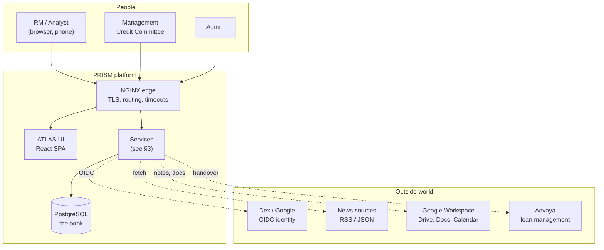
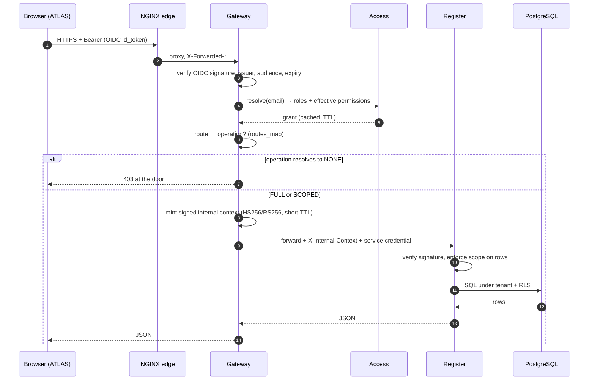
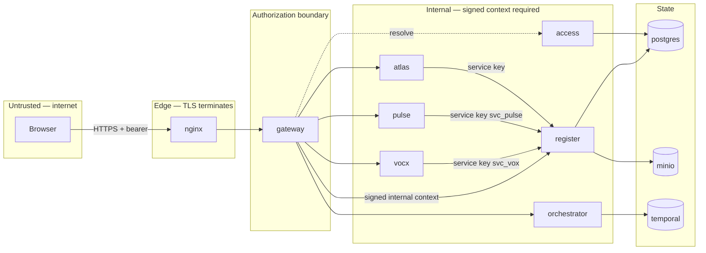
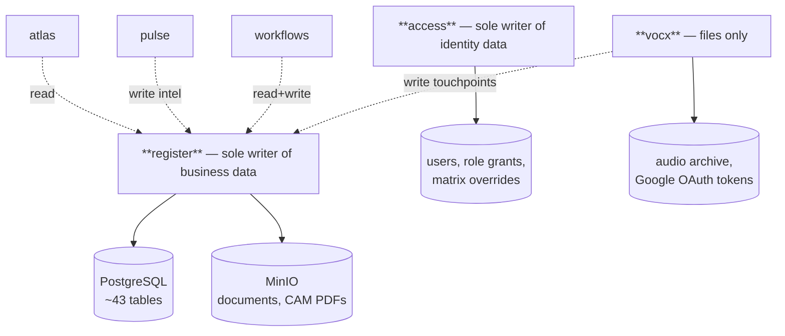

# 01 — PRISM Architecture

> **Audience:** engineers, architects, anyone who needs the whole shape of the system in one sitting.
> **Companion docs:** [02 Deployment](02-DEPLOYMENT-ARCHITECTURE.md) · [03 Module interaction](03-MODULE-INTERACTION.md) · [06 Code map](06-CODE-MAP.md)

---

## 1. What PRISM is

PRISM is Evam Finance's climate-finance origination and servicing platform. It carries a
deal from the first conversation an RM has in the field, through qualification, credit
approval, syndication or asset monetisation, to disbursement and loan servicing — and it
keeps an auditable record of every decision along the way.

The product surface people actually use is called **ATLAS** (the web dashboard) and
**VocX** (voice capture). Everything else is infrastructure behind those two.

### The three design commitments

Every structural choice in this codebase follows from three commitments. If a piece of the
system looks odd, it is almost always one of these being honoured.

| Commitment | What it means in practice |
| --- | --- |
| **The Register is the book.** | Exactly one service owns business data. Every other service is stateless and reads/writes through the Register's API. A bug in the dashboard, the news radar, or a workflow can never corrupt the record. |
| **Authorization is decided once, at the edge, and carried.** | The gateway verifies identity, resolves permissions from the Access service, and mints a *signed* internal context. Downstream services enforce from that signature — they never re-derive authority from a stale local copy of the matrix. |
| **Anything that must not be half-done is a workflow.** | Multi-step business processes with human decision points (lead conversion, sanction, handover) run as durable Temporal workflows with explicit compensation, not as a chain of HTTP calls that can die mid-way. |

---

## 2. System context



**Boundaries worth naming.** Dex (or Google directly) is the only identity authority —
PRISM stores no passwords. News sources are pulled, never pushed. The Advaya handover is
one-way and gated by an explicit money-movement approval. Google Workspace integration is
per-user OAuth, and its tokens live outside the repository (see
[12 VocX & STT](12-VOCX-STT.md)).

---

## 3. Service catalogue

Ten runtime services plus two shared libraries. Each is a directory under `services/` or
`packages/`.

| Service | Port (compose) | Owns data? | One-line purpose |
| --- | --- | --- | --- |
| **register** | 8000 | **Yes — the only one** | The book. Entities, leads, deals, all three product trackers, loan accounts, documents, decisions, audit. |
| **gateway** | 8001 | No | The single front door. Verifies OIDC, resolves permissions, mints the signed internal context, routes to every backend. |
| **access** | 8002 | Yes (identity only) | Users, role grants, the live RBAC matrix. Answers "what may this person do?" |
| **atlas** | 8005 | No | Read-side BFF. Composes dashboard, "Today", pipeline and company-summary payloads. |
| **vocx** | 8003 | No (files only) | Voice capture → transcript → structured touchpoint → Register write. Owns audio archive + Google tokens on disk. |
| **stt** | internal | No | Speech-to-text. faster-whisper on CPU, behind an OpenAI-compatible endpoint. |
| **pulse** | 8004 | No | News / adverse-media radar. Fetch, match, classify RED/AMBER/GREEN, file intel idempotently. |
| **workflows** *(worker)* | — | No | Temporal worker. Executes every durable business workflow. |
| **orchestrator** | 8006 | No | HTTP front for Temporal: starts workflows, delivers signals (approve/reject). |
| **notifier** | — | No | Drains the notification outbox and delivers (email/SMTP). |
| **ui** | 80 | No | Static NGINX serving the built ATLAS React bundle. |

Supporting infrastructure: **postgres** (16), **minio** (S3-compatible object store for
documents), **temporal** + **temporal-ui**, **dex** (OIDC, `sso` profile), **nginx** (edge),
**pgbackup** (`backup` profile).

### Shared libraries

| Package | What lives there |
| --- | --- |
| `packages/evam-backend-core` | The spine every FastAPI service imports: app factory, config, DB session, CRUD, pagination, errors, logging, health, **RBAC catalogue**, **policy/scope evaluator**, **signed internal token**, **service principal policy**, retry, lifecycle. |
| `packages/evam-register-client` | Typed HTTP client for the Register, used by ATLAS, PULSE, VocX and the workflow activities. Nothing else should hand-roll Register calls. |

The rule this enforces: **cross-cutting security lives in one library, not copied into ten
services.** If you find authorization logic re-implemented in a service, that is a bug.

---

## 4. The request path

Every browser request follows the same spine. This is the diagram to hold in your head.



Three properties fall out of this shape:

1. **A request rejected at the gateway never touches the database.** Cheap denial.
2. **A request that gets through still gets checked at the Register.** Defence in depth —
   the gateway's route map is an accelerator, not the only gate. A route absent from
   `routes_map.py` forwards and is enforced downstream, which is the safe default.
3. **Nothing downstream trusts a plaintext header.** `X-User-Email` from the outside is
   stripped at the gateway; identity only ever arrives as a signature.

---

## 5. Trust boundaries



**Machine identities are least-privilege and defined in code.** A service calling the
Register authenticates with a *named* API key, and each name has an explicit capability
allowlist in `packages/evam-backend-core/evam_backend_core/service_policy.py`:

```python
SERVICE_GRANTS: dict[str, set[str]] = {
    "svc_pulse":     {"run_news_scan", "edit_intel"},
    "svc_vox":       {"create_client", "add_lead", "edit_lead", "log_interaction", ...},
    "svc_workflows": {"create_client", "add_lead", "push_lead_to_deals", ...},
}
```

This is deliberately code and not a database table. Widening what a machine may do is a
reviewed pull request, never a runtime admin click. `svc_pulse` cannot create a lead;
`svc_vox` cannot push a lead to deals. If the news radar is compromised, the blast radius
is two operations.

---

## 6. Data ownership



| Store | Owner | Backed up by |
| --- | --- | --- |
| PostgreSQL (business + identity) | register, access | `pgbackup` service + `prism-deploy.sh backup` |
| MinIO object store (documents) | register | volume snapshot (see [09](09-BACKUP-RESTORE.md)) |
| VocX audio archive | vocx | volume snapshot |
| VocX Google OAuth tokens | vocx | **secrets snapshot only — never in the repo** |
| Temporal history | temporal | its own PostgreSQL database |

---

## 7. Where each concern is implemented

A short index so you can jump straight to code. The full version is
[06 Code map](06-CODE-MAP.md).

| Concern | Where |
| --- | --- |
| Role list, tiers, aliases | `packages/evam-backend-core/evam_backend_core/rbac_catalog.py` |
| Scope evaluation ("may this user write *this row*") | `packages/evam-backend-core/evam_backend_core/policy.py` |
| Signed internal context | `packages/evam-backend-core/evam_backend_core/internal_token.py` |
| Machine capability allowlists | `packages/evam-backend-core/evam_backend_core/service_policy.py` |
| Route → operation map (edge gate) | `services/gateway/app/routes_map.py` |
| Tables | `services/register/app/models/*.py` |
| REST surface | `services/register/app/api/*.py` |
| Lifecycle vocabulary + legal stage moves | `services/register/app/api/` + `services/atlas/ui/src/**/lifecycle` |
| Durable business processes | `services/workflows/app/workflows.py` |
| Register calls made by workflows | `services/workflows/app/activities.py` |
| Front-end RBAC mirror | `services/atlas/ui/src/auth/rbac.ts` |
| Edge timeouts, body size, upstreams | `deploy/nginx/nginx.conf` |

---

## 8. Technology choices, and why

| Choice | Reason |
| --- | --- |
| **FastAPI + SQLAlchemy (async)** | One idiom across every Python service; OpenAPI generated from the same types the code enforces. |
| **PostgreSQL, self-hosted** | Row-level security, strong constraints, and no cloud lock-in for a book of record. See `docs/adr/0005-postgresql-self-hosted.md`. |
| **Row-level security (RLS), fail-closed** | Tenant isolation enforced by the database, not only by application `WHERE` clauses. A missing filter is a bug that RLS still contains. |
| **Optimistic concurrency (version column)** | Two RMs editing the same deal produce a visible 409, never a silent lost update. See `docs/adr/0003-optimistic-concurrency.md`. |
| **Temporal** | Business processes that span days and human approvals need durable state, retries and compensation. An HTTP chain cannot survive a redeploy mid-approval. |
| **Monorepo with shared core** | Security invariants live in one library. See `docs/adr/0004-monorepo-shared-core.md`. |
| **React + MUI SPA** | One dashboard used on desktop and phone; the desk works from a phone in the field. |
| **faster-whisper on CPU** | Voice capture must work on the EC2 box the platform already runs on, with no GPU. Accuracy tuned by beam size and thread count. |

---

## 9. What is deliberately *not* here

Naming the absences saves the next engineer a search.

- **No message bus.** Cross-service async work goes through Temporal or the notification
  outbox table, not Kafka/RabbitMQ.
- **No service mesh.** Trust is carried in a signed token, not by mTLS between pods.
- **No separate read replica / CQRS store.** ATLAS composes reads live from the Register
  and caches briefly; the book is small enough that this is honest and simple.
- **No secrets manager in the compose deployment.** Secrets are files on disk under
  `deploy/`, excluded from git, snapshotted by the deploy script. Helm deployments use
  Kubernetes Secrets.
- **No front-end test suite.** The ATLAS UI is verified by TypeScript, by browser-driven
  checks during development, and by the E2E runbooks under `docs/`. This is a known gap.

---

## 10. Reading order from here

| If you are… | Read next |
| --- | --- |
| A new backend engineer | [06 Code map](06-CODE-MAP.md) → [08 Register](08-REGISTER.md) → [15 Data model](15-DATA-MODEL.md) |
| A new front-end engineer | [11 ATLAS usage](11-ATLAS-USAGE.md) → [06 Code map](06-CODE-MAP.md) → [07 RBAC](07-USER-MANAGEMENT-RBAC.md) |
| On call / deploying | [02 Deployment](02-DEPLOYMENT-ARCHITECTURE.md) → [10 Upgrade](10-UPGRADE-ROLLBACK.md) → [13 Operations](13-OPERATIONS.md) |
| Wiring a new business process | [05 Temporal](05-TEMPORAL-WORKFLOWS.md) → [04 Running flows](04-RUNNING-FLOWS.md) |
| Doing a security review | [07 RBAC](07-USER-MANAGEMENT-RBAC.md) → [03 Module interaction](03-MODULE-INTERACTION.md) → §5 above |
