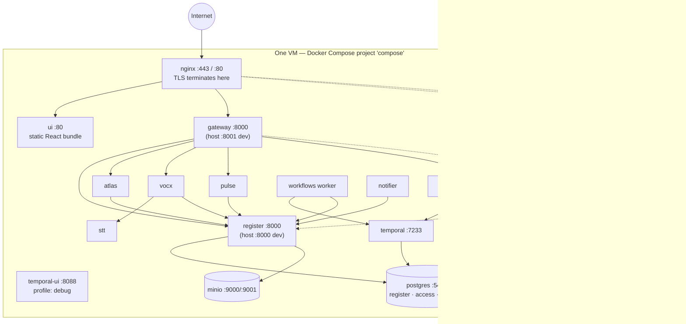
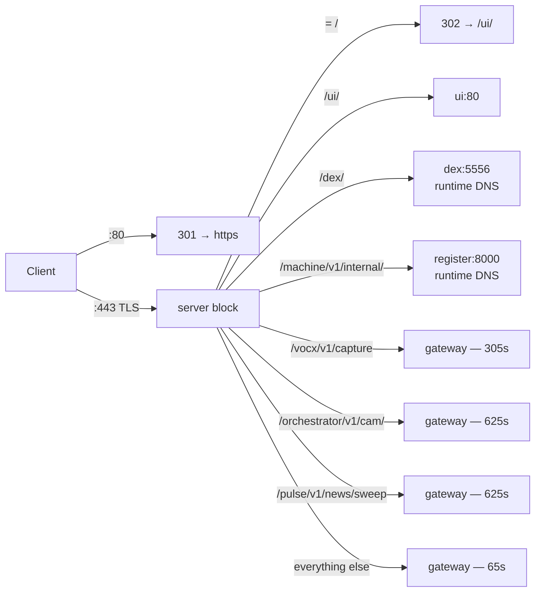
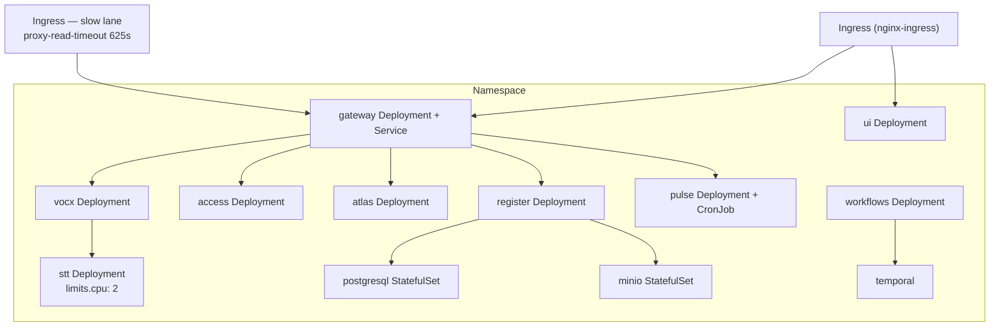

# 02 — Deployment Architecture

> **Audience:** whoever deploys, operates or sizes PRISM.
> **Companion docs:** [10 Upgrade & rollback](10-UPGRADE-ROLLBACK.md) · [09 Backup & restore](09-BACKUP-RESTORE.md) · [13 Operations](13-OPERATIONS.md) · [14 Configuration](14-CONFIGURATION.md)

PRISM ships in two shapes from the same source tree:

| Shape | Where it is used | Entry point |
| --- | --- | --- |
| **Docker Compose on one VM** | Evam production (EC2), demos, laptops, WSL | `deploy/compose/docker-compose.yml` |
| **Helm on Kubernetes** | Larger / multi-replica deployments | `deploy/helm/prism` |

Both build the *same images* from the *same Dockerfiles*. The difference is orchestration,
not code.

---

## 1. Compose topology (production today)



### The rule the diagram encodes

**Only three things are reachable from outside: nginx, and (in dev only) the debug ports.**
ATLAS, PULSE, VocX, the orchestrator, the UI container and STT publish **no host port at
all**. They are reachable only through the edge → gateway, and each accepts only the
scoped service key the gateway injects. There is no way to call ATLAS around the
authorization boundary.

### Published ports

| Port | Service | Present in production? |
| --- | --- | --- |
| 443 / 80 | nginx (`EDGE_HTTPS_PORT` / `EDGE_HTTP_PORT`) | **Yes — the only ports that matter** |
| 8443 / 8080 | nginx (fixed dev aliases) | Yes, harmless |
| 8000 | register | Dev convenience — close it in production |
| 8001 | gateway | Dev convenience |
| 8002 | access | Dev convenience |
| 5432 | postgres | Dev convenience — **close in production** |
| 9000 / 9001 | minio API / console | Dev convenience |
| 5556 | dex | Only with the `sso` profile |
| 8088 | temporal-ui | Only with the `debug` profile |

> **Hardening note.** The dev ports exist because one compose file serves laptops and
> production. On the production VM, either bind them to `127.0.0.1` or rely on the
> security group to expose only 443. Nothing in the platform needs them.

### Compose profiles

| Profile | Brings up | When |
| --- | --- | --- |
| *(none)* | The whole core stack | Always |
| `sso` | **dex** | Whenever OIDC login is required — i.e. every production run |
| `backup` | **pgbackup** (nightly `pg_dumpall`, 14-day retention) | Production |
| `debug` | **temporal-ui** | While investigating workflows |

Production runs `PRISM_PROFILES="sso backup"`, which is the default in
`deploy/prism-deploy.sh`.

### The production posture overlay

`deploy/compose/docker-compose.prod-posture.yml` is not a different stack — it turns on
the controls that default to *off* so a laptop run stays frictionless:

```bash
docker compose -f docker-compose.yml -f docker-compose.prod-posture.yml \
  --profile sso up -d --build
```

| Switch | Effect |
| --- | --- |
| `GATEWAY_REQUIRE_AUTH=true` + issuer | Anonymous refused. `X-User-Email` is no longer trusted; identity comes only from a verified bearer. |
| `GATEWAY_OIDC_ALLOWED_DOMAINS` | Only `evamfinance.com` identities may authenticate. Essential once a consumer IdP such as Google is accepted — a valid Google token proves the account is real, not that it belongs to Evam. |
| `REGISTER_ENFORCE_RBAC=true` | An operation with no user context is refused; a bare API key can no longer act. |
| `REGISTER_ENFORCE_RLS=true` | PostgreSQL row-level security applied and force-converged at startup. A query cannot leave its tenant even if application code forgets a filter. |
| `REGISTER_ONLINE_REVALIDATION=true` | Sensitive operations (delete/restore, assignments, governed imports, evidence break-glass) revalidate against Access *online*, so a revocation takes effect immediately rather than at signed-context expiry. Fails closed (503) if Access is down. |
| `ACCESS_AUTO_SEED=false` | A container start never writes to a non-empty identity database; it prints a drift report instead. |
| `orchestrator REQUIRE_AUTH` | An approver's identity is no longer taken on trust. |

> **The `--profile sso` flag is required, not optional.** Dex is profile-gated in the base
> file and an override *cannot* un-gate it — Compose filters profiled services out before
> merging. Without the flag you get `REQUIRE_AUTH` on with no issuer reachable, and every
> request 401s.

---

## 2. The edge (nginx)

`deploy/nginx/nginx.conf` is where TLS ends and where every timeout decision is made.



### Timeouts are per-path, and deliberately so

| Path | Read/send timeout | Why |
| --- | --- | --- |
| default | **65 s** | A slow Register call is a fault. It should fail fast. |
| `/vocx/v1/capture` | **305 s** | A clip is transcribed synchronously on CPU. Cut short, the user loses a recording they already made. |
| `/orchestrator/v1/cam/` | **625 s** | Generating an 11-section CAM memo legitimately takes 5–10 minutes. |
| `/pulse/v1/news/sweep` | **625 s** | An all-firms sweep across three sources at ~400 terms is minutes of real work. |

`client_max_body_size` is **64 m** — MIS spreadsheets and scanned financials.

### Two upstream styles, and the 502 they explain

```nginx
upstream gateway { server gateway:8000; keepalive 32; }   # resolved ONCE at startup
upstream ui      { server ui:80;        keepalive 8;  }

location /dex/ { resolver 127.0.0.11 valid=10s; set $dex_upstream http://dex:5556; ... }
```

A static `upstream` block resolves its DNS name **once, when nginx starts**. If `ui` or
`gateway` is later recreated, Docker gives it a new IP and nginx keeps dialling the old
one → **502 Bad Gateway** on a stack that is otherwise perfectly healthy.

This is a real failure that has happened in production here. Two mitigations are in place:

1. `deploy/prism-deploy.sh` calls `reload_edge()` after every swap (`nginx -s reload`,
   falling back to a container restart).
2. `/dex/` and `/machine/v1/internal/` use **request-time DNS** (`resolver 127.0.0.11`),
   so the edge starts even when those services are absent and never caches their address.

If you recreate `ui` or `gateway` by hand, run `docker compose exec nginx nginx -s reload`.

### Security headers set at the edge

`X-Content-Type-Options: nosniff`, `X-Frame-Options: DENY`, `Referrer-Policy: no-referrer`,
plus a per-request `X-Request-ID` echoed back for correlation. HSTS is deliberately **not**
set while the certificate is self-signed — enable it once a CA-issued pair is mounted.

Rate limiting: `limit_req zone=api` with per-path burst, and `limit_conn conn 50`.

---

## 3. Persistent state

| Volume | Contents | Loss means |
| --- | --- | --- |
| `pgdata` | The whole book — register, access **and** Temporal databases | Total data loss. Restore from `backups/`. |
| `miniodata` | Uploaded documents, CAM PDFs | Documents gone; database rows still reference them. |
| `pgbackups` | Nightly `pg_dumpall` archives, 14-day retention | Your recovery position. |
| `dexdata` | Dex's own storage | Re-seeded on next start. |
| `pulsedata` | PULSE working files | Rebuilt on next scan. |
| `deploy/vocx-secrets/` *(bind, on disk)* | Google OAuth client + per-user tokens | Users must re-authorise Google. **Never in git.** |
| `deploy/nginx/certs/` *(bind, on disk)* | TLS keypair | Edge will not start. |
| `deploy/compose/.env` *(bind, on disk)* | Every secret and tunable | Stack misconfigures. **Never in git.** |

> **The three paths that must never enter the repository or a delivery zip:**
> `deploy/compose/.env`, `deploy/vocx-secrets/`, `deploy/nginx/certs/`.
> `prism-deploy.sh` snapshots all three before an upgrade and restores them into the new
> tree — see [10 Upgrade & rollback](10-UPGRADE-ROLLBACK.md).

### One Postgres, three databases

```
postgres:16-alpine
├── register              ← the book
├── access                ← users, grants, matrix (created by initdb/01-create-access-db.sql)
├── temporal              ← workflow state
└── temporal_visibility   ← workflow search
```

One server, a database per concern — matching the Helm umbrella. This is why a
`pg_dumpall` is the correct backup unit: it captures all four.

---

## 4. Production filesystem layout

The deploy script expects this shape on the VM (Evam production: `/home/ubuntu/aug_11`):

```
$PRISM_ROOT/
├── prism/                      ← the LIVE tree compose runs from
│   └── deploy/
│       ├── compose/.env            (secret — survives every swap)
│       ├── vocx-secrets/           (secret — survives every swap)
│       └── nginx/certs/            (secret — survives every swap)
├── releases/                   ← previous trees, newest last
│   ├── prism-9bdda8b/
│   ├── prism-b423fa2/
│   └── .previous -> prism-9bdda8b   (the rollback target; never pruned)
├── backups/                    ← dumps + secret snapshots + deploy logs
│   ├── prism-20260819-041500.sql.gz
│   ├── secrets-20260819-041500.tar.gz
│   └── deploy-20260819-041500.log
├── prism-deploy.sh             ← lives OUTSIDE the tree it swaps
└── .prism-deploy.lock
```

The script must sit **outside** `prism/`, because a copy inside the release tree would be
replaced mid-run. `PRISM_ROOT` overrides the auto-detection.

---

## 5. Helm topology



Umbrella chart at `deploy/helm/prism`, with a subchart per service:
`access · atlas · gateway · minio · postgresql · pulse · register · stt · temporal · ui · vocx · workflows`.

### Two Ingresses, on purpose

ingress-nginx annotations are **per-Ingress, not per-path**. A single Ingress cannot give
`/vocx/v1/capture` a 625-second read timeout while keeping 65 s everywhere else. So the
gateway subchart renders a second Ingress —
`deploy/helm/prism/charts/gateway/templates/ingress-slow.yaml` — carrying
`proxy-read-timeout` / `proxy-send-timeout` = `slowTimeoutSeconds` for the paths listed in
`gateway.ingress.slowPaths` (`/vocx/v1/capture`, `/orchestrator/v1/cam`). The main Ingress
carries `proxy-body-size: 64m`.

> Set `slowPaths` from a **values file**, not `--set`. `--set "gateway.ingress.slowPaths=[]"`
> is mis-parsed by Helm's `--set` grammar; a values file behaves correctly.

### The one place compose and Helm genuinely differ

| | Compose | Helm |
| --- | --- | --- |
| `stt` CPU limit | **none** | `limits.cpu: 2` |
| Correct `STT_CPU_THREADS` | derive from `nproc` on the VM | `2` (matches the pod limit) |

Setting `STT_CPU_THREADS=2` on a compose box with more cores throttles transcription for
no reason. See [12 VocX & STT](12-VOCX-STT.md) §sizing.

---

## 6. Network policy and outbound access

| Direction | What needs it |
| --- | --- |
| Inbound 443 | Everything. The only port that must be open. |
| Outbound HTTPS | Dex → Google (if Google is the upstream IdP); PULSE → news sources; VocX → Google Drive/Docs/Calendar; notifier → SMTP. |
| Outbound SMTP (587/465) | The notifier, for digests and approval mails. |
| Internal only | Every service-to-service hop; all on the compose bridge network / cluster network. |

If the deployment sits behind an egress proxy, PULSE and the VocX Google integration are
the two features that will fail first, and both fail soft — the platform stays up.

---

## 7. Sizing guidance

| Component | Cost driver | Notes |
| --- | --- | --- |
| **stt** | CPU, heavily | The only genuinely CPU-hungry service. One transcription is serialised per process (ctranslate2 is not thread-safe on one model instance). |
| **register** | Modest CPU, DB connections | Scale with replicas; stateless. |
| **postgres** | RAM for cache, disk for the book + Temporal history | Temporal history grows faster than business data. |
| **gateway / atlas / pulse / vocx** | Small | Stateless, cheap to replicate. |
| **workflows worker** | Small, but must be running | A stopped worker silently stalls every in-flight process. |

Practical guidance for the single-VM deployment: 4 vCPU / 16 GB is comfortable for the
current desk. The binding constraint on concurrent voice captures is `nproc` versus
`STT_CPU_THREADS`, covered in [12](12-VOCX-STT.md).

---

## 8. Quick reference — bringing the stack up

```bash
# Local / demo — everything, dev posture
docker compose -f deploy/compose/docker-compose.yml up --build

# Production posture (the controls on)
docker compose -f deploy/compose/docker-compose.yml \
               -f deploy/compose/docker-compose.prod-posture.yml \
               --profile sso --profile backup up -d --build

# Just the core, no workflow plane
docker compose -f deploy/compose/docker-compose.yml up postgres minio register nginx

# Helm
helm upgrade --install prism deploy/helm/prism -n prism --create-namespace -f my-values.yaml
```

For a real production upgrade, do **not** run compose by hand — use
[`prism-deploy.sh upgrade`](10-UPGRADE-ROLLBACK.md), which backs up first, builds before it
disturbs anything, health-gates the result and rolls itself back on failure.
