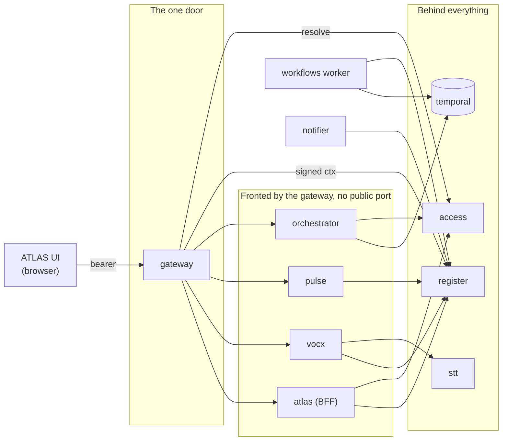
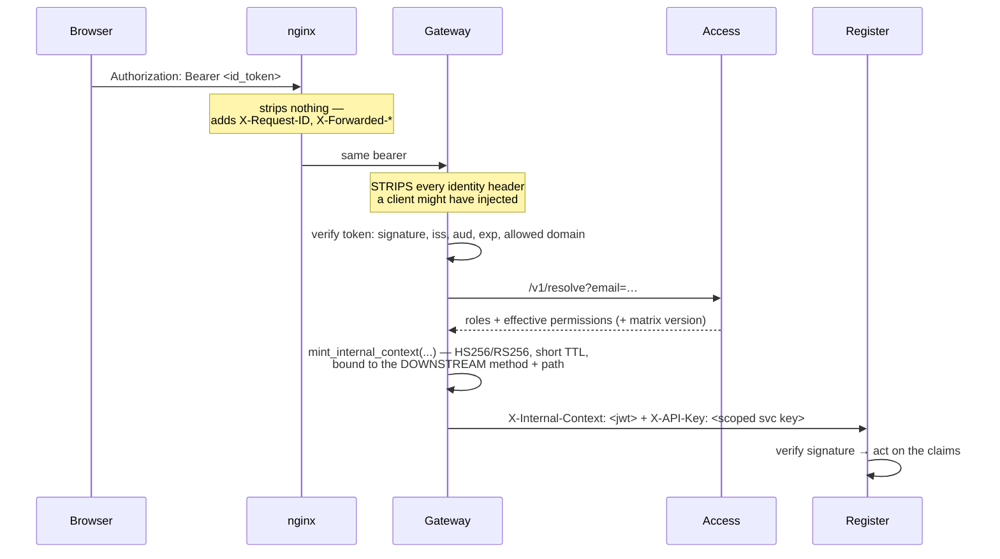
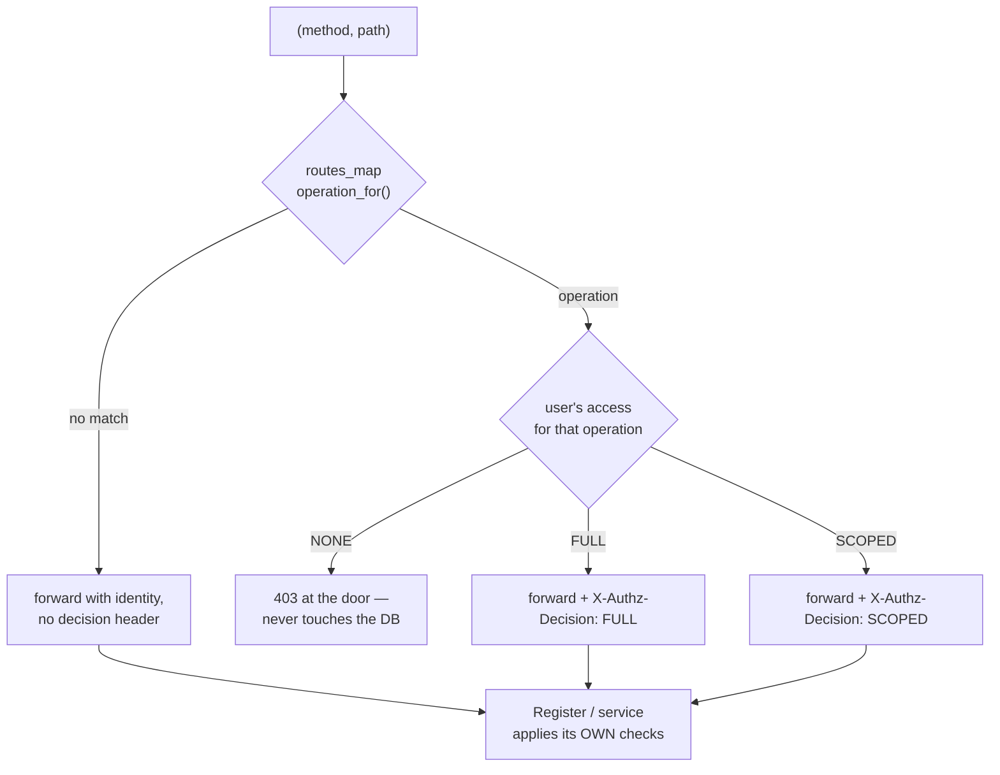

# 03 — Module Interaction

> **Audience:** engineers changing anything that crosses a service boundary; security reviewers.
> **Companion docs:** [01 Architecture](01-ARCHITECTURE.md) · [04 Running flows](04-RUNNING-FLOWS.md) · [07 RBAC](07-USER-MANAGEMENT-RBAC.md)

This document answers three questions precisely: **who calls whom**, **what identity
travels with the call**, and **what happens when the callee is down**.

---

## 1. The interaction map



Which credential each of those edges carries, and what happens when the callee is down, is
the table in §2 — the labels are left off here so the shape stays readable.

**There are no other edges.** In particular: the browser never talks to anything but the
gateway (and the static UI bundle); no service calls another service's *database*; and
nothing calls back into the gateway.

---

## 2. Call directory

| Caller | Callee | Transport | Identity carried | If callee is down |
| --- | --- | --- | --- | --- |
| Browser | gateway | HTTPS via nginx | OIDC bearer | UI shows an error; nothing is written |
| gateway | access | HTTP `/v1/resolve` | service key | **Cached grant is reused** (TTL); stale-cache fallback keeps the platform readable |
| gateway | register | HTTP | `X-Internal-Context` (signed) + scoped service key | 502 with a problem envelope |
| gateway | atlas / vocx / pulse / orchestrator / access | HTTP, prefix stripped | signed context + that service's own injected key | 502 |
| atlas | register | HTTP (register-client SDK) | its own service key + `X-Tenant`, `X-User-Email` | Dashboard call fails; nothing else affected |
| atlas | access | HTTP `/v1/resolve` | service key | Cached permissions; stale-cache fallback |
| vocx | stt | HTTP multipart (OpenAI-compatible) | `VOCX_STT_API_KEY` | Retries within a budget, then a 504 the UI explains |
| vocx | register | HTTP | `svc_vox` key + `X-On-Behalf-Of` | Capture is archived; the write is reported as failed |
| pulse | register | HTTP with `Idempotency-Key` | `svc_pulse` key | Scan reports failure; a re-run is safe |
| orchestrator | temporal | gRPC | — | Workflow start fails loudly |
| orchestrator | access | HTTP | service key | Fails **closed** for authority rechecks |
| workflows worker | register | HTTP (activities) | `svc_workflows` key | Temporal retries the activity with backoff |
| notifier | register | HTTP | service key | Outbox rows stay unsent; retried next tick |

---

## 3. How identity travels

This is the single most important thing to understand before changing anything at a
boundary.



### Headers the gateway strips from every inbound request

From `services/gateway/app/main.py`:

```python
_SKIP_REQUEST_HEADERS = {
    "host", "content-length", "connection", "keep-alive", "transfer-encoding",
    "upgrade", "expect",
    "x-authz-decision", "x-gateway-auth", "x-user-email", "x-user-id",
    "x-user-roles", "x-user-report-ids", "x-user-reports", "x-internal-context",
    "x-api-key",       # the client never presents a backend data-plane key
    "x-admin-key",     # injected by the gateway for a verified Admin only
    "x-on-behalf-of",  # a claim only a NAMED SERVICE may make
}
```

Each entry is a specific attack closed:

| Stripped header | What forwarding it would allow |
| --- | --- |
| `x-user-email`, `x-user-roles`, `x-user-id` | Impersonating anyone, including Admin |
| `x-authz-decision` | Declaring your own request FULL-authorised |
| `x-gateway-auth`, `x-internal-context` | Forging the trusted internal identity |
| `x-api-key` | Presenting a backend data-plane credential directly |
| `x-admin-key` | Reaching tenant administration without being Admin |
| `x-on-behalf-of` | Filing rows under a colleague's name from a browser |

> **If you add an identity- or authorization-bearing header anywhere, add it to this set
> in the same commit.** A header the gateway stamps but does not strip is a forgery
> channel.

### The signed internal context

`packages/evam-backend-core/evam_backend_core/internal_token.py`. It replaced plaintext
`X-User-*` headers plus a static shared secret, because:

- **Tamper-evident** — identity, roles *and* the effective grant are covered by the
  signature. A compromised downstream component cannot rewrite `X-User-Roles`.
- **Per-request and expiring** — a stolen token dies in `ttl` seconds; a static secret
  never does.
- **Single source of truth** — the token carries the *live* effective matrix with its
  version, so the Register enforces exactly what Access resolved, not a stale local copy.
- **Replay-bound** — minted against the *downstream* (prefix-stripped) method and path, so
  it cannot be replayed on a different route.

Two signing modes: **HS256** (shared secret; fine inside one trust boundary) and **RS256**
(gateway holds the private key, Register only the public one — use when the Register must
be provably unable to mint gateway tokens).

### Machine identity

Service-to-service calls that do *not* originate from a human use a **named** service API
key. `packages/evam-backend-core/evam_backend_core/service_policy.py` maps each name to an
explicit capability allowlist. `svc_pulse` gets exactly `{run_news_scan, edit_intel}`. This
is code, not configuration, so widening it is a reviewed change.

---

## 4. Routing: how one door fronts everything

`services/gateway/app/main.py::_route()`:

```python
prefixes = (
    ("/access",       settings.access_url,       settings.access_api_key),
    ("/atlas",        settings.atlas_url,        settings.atlas_api_key),
    ("/vocx",         settings.vocx_url,         settings.vocx_api_key),
    ("/pulse",        settings.pulse_url,        settings.pulse_api_key),
    ("/orchestrator", settings.orchestrator_url, settings.orchestrator_api_key),
)
# …anything else → the Register
```

Two properties worth knowing:

1. **The prefix is stripped.** VocX sees `/v1/capture`, not `/vocx/v1/capture`. This is
   why `routes_map.py` entries for fronted services *include* the prefix — the gate runs
   before the strip.
2. **An unconfigured prefix falls through to the Register.** A partial deployment still
   works, and nothing becomes reachable around the gateway.

### The edge gate is an accelerator, not the only gate



From the module docstring of `routes_map.py`: *"A route NOT in this map forwards with
identity headers but no decision; the Register then applies its own checks. Grow this map
as routes are classified — unmapped is safe (enforced downstream), mapped is fast
(rejected at the door)."*

`SCOPED` is not an answer, it is a question passed along: the Register decides which
*rows* this user may write, using the central scope evaluator in
`evam_backend_core/policy.py` against line assignments.

---

## 5. Timeouts must agree across the chain

A hop with a shorter budget than the hop below it turns a working request into a 504. The
three chains that matter:

### Voice capture

| Hop | Budget | Source |
| --- | --- | --- |
| Browser (axios) | 300 s | `CAPTURE_TIMEOUT_MS` in `services/atlas/ui/src/api/vocxClient.ts` |
| nginx `/vocx/v1/capture` | 305 s | `deploy/nginx/nginx.conf` |
| gateway slow path | 600 s | `_SLOW_PATHS` + `slow_upstream_timeout_s` |
| VocX → STT total budget | 240 s | `stt.api.budget_s` |

**Shortest wins, so the browser decides.** That ordering is intentional: the user's own
client gives up first, with a message it can explain, rather than the edge returning an
opaque 504.

### CAM generation and the PULSE sweep

| Hop | Budget |
| --- | --- |
| Browser | 620 s |
| nginx `/orchestrator/v1/cam/`, `/pulse/v1/news/sweep` | 625 s |
| gateway `_SLOW_PATHS` | 600 s |

### Everything else

65 s at the edge, 60 s at the gateway. A slow Register call is a fault and should fail
fast.

> **Rule:** if you add a legitimately slow endpoint, you must widen **three** places —
> nginx (`deploy/nginx/nginx.conf`), the gateway (`_SLOW_PATHS`), and the browser client —
> plus `gateway.ingress.slowPaths` for Helm. Widening one does nothing.

---

## 6. Failure behaviour, by design

| Dependency | Posture | Rationale |
| --- | --- | --- |
| Access down, **normal** requests | **Fail open on cache** — the last resolved grant is reused | A brief identity outage must not stop the desk reading its own book |
| Access down, **sensitive** operations (delete/restore, assignments, governed imports, evidence break-glass) with `REGISTER_ONLINE_REVALIDATION=true` | **Fail closed (503)** | A revocation must take effect immediately for actions that cannot be undone |
| Register down | Hard failure everywhere | It is the book; there is nothing sensible to serve |
| STT down / slow | Retry within a budget, then 504 with a plain-language message; **the audio is already archived** | The user must never lose a recording they made |
| Temporal down | Workflow starts fail loudly; in-flight workflows resume when it returns | Durable by construction |
| PULSE sources down | Scan reports partial failure; nothing written | Intel is advisory |
| Google Workspace down | VocX capture still completes; the Drive/Docs write is skipped | The register write is the part that matters |
| MinIO down | Document upload fails; metadata is not written either | No dangling rows |

---

## 7. Idempotency and duplicate suppression

| Path | Mechanism |
| --- | --- |
| PULSE intel writes | `Idempotency-Key: pulse:{tenant}:{entity}:{hash}` — a re-run never duplicates an alert |
| Workflow activities that write | Explicit `idempotency_key` argument on the activity, backed by the `idempotency_keys` table |
| Lead conversion | Transactional endpoint plus an idempotency key; a retry cannot create a second deal |
| VocX capture | `capture_id` stamped on the extraction and carried through |
| Register generally | `idempotency_keys` table; `POST` routes that matter accept the header |

> **Known gap:** `POST /v1/{subject}/{id}/interactions` is not idempotency-keyed. A retried
> interaction write can produce a duplicate timeline row. This has been observed as a
> *display* duplicate caused by a UI bug (since fixed), not by duplicated writes — but the
> gap in the API is real and worth closing.

---

## 8. Changing a boundary — a checklist

When you add or move an endpoint that crosses services:

- [ ] Does the gateway route it? (`_route` prefixes, or it falls through to the Register.)
- [ ] Should it be gated at the door? (Add to `routes_map.py` — unmapped is safe, mapped is fast.)
- [ ] Is it slow? (nginx + `_SLOW_PATHS` + browser client + `gateway.ingress.slowPaths`.)
- [ ] Does it introduce a new header carrying identity or authority? (Add to `_SKIP_REQUEST_HEADERS`.)
- [ ] Does a *machine* call it? (Add the capability to that principal in `service_policy.py`.)
- [ ] Is it a write that a retry could duplicate? (Take an `Idempotency-Key`.)
- [ ] What is the correct behaviour when the callee is down? (Fail open or closed — §6.)
- [ ] Does the UI need a new service module? (`services/atlas/ui/src/services/` — one per domain.)
