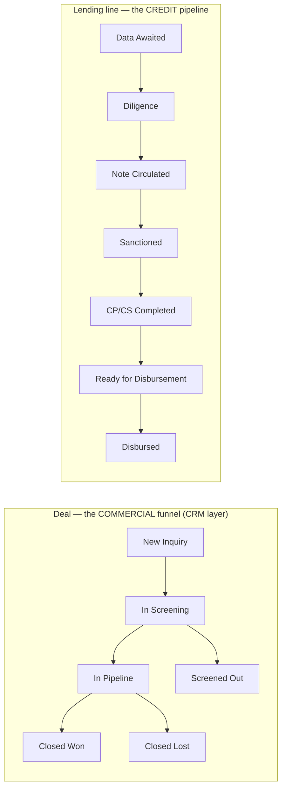
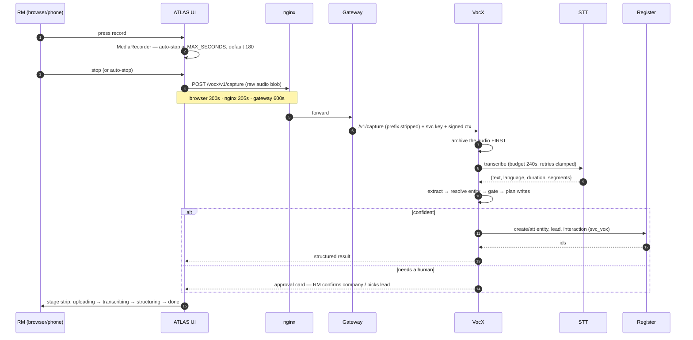
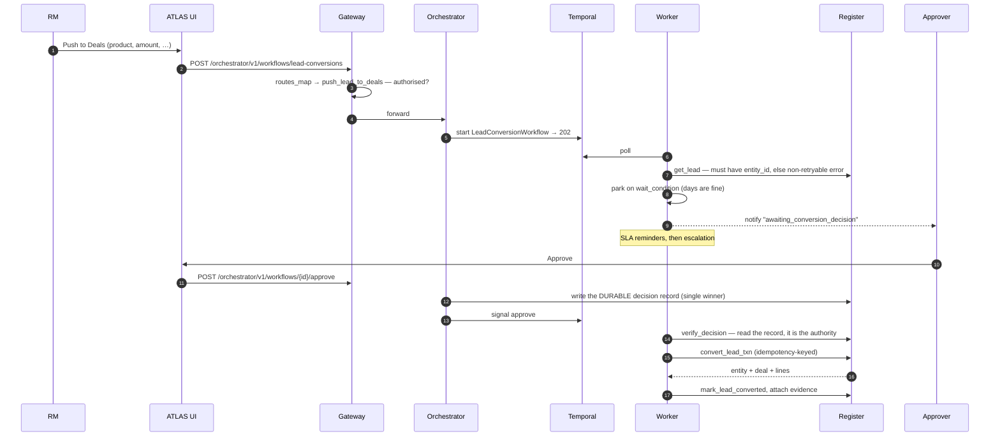
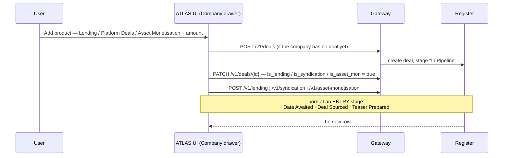
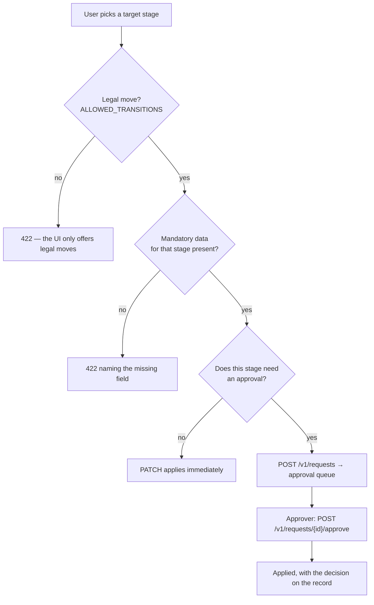
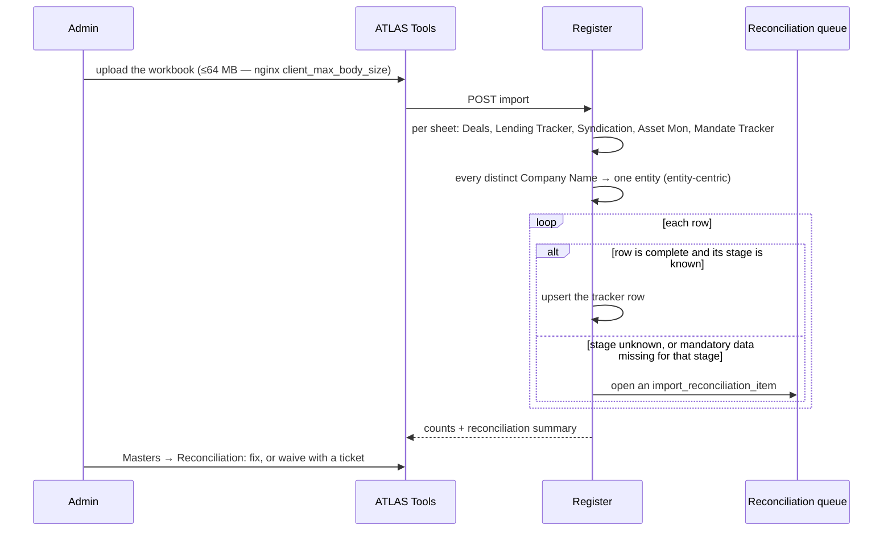
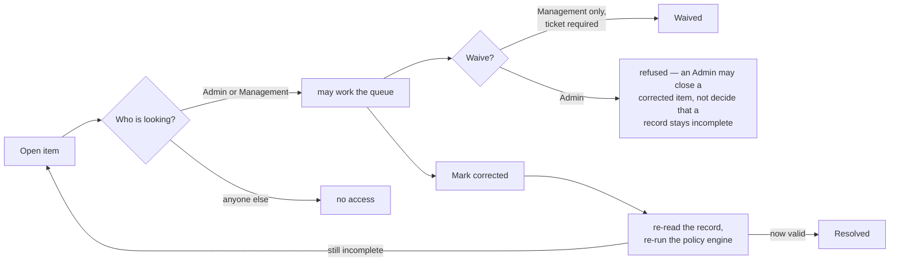
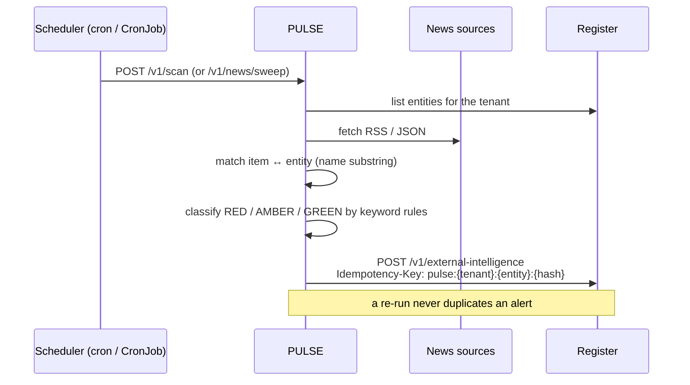
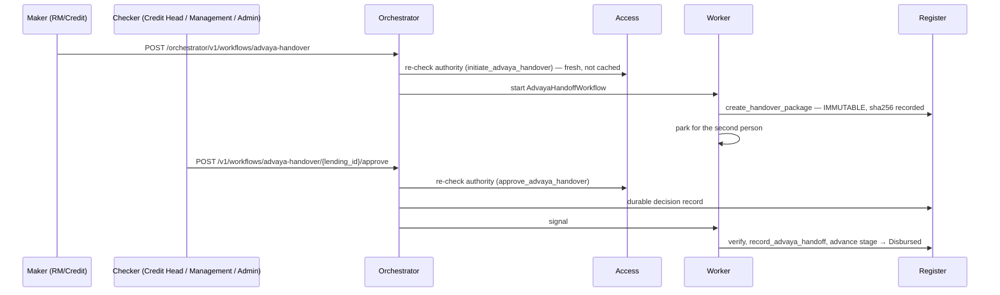
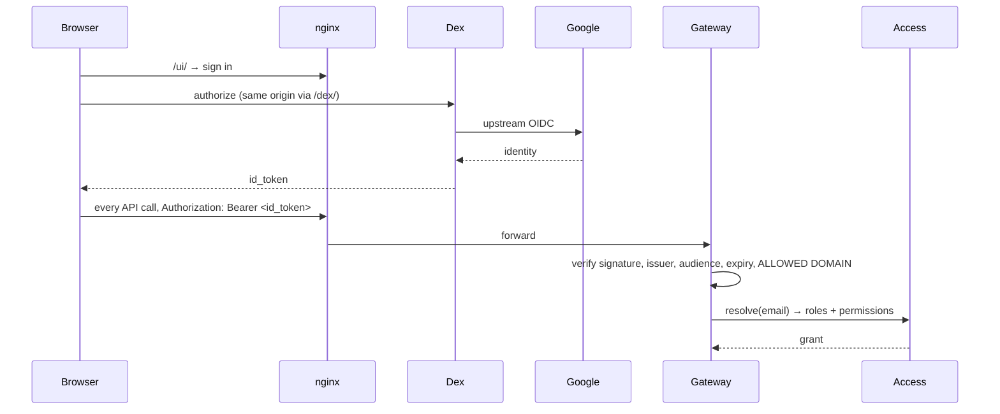

# 04 — Running Flows (end to end)

> **Audience:** anyone who needs to follow a real business event through the whole system.
> **Companion docs:** [05 Temporal](05-TEMPORAL-WORKFLOWS.md) · [11 ATLAS usage](11-ATLAS-USAGE.md) · [08 Register](08-REGISTER.md)

Each flow below is traced through actual code paths. Where a flow can fail, the failure is
named.

---

## 0. The lifecycle map everything else hangs off

PRISM models **two independent dimensions** and confusing them is the commonest
misunderstanding.



> *"A DEAL answers 'how good is our origination?' … while the Indian bank/NBFC CREDIT
> lifecycle ('where is this exposure in the approval chain?') lives on the LENDING TRACKER
> line."* — `evam_backend_core/lifecycle.py`

A deal-level credit stage is **deprecated**; historical values are parked in
`deals.credit_stage_legacy`.

### The three product pipelines

| Product | Ordered stages |
| --- | --- |
| **Lending** | Data Awaited → Diligence → Note Circulated → Sanctioned → CP/CS Completed → Ready for Disbursement → **Disbursed** *(terminal)* · plus Rejected / On Hold |
| **Syndication** | Deal Sourced → Docs Pending → IM in Prep → IM Circulated → Queries Received → IP Received → Sanctioned → Disbursed · plus On Hold / Withdrawn / Rejected / Dropped |
| **Asset Monetisation** | Teaser Prepared → Teaser Shared → In Discussion → NBO Received → BO Received → SPA / Documentation → **Closed** · plus Dropped |

**Syndication has no `Diligence` stage.** Lending does. This trips people up when mapping
imported spreadsheets.

### Three rules the register enforces on every stage move

1. **Vocabulary is closed.** A lifecycle field may hold only a value from `STAGE_VOCAB`.
   Free text is rejected (422) on every interactive write path.
2. **Birth states are restricted** (`INITIAL_STATUS`). A lending line may be born only at
   `Data Awaited` or `Diligence`; a syndication mandate only at `Deal Sourced`,
   `Docs Pending` or `IM in Prep`. Later stages must be *stepped* to.
3. **Moves follow the graph** (`ALLOWED_TRANSITIONS`). Forward one step, back one step for
   rework, On Hold and resume, or to a terminal. Anything else is 422. Converting a Lead is
   deliberately absent — it must go through `/convert`.

Plus mandatory data per stage: e.g. Lending at `Disbursed` or `Ready for Disbursement`
requires `proposed_disbursement_amount` **and** `proposed_disbursement_date`.

---

## 1. Voice capture → a record on the book (VocX)

The flow that makes PRISM different from a spreadsheet. An RM finishes a site visit,
presses record, and speaks for two minutes.



### The pipeline inside VocX

`services/vocx/app/vocx/core/pipeline.py`:

```
1) extract   — transcript → structured fields (company, discussion points, follow-ups)
2) resolve   — EntityResolver matches the company against the register's entities
3) gate      — decide: auto-write, or raise an approval card?
4) plan      — the exact writes that would be made
5) execute   — only when the gate says auto_write
```

The capture-side facts (`language`, `gps_lat`, `gps_lng`, `location`) ride on `_meta` into
the interaction's structured columns. Per the code comment they are **"never trusted for
routing — only recorded."**

### Timeouts, and what the user sees

| Hop | Budget |
| --- | --- |
| Browser (`CAPTURE_TIMEOUT_MS`) | 300 s ← **shortest, so it decides** |
| nginx `/vocx/v1/capture` | 305 s |
| gateway slow path | 600 s |
| VocX → STT total budget | 240 s |

The recording length cap is configurable: `VITE_VOCX_MAX_SECONDS` (build-time, via
`deploy/ui-image/Dockerfile`), clamped to 30–600 s, default **180**. At the cap the
recorder auto-stops and **keeps the clip so far** — nothing is discarded.

### Failure modes and what happens

| Failure | Behaviour |
| --- | --- |
| STT slower than the budget | `SttTimeoutError` → VocX answers `504 {"ok": false, error, ref}`; the UI says *"VocX did not answer in time. The recording is safe — try again in a moment."* |
| STT briefly unreachable | Retried with backoff *within* the budget; the first attempt is always made even if the budget is nearly gone (`MIN_ATTEMPT_S = 15`) |
| Company not recognised | Approval card — the RM confirms the company or selects an existing lead |
| Company is genuinely new | An entity **and** a lead are created. Three approvals of a new company legitimately create three leads — that is not a bug |
| Register write refused | The audio is already archived; the failure is reported, and the capture can be re-committed |

> **Known behaviour worth flagging:** a VocX-created lead is assigned to the *capturer*,
> not to the company's BD owner. If the desk wants owner-based assignment, that is a
> deliberate change to the assignment activity.

---

## 2. Lead → Deal ("Push to Deals")

The human-in-the-loop pattern, and the reason Temporal is in the stack.



### Points that matter

- **A lead with no `entity_id` fails immediately and non-retryably** — link it to a company
  first. This is a deliberate hard stop, not a retry loop.
- **The signal is not the authority.** `verify_decision` reads the persisted single-winner
  decision record and derives the outcome, the approver identity and the note from *it*.
  A direct Temporal signal with no record is discarded and the run keeps waiting.
- **Two approvers who both click approve** produce one recorded decision, naming the first.
- **The conversion is one transaction** (`convert_lead_txn`), idempotency-keyed, so a retry
  cannot create a second deal.
- **Run control:** cancel / return-for-information / resubmit are also signals verified
  against durable records. A resubmit restarts the SLA clock fully.

---

## 3. Adding a product line to an existing company

Simpler, synchronous, and the path most desks use daily.



Implementation: `services/atlas/ui/src/services/dealsService.ts::addProduct`. Amount is
mandatory and has **no default** — v2.1 removed the default of 2 to prevent silent data
pollution.

Note the shape: **the UI always creates a deal**, so a line added through ATLAS always has
`deal_id`. Lines *without* a deal exist and are legal (`deal_id` is nullable) — they come
from the spreadsheet import (§5).

---

## 4. Stage change and approval



The stage-change request lane is **per desk**: an AM RM sees no lending request button, and
the Target select is populated from the legal-moves map rather than the full vocabulary.

Senior-locked moves (`ROW_LOCKS`) — notably `Ready for Disbursement → Disbursed` — are
normally reached only through the maker-checker handover approval, not by a direct PATCH.

---

## 5. Spreadsheet import (MIS / ledger)



### Things to know before importing

- **Distinct company names become entities**, and RMs/analysts become people, banks become
  counterparties. A name typo creates a second company.
- **A row whose stage is unknown, or which lacks that stage's mandatory data, is
  quarantined** into the reconciliation queue rather than written wrong.
- **`deal_id` comes from a lookup that can miss.** `from_xlsx.py` sets
  `"deal_id": deal_by_entity.get(entity)` — `None` when the company appears on a tracker
  sheet but not on the Deals sheet. Those rows are valid and now display correctly; they
  are simply mandates with no deal record.
- **Import is upsert-capable** (`--no-truncate` merges rather than replaces).

See [`docs/MIS_IMPORT.md`](../MIS_IMPORT.md) for the sheet-by-sheet column contract.

---

## 6. Reconciliation queue



The asymmetry is deliberate: **working the queue and waiving are different authorities.**
A waiver leaves an incomplete record on the book, so it needs Management *and* a ticket
reference. Resolution is not a status flip — the record is re-read and the policy engine
re-run, so "corrected" cannot be claimed for a record that is still wrong.

UI: `services/atlas/ui/src/pages/Masters/ReconciliationPage.tsx`.
Backend: `services/register/app/api/reconciliation.py`.

---

## 7. News intelligence (PULSE)



PULSE has **no clock of its own** — scheduling is external (cron, a Kubernetes CronJob, or
a Temporal schedule). That keeps replicas identical and restarts boring. Matching is
deliberately explainable: a human can always answer *"why did this alert fire?"*, which
matters when an alert can stop a disbursement.

The all-firms sweep is slow by nature (hundreds of terms across three sources) and has its
own 625 s lane at the edge.

---

## 8. Disbursement and handover to Advaya

The most tightly governed path in the platform — it authorises money movement.



Two-person maker-checker, authority re-checked *online* at both ends, and the package is
immutable with its hash on the record. `attach_advaya_evidence` is deliberately **not** in
`svc_workflows`' default grants — the acknowledgement path is only executable under an
enabled Advaya integration, so a fabricated acknowledgement cannot be made in a normal
deployment.

---

## 9. Sign-in



Dex is proxied **same-origin** at `/dex/` so the SPA's token call needs no CORS
configuration. `GATEWAY_OIDC_ALLOWED_DOMAINS` matters once a consumer IdP such as Google is
accepted: *a valid Google token proves the account is real, not that it belongs to Evam.*

---

## 10. Where each flow can silently stall

A short triage table for the flows above.

| Flow | Silent-stall cause | Check |
| --- | --- | --- |
| Any workflow | worker not running | `docker compose ps workflows` |
| Approvals | signal delivered without a durable decision record | Register `workflow_decisions` table |
| VocX | STT saturated by concurrent captures | `docker compose logs stt`; `nproc` vs `STT_CPU_THREADS` |
| PULSE | nothing schedules the scan | the external cron / CronJob |
| Notifications | notifier not draining the outbox | `notification_deliveries` rows piling up |
| Everything, after a redeploy | nginx holding a stale upstream IP → 502 | `docker compose exec nginx nginx -s reload` |
