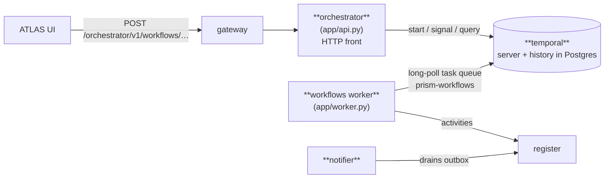
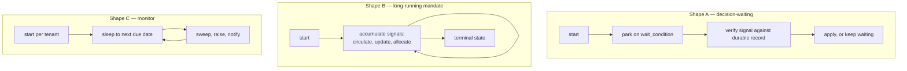
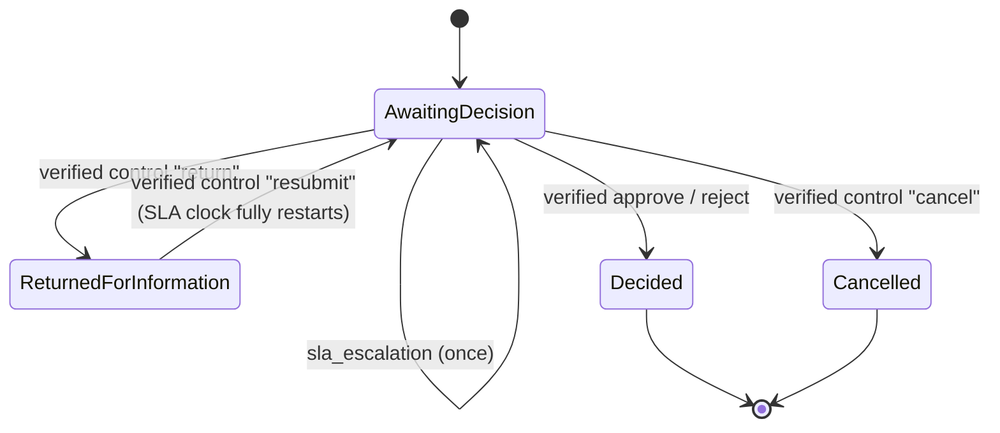

# 05 — Temporal Workflows

> **Audience:** engineers adding or debugging a business process; anyone asked "why is this approval stuck?"
> **Companion docs:** [04 Running flows](04-RUNNING-FLOWS.md) · [03 Module interaction](03-MODULE-INTERACTION.md) · [13 Operations](13-OPERATIONS.md)
> **Code:** `services/workflows/app/` — `workflows.py` (the processes), `activities.py` (every Register call), `api.py` (the orchestrator HTTP front), `worker.py`, `codec.py`, `types.py`

---

## 1. Why Temporal is here at all

A lead conversion is: read the lead → wait, possibly for **days**, for a human decision →
create an entity, a deal and one or more product lines → mark the lead converted → file
evidence. If that runs as a chain of HTTP calls and the process dies after step 3, you have
a deal with no lines and a lead that still says "open". Nobody knows. There is no retry.

Temporal makes the *process itself* durable. The workflow's state survives a worker
restart, a redeploy, and a five-day wait for a Credit Committee. A failed step is retried
with backoff; a step that cannot be retried triggers explicit compensation.

**The rule this creates:** any multi-step change with a human decision point, or with more
than one write that must not be left half-done, belongs in `workflows.py` — not in a
FastAPI route.

---

## 2. The moving parts



| Component | Process | Responsibility |
| --- | --- | --- |
| **orchestrator** | `python -m app.api` | HTTP: start workflows, deliver signals, answer queries. Verifies the caller. Never contains business logic. |
| **worker** | `python -m app.worker` | Long-polls the `prism-workflows` task queue and *executes* workflow and activity code. |
| **temporal** | container | Durable event history, timers, task queues. Stores state in its own Postgres databases. |
| **notifier** | container | Drains the Register's notification outbox to email. |

> **If the worker is stopped, nothing errors — everything silently stalls.** Workflow
> starts still get accepted (202) and sit in the queue. This is the single most common
> "the approval disappeared" cause. Check `docker compose ps workflows` first.

Task queue: `prism-workflows` (`WORKFLOWS_TASK_QUEUE`). Namespace: `default`.

---

## 3. The workflow catalogue

Fourteen workflows are registered on the worker.

| Workflow | Started by | Waits for | What it produces |
| --- | --- | --- | --- |
| `IngestInteractionWorkflow` | reference/demo | — | The minimal example. Read this one first. |
| `VoxTouchpointWorkflow` | VocX capture | *(optionally)* company confirmation / lead selection | Entity + lead + interaction from a field touchpoint |
| `LeadConversionWorkflow` | "Push to Deals" | **human approve/reject** | Entity → deal → product lines, lead marked converted |
| `LeadQualificationWorkflow` | ATLAS | qualification review | The first, cheapest gate — no deal work begins on an unqualified lead |
| `DealStructuringWorkflow` | ATLAS | **Credit Committee decision** | A lending facility structured to the sanction milestone |
| `SyndicationMandateWorkflow` | ATLAS | IM circulation, lender responses, allocation | The syndication mandate's whole journey |
| `AssetMonetisationWorkflow` | ATLAS | teaser circulation, buyer updates, NDA, offers | The AM mandate's journey to Closed or Lost |
| `DocumentCollectionWorkflow` | ATLAS | each document received | Evidence that the mandatory documentation set is complete |
| `CpcsChecklistWorkflow` | ATLAS | **checker approval** | The authoritative CP/CS checklist (maker-checker) |
| `AdvayaHandoffWorkflow` | ATLAS | **second-person approval** | An immutable handover package to the loan-management system |
| `SanctionExpiryMonitorWorkflow` | on sanction | timers | The clock on a perishable sanction validity window |
| `DocumentExpiryMonitorWorkflow` | per tenant | timers | Tenant-wide document-expiry sweep |
| `CovenantMonitorWorkflow` | per tenant | timers | Tenant-wide covenant clock (generation, overdue, waiver expiry) |
| `EwsCaseWorkflow` | on EWS case | timers, SLA | One early-warning case's clock, auto-escalating on a lapsed SLA |

Three shapes recur:



---

## 4. The two ideas that make this trustworthy

### 4.1 A signal is untrusted until verified against a durable record

This is the pattern to internalise. A Temporal signal can, in principle, be delivered by
anyone who can reach the Temporal server. So **the signal is only a nudge; the authority is
a row in the Register.**

```python
# activities.py — verify_decision
"""Validate a lead-conversion approve/reject signal BEFORE the workflow lets it count …
Fail-closed against a DIRECT Temporal signal — for BOTH approve and reject.

The single-winner decision resource is the SOLE authority. The worker always derives the
outcome, the approver identity AND the note from the persisted record — NEVER from the
signal's (latest-caller) token or note."""
```

Consequences that matter operationally:

- **Two approvers, same outcome → the run and the database name the same (first) approver
  and note.** No race on who "won".
- **A spoofed or premature signal is discarded and the run keeps waiting** — it can neither
  finalise a fake rejection nor deny service to a pending approval.
- **A transient Register failure raises rather than returning "invalid"**, so Temporal
  retries *without consuming the decision*. Distinguishing a genuine `NotFound` from a
  502 is the whole point.

The same pattern governs **run control** (cancel / return-for-information / resubmit) via
`verify_control`, and committee, syndication, AM and facility decisions via their own
`verify_*` activities.

In dev (`WORKFLOWS_INTERNAL_SIGNING_SECRET` empty) verification is bypassed and the signal
is trusted — which is exactly why that variable must be set in production.

### 4.2 The worker re-mints the human's identity

By default a worker's writes would land as its own service key. Instead:

```python
# config.py
internal_signing_secret: str = ""
# "When set, the worker RE-MINTS a short-lived signed context from the caller identity
#  carried in the workflow input, so the Register authorizes writes as the HUMAN (with
#  their scope) — not the worker's service key."
```

So a SCOPED user's workflow cannot write rows that user could not write directly. The
workflow is not an authority escalation.

---

## 5. Retry policy — two tiers, deliberately

`services/workflows/app/workflows.py`:

```python
_RETRY = RetryPolicy(               # _IO — ordinary reads/writes
    initial_interval=timedelta(seconds=1),
    backoff_coefficient=2.0,
    maximum_interval=timedelta(seconds=30),
    non_retryable_error_types=_DETERMINISTIC,
    # 8 attempts ≈ a 90-second window (1+2+4+8+16+30+30), enough to ride out a DB restart
    # or connection-pool flush; 5 gave up after ~15s, which turned every brief Register
    # blip into a dead run. All _IO activities are idempotency-keyed, so the extra
    # attempts are replay-safe.
)

_DURABLE = RetryPolicy(             # _DURABLE_IO — writes that MUST land
    initial_interval=timedelta(seconds=1),
    backoff_coefficient=2.0,
    maximum_interval=timedelta(minutes=5),
    non_retryable_error_types=_DETERMINISTIC,
    maximum_attempts=0,             # unlimited — reconcile until the write lands
)
```

> *"'Unbounded' means unbounded for OUTAGES, not for refusals. A 422/404/403/409 is the
> Register's final answer and will read the same on attempt 10,000, so it must break the
> loop rather than be reconciled against."*

This is the distinction to preserve when you add an activity: **a refusal is deterministic
and must be non-retryable; an outage is transient and must be retried.** Getting it
backwards either spins forever on a validation error or gives up on a DB restart.

---

## 6. SLA, reminders and escalation

Every decision-waiting workflow shares `_Foundation`:

```python
class _Foundation:
    """The shared run-control + SLA state machine for a decision-waiting workflow.

    * controls          — the UNTRUSTED queue of (action, control_ref) signals
    * business_status   — AwaitingDecision / ReturnedForInformation / Cancelled / …
    * SLA bookkeeping   — reminder count + escalation flag; the clock RESETS on resubmit.
    """
```

The wait loop sleeps until **whichever comes first**: the decision deadline, the next SLA
reminder, or the escalation point (`next_wakeup`). Escalation outranks a reminder
(`due_sla_event`).



A resubmit resets `start`, `reminders_sent` and `escalated` — the decision window restarts
*fully*, which is the honest behaviour when new information has been supplied.

### Very long waits

```python
if workflow.info().is_continue_as_new_suggested():
    workflow.continue_as_new(dataclasses.replace(
        inp, resumed_elapsed_hours=waited.total_seconds() / 3600))
```

When the event history grows too large, the run continues as new — carrying the elapsed
window across the reset so the SLA clock is not silently rewound.

---

## 7. Payload encryption

Workflow inputs, activity arguments and results all live in Temporal's history, **outside**
the Register's PostgreSQL and its row-level security. With
`WORKFLOWS_PAYLOAD_ENCRYPTION_KEY` set, every payload is encrypted client-side (worker
*and* orchestrator) with AES-256-GCM before it reaches the Temporal server.

| | Without the key | With the key |
| --- | --- | --- |
| Temporal history | plaintext business data | ciphertext |
| Temporal Web UI | readable payloads | opaque blobs (unless a codec server is configured) |
| Posture | dev | production |

Key format: base64url, exactly 32 bytes decoded. Rotation is supported via a 4-byte key-id
prefix — pass previous keys as `retired` so old history still decodes.

---

## 8. The orchestrator HTTP surface

`services/workflows/app/api.py`. Reached through the gateway at `/orchestrator/...`.

### Starting a workflow

```
POST /v1/workflows/vox-touchpoints        → 202
POST /v1/workflows/lead-conversions       → 202
POST /v1/workflows/lead-qualifications    → 202
POST /v1/workflows/deal-structurings      → 202
POST /v1/workflows/document-collections   → 202
POST /v1/workflows/syndications           → 202
POST /v1/workflows/asset-monetisations    → 202
POST /v1/workflows/cpcs-checklists        → 202
POST /v1/workflows/advaya-handover        → 202
POST /v1/workflows/ews-cases              → 202
```

### Delivering a decision

```
POST /v1/workflows/{id}/approve
POST /v1/workflows/{id}/reject
POST /v1/workflows/{id}/committee-decision
POST /v1/workflows/{id}/syndication-decision
POST /v1/workflows/{id}/am-decision
POST /v1/workflows/{id}/control                 (cancel / return / resubmit)
POST /v1/workflows/advaya-handover/{lending_id}/approve|reject|return
POST /v1/workflows/cpcs-checklists/{id}/approve|reject|return
POST /v1/workflows/cam-reports/{id}/approve|reject|return
```

### Feeding a long-running mandate

```
POST /v1/workflows/{id}/circulate-im       POST /v1/workflows/{id}/circulate-teaser
POST /v1/workflows/{id}/lender-update      POST /v1/workflows/{id}/buyer-update
POST /v1/workflows/{id}/allocate           POST /v1/workflows/{id}/record-nda
POST /v1/workflows/{id}/revise-credit-note POST /v1/workflows/{id}/record-offer
POST /v1/workflows/{id}/document-received
POST /v1/workflows/{id}/confirm-company    POST /v1/workflows/{id}/select-lead
```

### Reading state

```
GET  /v1/workflows                  list runs
GET  /v1/workflows/{id}             one run (queries the workflow)
GET  /v1/workflows/pending          everything awaiting a human — the approval queue
GET  /v1/workflows/actions          which actions this user may take
```

`GET /v1/workflows/pending` is what the ATLAS "Today" approval queue reads. The parked run
*is* the work item — there is no separate task table to drift out of sync.

### Authorization on this surface

Two independent checks:

1. **At the gateway** — `routes_map.py` maps each start/decision route to the RBAC
   operation the resulting change requires, so an unauthorised user is stopped *before* a
   durable workflow starts.
2. **At the orchestrator** — it re-checks fresh committee / handover authority against
   Access before it persists or signals. Defence in depth; the Advaya handover and CP/CS
   approval both do this because they authorise money movement.

---

## 9. Adding a workflow — the checklist

- [ ] Define the input/result dataclasses in `app/types.py`.
- [ ] Write the workflow in `app/workflows.py`; inherit `_Foundation` if it waits for a human.
- [ ] Every side effect goes through an `@activity.defn` in `app/activities.py` — **never** call the Register from workflow code directly.
- [ ] Choose `_IO` (bounded) or `_DURABLE_IO` (unbounded) per activity, and make sure a *refusal* is in `_DETERMINISTIC`.
- [ ] Every write activity takes an `idempotency_key`. Retries are guaranteed, so replay-safety is not optional.
- [ ] Register the class in `app/worker.py`'s import list **and** the `Worker(...)` construction.
- [ ] Add the start / signal routes to `app/api.py`.
- [ ] Add those routes to `services/gateway/app/routes_map.py` with the operation they exercise.
- [ ] Add any new Register capability to `svc_workflows` in `evam_backend_core/service_policy.py`.
- [ ] If a human decides something, persist a **durable decision record** and verify signals against it. Do not trust the signal.

---

## 10. Debugging

| Symptom | First checks |
| --- | --- |
| "I approved it and nothing happened" | Is the worker running? `docker compose ps workflows`. Then: was a durable decision record written? An unverified signal is *silently discarded by design*. |
| Workflow start returns 202 but nothing runs | Worker down, or listening on a different task queue than the orchestrator started on. |
| Activity retrying forever | It is on `_DURABLE_IO` and the Register is returning a *refusal* that is not in `_DETERMINISTIC`. Fix the classification. |
| Temporal UI shows opaque payloads | Expected — `WORKFLOWS_PAYLOAD_ENCRYPTION_KEY` is set. Not a fault. |
| Run vanished after days | It hit `continue_as_new`; look for the newer run id with the same workflow id. |

**Temporal Web UI:** `docker compose --profile debug up -d temporal-ui`, then
`http://localhost:8088`. It is profile-gated because it is a read window into every
payload — bring it up to investigate, take it down afterwards.

**Worker metrics:** set `WORKFLOWS_METRICS_BIND_ADDRESS` to expose a Prometheus endpoint
with task/activity latencies, failures and slot usage.
