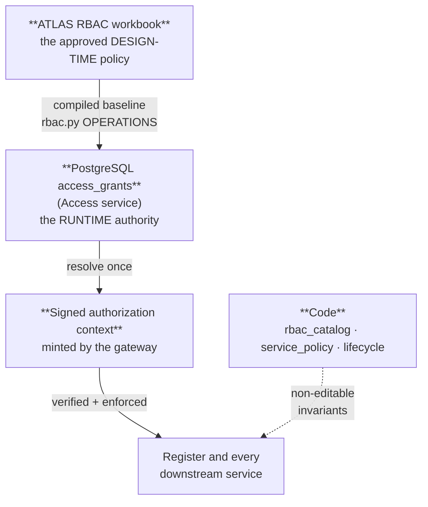
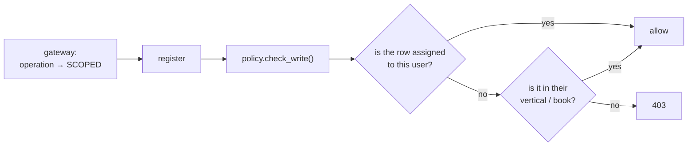
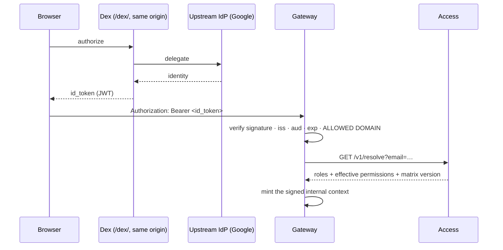

# 07 — User Management & RBAC

> **Audience:** admins provisioning people; engineers touching authorization; security reviewers.
> **Companion docs:** [03 Module interaction](03-MODULE-INTERACTION.md) · [11 ATLAS usage](11-ATLAS-USAGE.md) · [08 Register](08-REGISTER.md)
> **Policy version:** `POLICY_VERSION = "3.8"` (`packages/evam-backend-core/evam_backend_core/rbac_catalog.py`)

---

## 1. The authority model — read this first

Three things decide what a person can do, and they are deliberately different things:



| Layer | What it is | Changed by |
| --- | --- | --- |
| **Compiled baseline** (`rbac.py`) | The approved workbook, transcribed into code | A reviewed pull request |
| **`access_grants` in PostgreSQL** | What actually decides a live request | Admin, through the governed API |
| **Signed context** | The per-request carrier of the resolved answer | Nothing — it is derived |
| **Code invariants** | Role catalogue, service-principal grants, lifecycle graph | A reviewed pull request only |

> `rbac.py`'s own header says it plainly: *"This file NEVER decides a production user
> request."* It exists to **seed** the runtime matrix, to produce a **drift report**
> (`python -m app.seed --check`), and for dev evaluation where no signed context exists.

This split is what lets an Admin widen someone's access at 4pm without a deploy, while
keeping the things that must not be editable at runtime — which roles exist, what a machine
may do, which stage moves are legal — in reviewed code.

---

## 2. The twelve roles

`packages/evam-backend-core/evam_backend_core/rbac_catalog.py`:

```python
ROLES: dict[str, dict[str, str]] = {
    "Admin":          {"tier": "Leadership", "vertical": "System"},
    "Management":     {"tier": "Leadership", "vertical": "All"},
    "BD Head":        {"tier": "Head",       "vertical": "BD"},
    "Credit Head":    {"tier": "Head",       "vertical": "Credit"},
    "Syn Head":       {"tier": "Head",       "vertical": "Syndication"},
    "AM Head":        {"tier": "Head",       "vertical": "Asset Monetisation"},
    "BDRM":           {"tier": "IC",         "vertical": "BD"},
    "Deal Analyst":   {"tier": "IC",         "vertical": "Credit"},
    "Syn RM":         {"tier": "IC",         "vertical": "Syndication"},
    "AM RM":          {"tier": "IC",         "vertical": "Asset Monetisation"},
    "LMS Operator":   {"tier": "IC",         "vertical": "Servicing"},
    "LMS Management": {"tier": "Head",       "vertical": "Servicing"},
}
```

Three tiers (Leadership / Head / IC) across six verticals. The LMS pair is a **maker–checker
pair**: the Operator posts routine ledger and covenant events; LMS Management holds the
hard-to-reverse verbs — booking approval, classification, closure, waiver authority.

### Role stacking

A person may hold several roles. Access levels are an `IntEnum` ordered so that
**stacking is `max()` across held roles**:

```python
class Access(IntEnum):
    NONE = 0
    READ = 1
    SCOPED = 2   # read-write on rows in the user's own scope
    FULL = 3     # read + write, no scope restriction within the module
    APPROVE = 4  # not a data write — an approve/reject decision
```

### Renamed roles never strip access

```python
ROLE_ALIASES: dict[str, str] = {"LMS Authorizer": "LMS Management"}
```

A role string stored before a rename — an `access_grants` row, a signed context minted by an
older service, a decision's recorded roles — still resolves to the current role. New grants
must use the current name.

### Rank, as the UI uses it

The front-end mirror (`services/atlas/ui/src/auth/rbac.ts`) carries a numeric rank used for
"is this a Head or above" decisions:

| Rank | Roles |
| --- | --- |
| 100 | Admin |
| 90 | Management |
| 70 | BD Head, Credit Head, Syn Head, AM Head, **LMS Management** |
| 40 | BDRM, Deal Analyst, Syn RM, AM RM, **LMS Operator** |

---

## 3. Two matrices: views and operations

### The view matrix — "may this user open this screen?"

`services/atlas/ui/src/auth/rbac.ts`, and enforced server-side by Access.

```
        Adm Mgmt BDH BDRM CrH  DA  SynH SynRM AMH AMRM LMSO LMSM
today    F   F    S   S    S   S    S    S     S   S    S    S
dash     F   F    S   N    S   N    S    N     S   N    N    N
leads    F   F    F   S    N   N    N    N     N   N    N    N
deals    F   F    F   S    S   S    S    S     S   S    R    R
lend     F   F    R   R    F   S    R    R     R   R    R    R
syn      F   F    R   R    R   S    F    S     R   R    N    N
am       F   F    R   R    R   S    R    R     F   S    N    N
fi       F   F    R   R    R   R    F    R     R   R    N    N
clients  F   F    R   N    R   N    R    N     R   N    R    R
emp      F   F    R   R    R   R    R    R     R   R    R    R
audit    F   N    N   N    N   N    N    N     N   N    N    N
activity F   N    N   N    N   N    N    N     N   N    N    N
tools    F   R    R   R    R   R    R    R     R   R    R    R
```

`F` full · `S` scoped · `R` read-only · `N` module hidden.

Two rows worth noticing:

- **`leads` is `N` for everyone below BD.** A Deal Analyst has no leads access at all. This
  produces a legitimate-looking oddity: *a Deal Analyst can own a lead they cannot see.*
  It is the matrix working as designed, not a bug.
- **`audit` and `activity` are Admin-only.** Not even Management.

The guiding principle from the workbook: **"Write follows the vertical, read follows the
deal."**

### The operations matrix — "may this user perform this verb?"

`packages/evam-backend-core/evam_backend_core/rbac.py::OPERATIONS`, ~70 operations. A
sample of the shape:

```python
OPERATIONS: dict[str, dict[str, Access]] = {
    "sign_in":            _row("F F F F F F F F F F F F"),
    "add_lead":           _row("F F F F - - - - - - - -"),
    "edit_lead":          _row("F F F S - - - - - - - -"),
    "push_lead_to_deals": _row("F F F S - - - - - - - -"),
    "edit_client":        _row("F F F S - - S S S S - -"),
    ...
}
```

The full operation list, grouped:

| Group | Operations |
| --- | --- |
| Views | `today` `dashboard` `leads` `deals` `lending` `syndication` `asset_monetisation` `fi_master` `clients` `employees` `audit` `activity_log` `tools` |
| Leads | `add_lead` `edit_lead` `reassign_lead` `push_lead_to_deals` |
| Clients | `create_client` `edit_client` `edit_contract` `edit_intel` `edit_monitoring` `add_company_note` |
| Deals | `edit_deal_profile` `edit_deal_ownership` `add_product_line` |
| Lending | `assign_analyst_lending` `change_lending_stage` `edit_lending_line` |
| Syndication | `assign_analyst_syndication` `assign_syn_rm` `edit_syndication_line` `add_lender_to_mandate` `log_chase` `log_response` `advance_matrix_cell` |
| Asset Mon | `assign_analyst_am` `assign_am_rm` `edit_am_record` |
| Shared | `log_interaction` `edit_fi_record` `edit_employee` `add_employee_assign_role` `manage_counterparty` `manage_checklist` `upload_remove_documents` `snooze_today_item` `export_csv` |
| Governance | `request_stage_change` `approve_stage_change` `delete_row` `backup_restore` |
| Evidence | `attach_committee_evidence` `attach_sanction_evidence` `attach_document_evidence` `attach_qualification_evidence` `attach_syndication_evidence` `attach_am_evidence` `attach_advaya_evidence` |
| Handover / CP-CS | `prepare_cpcs_checklist` `approve_cpcs_checklist` `initiate_advaya_handover` `record_handover_package` `approve_advaya_handover` |
| Servicing | `record_ledger_entry` `authorize_loan_account` `manage_covenants` `manage_ews` |
| Intel | `run_news_scan` |

---

## 4. What `SCOPED` actually means

`FULL` and `NONE` are self-explanatory. `SCOPED` is the interesting one: **read-write on
rows in the user's own scope** — their book, their vertical, or rows explicitly assigned to
them.

`SCOPED` is *not* resolved at the gateway. The gateway forwards
`X-Authz-Decision: SCOPED` and the **Register** decides which rows qualify, using the
central scope evaluator in `packages/evam-backend-core/evam_backend_core/policy.py` against
`line_assignments`.



There is exactly one implementation of this. If you find scope logic re-derived in a
service, that is a bug — it will drift.

---

## 5. The policy engine — three rules beyond RBAC

`policy.py` layers **business-lifecycle** rules on top of role permissions. Having the right
role is necessary, not sufficient.

| Rule | Meaning | Example |
| --- | --- | --- |
| **Transitions** | Which stage moves are legal (`ALLOWED_TRANSITIONS`) | `IM in Prep → IM Circulated` yes; `IM in Prep → Sanctioned` 422 |
| **Mandatory fields for a stage** (`MANDATORY_FOR_STAGE`) | A row may not enter a stage until that stage's required fields are present | Lending at `Disbursed` or `Ready for Disbursement` requires `proposed_disbursement_amount` **and** `proposed_disbursement_date` |
| **Role/stage field locks** (`FIELD_LOCKS`, `ROW_LOCKS`) | At a given stage, a field may be edited only by listed roles | A sanctioned amount is frozen except for Admin/Management |
| **Evidence gates** (`EVIDENCE_FOR_STAGE`) | Some stages require workflow-generated evidence on file | Committee outcome, document completeness, CP/CS |

Plus the entry rules: **vocabulary is closed** (`STAGE_VOCAB` — free text is rejected) and
**birth states are restricted** (`INITIAL_STATUS`).

---

## 6. The Access service

`services/access/` — the only service besides the Register that owns data.

### Tables

| Table | Contents |
| --- | --- |
| `tenants` | Tenant registry |
| `users` | People: email, name, active flag |
| `user_roles` | Which roles a person holds |
| `access_grants` | **The runtime authority** — the live matrix cells |
| `matrix_versions` | Version stamp for the effective matrix |
| `access_audit` | Every change to the above |

### API

| Endpoint | Purpose |
| --- | --- |
| `POST /v1/users` | Create a user |
| `GET /v1/users` · `GET /v1/users/{id}` | List / read |
| `PATCH /v1/users/{id}` | Update (name, active) |
| `POST /v1/users/{id}/roles` | **Grant a role** |
| `DELETE /v1/users/{id}/roles/{role}` | **Revoke a role** |
| `GET /v1/access` | The live matrix |
| `PATCH /v1/access` | Edit a matrix cell (governed, audited) |
| `GET /v1/access/drift` | Live matrix vs the compiled baseline |
| `GET /v1/access/version` | Effective matrix version |
| `GET /v1/resolve` | **What the gateway calls** — roles + effective permissions for an email |
| `GET /v1/me` | The caller's own resolved access |

Reached through the gateway at `/access/...`, so the browser never holds Access's key.

### Seeding and drift

```bash
# Report only — compare the live matrix against the approved baseline. Writes nothing.
docker compose exec access python -m app.seed --check

# Apply: insert MISSING baseline cells, provenance-tagged. Never overwrites a runtime override.
docker compose exec access python -m app.seed
```

In production posture `ACCESS_AUTO_SEED=false`: a container start **never** writes to a
non-empty identity database — it prints the drift report instead. The one exception is a
completely empty database, where first boot bootstraps tenant + matrix + admin user so a
fresh stack is usable rather than bricked.

---

## 7. Identity: sign-in and OIDC



**PRISM stores no passwords.** Dex is a dev IdP — for a real deployment point the issuer at
Entra ID, Okta or Keycloak and delete the `dex` service; nothing else changes.

### `GATEWAY_OIDC_ALLOWED_DOMAINS` is not optional with a consumer IdP

From `docker-compose.prod-posture.yml`:

> *"Empty = no restriction, which is fine while Dex is the only issuer (it holds just your
> own accounts) but MUST be set once a consumer IdP such as Google is accepted — a valid
> Google token proves the account is real, not that it belongs to Evam."*

Evam production sets `evamfinance.com`.

### A verified token is not a grant

Authentication and authorization are separate. A person with a valid `@evamfinance.com`
token but no roles in `access_grants` can sign in and see nothing. Provisioning is a
deliberate second step.

---

## 8. Provisioning a person — the runbook

### Through ATLAS (normal path)

1. Sign in as **Admin**.
2. **Masters → Employees → Add / Edit**.
3. Set the person's email (must match their IdP identity exactly) and select one or more
   roles from the multi-select.
4. Save. The UI calls `accessService.setRoles(...)`, which is
   `POST /access/v1/users/{id}/roles` and `DELETE .../roles/{role}` under the covers.
5. The person signs out and in, or waits for the permission cache TTL (30 s by default).

### If a role change appears not to take

This has happened, and the causes are worth listing:

| Cause | Symptom | Fix |
| --- | --- | --- |
| The employee row was not backed by an Access user | Save appears to succeed, nothing changes | Fixed in `employeesService.ts` — a role change that does not apply now **throws** rather than silently returning |
| The role list in the dialog was hardcoded and stale | A valid role is missing from the dropdown | Fixed — the dialog now imports `ROLES` from `auth/rbac.ts` |
| Permission cache | Change is correct but not visible yet | Wait the TTL, or `POST /atlas/cache/invalidate` |
| Email mismatch with the IdP | The person signs in as a *different* identity with no grants | Correct the email on the user record |

> The general lesson, and a rule for this codebase: **a save path must never `return`
> silently when it cannot do what was asked.** Report the failure.

### Through the API

```bash
# Create the user
curl -X POST https://<host>/access/v1/users \
  -H "Authorization: Bearer $TOKEN" -H 'Content-Type: application/json' \
  -d '{"email":"someone@evamfinance.com","full_name":"Someone"}'

# Grant a role
curl -X POST https://<host>/access/v1/users/$USER_ID/roles \
  -H "Authorization: Bearer $TOKEN" -H 'Content-Type: application/json' \
  -d '{"role":"Management"}'

# Revoke
curl -X DELETE https://<host>/access/v1/users/$USER_ID/roles/BDRM \
  -H "Authorization: Bearer $TOKEN"
```

### Deactivating someone

Set the user inactive (`PATCH /v1/users/{id}`) **and** revoke their IdP account. With
`REGISTER_ONLINE_REVALIDATION=true`, sensitive operations revalidate against Access online,
so the revocation bites immediately for deletes, assignments, governed imports and evidence
break-glass. Ordinary reads may still work until the signed context expires (seconds to
minutes) and the permission cache turns over.

---

## 9. Machine identities

Humans are not the only callers. Service principals are defined in **code**
(`service_policy.py`), least-privilege, and widened only by pull request:

| Principal | May do |
| --- | --- |
| `svc_pulse` | `run_news_scan`, `edit_intel` |
| `svc_vox` | `create_client`, `add_lead`, `edit_lead`, `log_interaction`, `add_company_note`, `add_employee_assign_role` |
| `svc_workflows` | the above plus `push_lead_to_deals`, `add_product_line`, the evidence-attachment verbs, `prepare_cpcs_checklist`, `approve_cpcs_checklist`, `record_handover_package`, `approve_advaya_handover`, `manage_covenants`, `manage_ews` |

`attach_advaya_evidence` is deliberately **absent** from `svc_workflows` — it is granted
only under an enabled Advaya integration (default off), so the dormant acknowledgement path
is not executable in a normal deployment. That is a fabricated-acknowledgement defence, and
it should stay that way.

A generic (unnamed) API key keeps legacy behaviour governed by `enforce_rbac`; in
production posture `REGISTER_ENFORCE_RBAC=true` means a bare key can no longer act at all.

---

## 10. Tenant isolation

Two independent mechanisms, both required:

1. **Application scoping** — every query carries the tenant, resolved from `X-Tenant` or the
   signed context.
2. **PostgreSQL row-level security** — with `REGISTER_ENFORCE_RLS=true`, RLS policies are
   applied *and force-converged at startup*. A query cannot leave its tenant even if
   application code forgets a filter.

RLS is **fail-closed**: if the policy cannot be established, the service refuses to serve
rather than serving everything.

---

## 11. Auditing

| Question | Where |
| --- | --- |
| Who changed a role or a matrix cell? | `access_audit` (Access service) |
| Who changed a business record? | The Register's audit trail; ATLAS **Activity** and **Audit** tabs (Admin-only) |
| Who approved a workflow decision? | `workflow_decisions` — the single-winner durable record, naming the decider, their roles and the note |
| Under which policy version was a decision made? | `policy_version` claim, stamped into every signed context and on seeds and drift reports |

That last one is the point of `POLICY_VERSION`: an authorization decision can always answer
*"under which policy?"*

---

## 12. Changing authorization — a checklist

- [ ] Is this a **runtime** grant (a person's roles, a matrix cell)? → Admin does it through Access. No deploy.
- [ ] Is this a **new role** or a **new operation**? → `rbac_catalog.py` / `rbac.py`, plus the UI mirror in `auth/rbac.ts`, plus a seed + drift check.
- [ ] Does a **machine** need it? → `service_policy.py`, reviewed.
- [ ] Is it a **route** that should be gated at the door? → `services/gateway/app/routes_map.py`.
- [ ] Is it a **lifecycle** rule (legal moves, mandatory fields, locks)? → `lifecycle.py` / `policy.py`, not RBAC.
- [ ] Did you bump `POLICY_VERSION` if the compiled baseline changed?
- [ ] Does the front-end mirror still match? The UI copy in `auth/rbac.ts` is a *mirror*, not the authority — but a drifted mirror shows people buttons that will 403.
