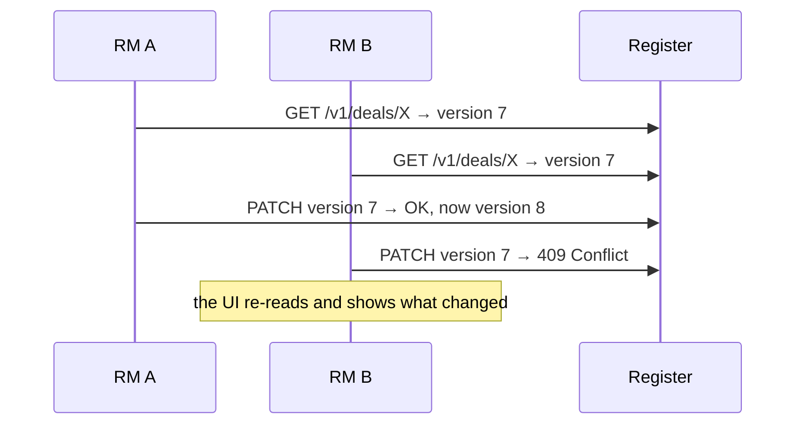
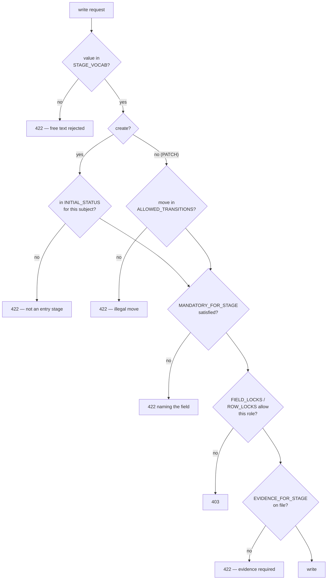
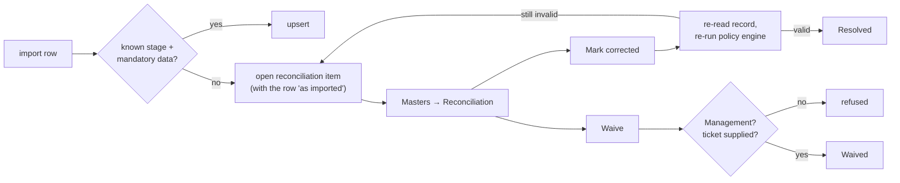
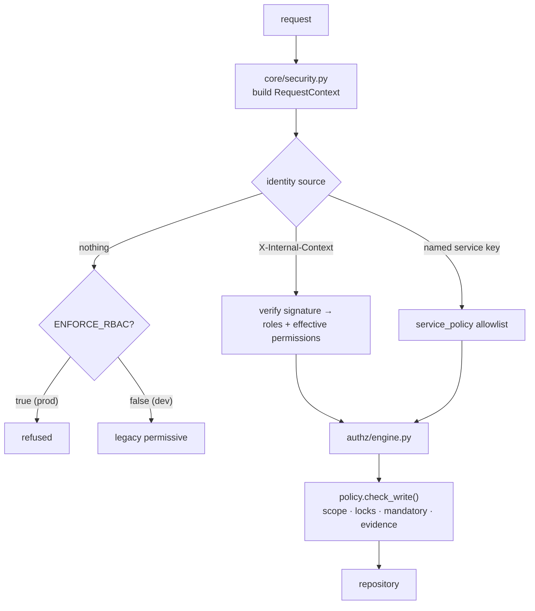

# 08 — The Register (the book of record)

> **Audience:** every backend engineer. This is the service you will spend most of your time in.
> **Companion docs:** [15 Data model](15-DATA-MODEL.md) · [04 Running flows](04-RUNNING-FLOWS.md) · [07 RBAC](07-USER-MANAGEMENT-RBAC.md)
> **Code:** `services/register/`

---

## 1. What the Register is, and what it refuses to be

The Register is **the only service that owns business data**. Every other service in PRISM
is stateless and reaches the data through this API. That single fact buys three things:

- A bug in the dashboard, the news radar, VocX or a workflow **cannot corrupt the book.**
- There is exactly one place where tenancy, concurrency, audit and lifecycle rules are
  enforced — so they cannot drift between services.
- Backup and restore have one subject.

What it deliberately is *not*: it holds no business logic that belongs to a process. A
multi-step change with a human decision point lives in a Temporal workflow
([05](05-TEMPORAL-WORKFLOWS.md)), and the Register provides the transactional primitives
that workflow calls.

---

## 2. Layout

```
services/register/app/
├── api/            34 routers — the REST surface
├── authz/          the engine that applies RBAC + policy to a request
├── core/           config, security/RequestContext, pagination, router, people, reconciliation
├── db/             session, RLS application
├── models/         20 modules → ~43 tables
├── repositories/   CRUDRepository + per-domain repositories
├── schemas/        Pydantic create/update/read per resource
├── seed/           reference data, atlas_data.json, MIS xlsx importer, ledger round-trip
└── storage/        MinIO / object storage
```

---

## 3. The generic CRUD router — read this before adding a resource

`app/api/crud_router.py` builds an identical, well-tested surface for every table:

```
POST   /                 create  (idempotent via Idempotency-Key)
GET    /                 list    (search, keyset pagination, whitelisted filters)
GET    /{id}             read one
PATCH  /{id}             partial update (optimistic concurrency)
DELETE /{id}             soft delete   (optimistic concurrency)
POST   /{id}/restore     undo a soft delete
```

> *"Doing this once means the concurrency, tenancy, auditing and error semantics are
> identical and correct across all 18 tables rather than copy-pasted 18 times."*

A resource is declared as a `ResourceSpec`, not written by hand:

```python
ResourceSpec(
    name="entity", prefix="/v1/entities", tags=["Entities"],
    repo=CRUDRepository(Entity,
                        searchable=["legal_name", "code", "display_name", "cin"],
                        filterable=["sector", "lens", "register_status", "entity_type",
                                    "state", "promoter_group_code", "code"]),
    create_schema=s.EntityCreate, update_schema=s.EntityUpdate, read_schema=s.EntityRead,
    filterable=[...],
    subject_type="Entity",       # what the policy engine keys lifecycle rules on
    view_name="clients",         # which view-matrix row governs read access
    pre_delete=_entity_pre_delete,
)
```

| Spec field | What it controls |
| --- | --- |
| `subject_type` | The key into `STAGE_VOCAB` / `MANDATORY_FOR_STAGE` / `FIELD_LOCKS`. **Must match the API subject string** — a mismatch silently disables every lifecycle rule for that resource. |
| `view_name` | Which row of the view matrix governs read access |
| `write_operation` | Which operation governs writes (defaults per resource) |
| `company_scoped`, `parent_scope` | How scoping is derived for SCOPED users |
| `pre_write`, `pre_delete` | Domain hooks (e.g. one-person-one-mailbox on `Person`) |
| `include_create/update/delete` | Turn off a verb for a read-only projection |

> **The `subject_type` warning is not theoretical.** From `policy.py`: *"A key that does not
> match the API subject silently disables every mandatory/lock rule for that resource, so
> these MUST stay in lock-step with the resource registry."* Integration tests PATCH the
> real `/v1/lending` and `/v1/syndication` routes precisely to guard this.

### Resources built from the factory

`/v1/entities` · `/v1/people` · `/v1/counterparties` · `/v1/leads` · `/v1/deals` ·
`/v1/lending` · `/v1/syndication` · `/v1/syndication-lenders` · `/v1/asset-monetisation` ·
`/v1/financials` · `/v1/contracts-assets` · `/v1/interactions` ·
`/v1/external-intelligence` · `/v1/monitoring` · `/v1/documents` · `/v1/document-checklist`

---

## 4. The custom routers

Anything that is not plain CRUD gets its own module in `app/api/`.

| Router | Surface | Why it is not CRUD |
| --- | --- | --- |
| `rbac.py` | `/v1/assignments` · `/v1/requests` · `/v1/requests/{id}/approve` · `/v1/leads/{id}/convert` · `/v1/authz/check` | Assignment and approval are authority decisions; conversion is transactional |
| `reconciliation.py` | `/v1/reconciliation` | Import quarantine queue — see §8 |
| `imports.py` | `/v1/import/atlas-xlsx` | Spreadsheet ingest |
| `export.py`, `export_ledger.py` | `/v1/export/{json,excel,counts}` · `/v1/export/ledger-xlsx` | Scoped bulk read |
| `custom.py` | `/v1/audit` · `/v1/entities/{id}/dossier` · `/v1/documents/upload` · `/v1/ref` | Composed reads and binary upload |
| `closure.py` | `/v1/deals/{id}/close` · `/v1/deals/{id}/open-items` | Closure has preconditions |
| `lms.py` | `/v1/lending/{id}/loan-account` (+ entries, conditions, accrue, interest-preview) | Loan servicing ledger |
| `tranches.py` | `/v1/lending/{id}/tranches` · `/v1/bookings/pending` | Drawdown booking |
| `sanction.py` | `/v1/internal/cam-reports…` | The CAM workbench |
| `covenants.py` | `/v1/covenants` · `/v1/monitoring/{id}/result` · `/waive` | Covenant lifecycle |
| `ews.py` | `/v1/ews-cases` (+ assign, escalate, close, note) | Early-warning cases |
| `cpcs.py` | `/v1/internal/cpcs-checklists…` | CP/CS maker-checker |
| `handover.py` | `/v1/internal/handover-packages…` | Advaya handover, immutable package |
| `advaya.py` | `/v1/internal/advaya-handoffs` | The boundary record |
| `decisions.py` | `/v1/internal/decisions…` | Durable single-winner workflow decisions |
| `notifications.py`, `notify.py` | `/v1/notifications` · `/v1/internal/notifications/deliveries…` | Outbox + delivery claim |
| `documents_lifecycle.py` | `/v1/documents/{id}/{validate,reject,replace}` · expiry sweep | Document states |
| `evidence.py` | `/v1/evidence` | Governance evidence with break-glass |
| `calendar.py` | `/v1/calendar-events` (+ complete, cancel) | Scheduling |
| `followups.py` | `/v1/internal/follow-ups` | Derived work items |
| `series.py` | `/v1/internal/number-series` | Tracker numbering |
| `people_sync.py` | `/v1/internal/people/{sync-access,handover}` | Directory ↔ Access reconciliation |
| `tenants.py` | `/v1/tenants` | Tenant administration (admin credential on **every** method, reads included) |
| `entity_rules.py`, `people_rules.py` | — | Pre-write/pre-delete domain hooks |

### The `/v1/internal/` convention

Routes under `/v1/internal/` are the **machine lane**: they enforce *named service
principals* rather than human RBAC. They are reachable from outside only through the edge's
dedicated location:

```nginx
location /machine/v1/internal/ {
    resolver 127.0.0.11 valid=10s;
    rewrite ^/machine(/v1/internal/.*)$ $1 break;
    proxy_pass $register_upstream;
}
```

So Advaya's boundary calls, cron sweeps and the notifier reach the internal API through the
same one door — nothing needs a direct service port. Human CRUD stays gateway-only.

---

## 5. Concurrency: optimistic, and visible

Every mutable row carries a `version`. `PATCH` and `DELETE` require the caller's version to
match; a mismatch is a **409**, not a silent overwrite.



Two RMs editing the same deal produce a visible conflict, never a lost update. See
`docs/adr/0003-optimistic-concurrency.md`.

## 6. Soft delete

`DELETE` is a soft delete; `POST /{id}/restore` undoes it. `delete_row` is an **Admin-only**
operation in the matrix, and the gateway gates it at the door:

```python
("DELETE", r"^/v1/(?!users|assignments|requests)[^/]+/[^/]+$", "delete_row"),
```

Restores and deletes are among the operations that revalidate against Access *online* in
production posture — a revoked Admin cannot delete on a stale signed context.

## 7. Idempotency

`POST` accepts `Idempotency-Key`. The key and a hash of the payload are recorded in
`idempotency_keys`; a replay returns the original result rather than creating a second row.
This is what makes Temporal's unlimited-retry policy safe.

> **Known gap:** `POST /v1/{subject}/{id}/interactions` does not take an idempotency key. A
> retried interaction write can duplicate a timeline row.

---

## 8. Lifecycle enforcement

The Register is where the lifecycle rules from
`packages/evam-backend-core/evam_backend_core/lifecycle.py` and `policy.py` actually bite.



### The vocabularies

| Subject | Field | Values |
| --- | --- | --- |
| Lead | `status` | Active · On Hold · Dropped · Converted |
| Deal | `stage` | New Inquiry · In Screening · In Pipeline · On Hold · Screened Out · Closed Won · Closed Lost · Dropped |
| Lending | `stage` | Data Awaited · Diligence · Note Circulated · Sanctioned · CP/CS Completed · Ready for Disbursement · Disbursed · Rejected · On Hold |
| Syndication | `status` | Deal Sourced · Docs Pending · IM in Prep · IM Circulated · Queries Received · IP Received · Sanctioned · Disbursed · On Hold · Withdrawn · Rejected · Dropped |
| AssetMonetisation | `status` | Teaser Prepared · Teaser Shared · In Discussion · NBO Received · BO Received · SPA / Documentation · Closed · Dropped |

**Syndication has no `Diligence`.** Lending does. The two vocabularies are separate on
purpose and mapping a spreadsheet across them is a common source of import errors.

### Entry states

| Subject | May be born at |
| --- | --- |
| Lead | Active · On Hold · Dropped |
| Deal | New Inquiry · In Screening · In Pipeline · On Hold |
| Lending | Data Awaited · Diligence |
| Syndication | Deal Sourced · Docs Pending · IM in Prep |
| AssetMonetisation | Teaser Prepared · Teaser Shared · In Discussion |

Every later stage — including working states like `Note Circulated` or `IM Circulated`, and
every terminal — must be *stepped* to, or arrive through a separately-audited import.

### Reference vocabularies are data, not code

`app/seed/refdata.py` seeds `ref_values`, served from `GET /v1/ref`. Front-ends fetch the
dropdowns rather than shipping their own copy, **so a vocabulary change is a data change,
not a browser redeploy**. Person names are never seeded — `/v1/ref` merges the live people
directory in.

A register-side test cross-checks `refdata.py` against `lifecycle.py` so the dropdown and
the enforcement cannot drift.

---

## 9. Import reconciliation

An import must never write a row it knows to be wrong, and must never silently drop it. So
a row whose stage is unknown, or which lacks that stage's mandatory data, becomes an
`import_reconciliation_items` row.



The authority split is deliberate and enforced in `api/reconciliation.py`:

- **Working the queue** — Admin **or** Management.
- **Waiving** — Management **only**, and a **ticket reference is required**.

An Admin may close a corrected item but may not decide that a record stays incomplete. And
"corrected" is not a status flip: resolution re-reads the record and re-runs the policy
engine, so it cannot be claimed for a row that is still wrong.

---

## 10. Tenancy and RLS

Every row carries `tenant_id`. Two independent mechanisms enforce isolation:

1. Application scoping from `X-Tenant` or the signed context.
2. **PostgreSQL row-level security**, applied and force-converged at startup when
   `REGISTER_ENFORCE_RLS=true` (`app/db/apply_rls.py`).

RLS is **fail-closed**. If the policy cannot be established the service refuses to serve.
The point is that a forgotten `WHERE` clause in application code is contained by the
database rather than becoming a cross-tenant leak.

---

## 11. Authorization inside the Register



The Register **never re-derives** authorization from a static copy of the matrix — it
enforces the effective grant carried in the verified signed context, which is what Access
resolved at that moment.

For sensitive operations with `REGISTER_ONLINE_REVALIDATION=true` (delete/restore,
assignments, governed imports, evidence break-glass) it additionally calls Access
**online** and fails closed (503) if Access is down. A revocation therefore takes effect
immediately for the actions that cannot be undone, regardless of any signed context still
within its TTL.

---

## 12. Pagination, search and filtering

- **Keyset pagination**, not offset — stable under concurrent writes.
- **Search** is restricted to the `searchable` columns declared on the repository.
- **Filters are whitelisted** per resource. An unknown filter is not ignored — it is
  **rejected**. Silently dropping an unrecognised filter would widen a result set a caller
  believed was narrowed, which is a data-leak shape.

---

## 13. Seeding and data loading

| Entry point | Purpose |
| --- | --- |
| `app/seed/refdata.py` | Reference vocabularies → `ref_values` |
| `app/seed/loader.py` | `atlas_data.json` demo/prototype data |
| `app/seed/from_xlsx.py` | The MIS consolidated workbook → the whole book |
| `app/seed/ledger_xlsx.py` | The desk's Excel in *and* out, round-trip |

```bash
# Replace everything from a workbook
python -m app.seed.from_xlsx data/Evam_ATLAS_MIS_Consolidated_v4.xlsx

# Merge / upsert instead of replacing
python -m app.seed.from_xlsx <path> --no-truncate
```

Sheets consumed: **Deals** (with the three product flags), **Lending Tracker**,
**Syndication** (one tracker + per-bank lender rows), **Asset Mon** (one row per *mandate* —
a company may have several), **Mandate Tracker**. Every distinct Company Name across all
sheets becomes one entity; distinct RMs/analysts become people; distinct banks become
counterparties.

> **A name typo creates a second company.** The importer is entity-centric and matches by
> name. This is the single most common import defect.

> `deal_id` on a tracker row comes from `deal_by_entity.get(entity)` — `None` when a
> company appears on a tracker sheet but not on the Deals sheet. Such rows are legal
> (`deal_id` is nullable) and display correctly; they are mandates with no deal record.

---

## 14. Adding a resource — the checklist

- [ ] Model in `app/models/`, with `tenant_id`, `version`, timestamps and soft-delete columns.
- [ ] Migration.
- [ ] Pydantic `Create` / `Update` / `Read` in `app/schemas/resources.py`.
- [ ] `ResourceSpec` in `app/api/resources.py` — set `subject_type` and `view_name` correctly.
- [ ] If it has a lifecycle: add to `STAGE_VOCAB`, `INITIAL_STATUS`, `ALLOWED_TRANSITIONS`, and `_STAGE_FIELD` in `policy.py`.
- [ ] If it has stage-mandatory fields or locks: `MANDATORY_FOR_STAGE`, `FIELD_LOCKS`, `ROW_LOCKS`.
- [ ] Reference vocabulary → `app/seed/refdata.py` (and the cross-check test will hold you to it).
- [ ] Gateway `routes_map.py` entry if the route should be gated at the door.
- [ ] Machine access → `service_policy.py` if a service writes it.
- [ ] RLS policy in `app/db/apply_rls.py`.
- [ ] UI service module in `services/atlas/ui/src/services/`.
- [ ] Tests: CRUD, concurrency (no lost updates), scope, and the lifecycle refusals.
