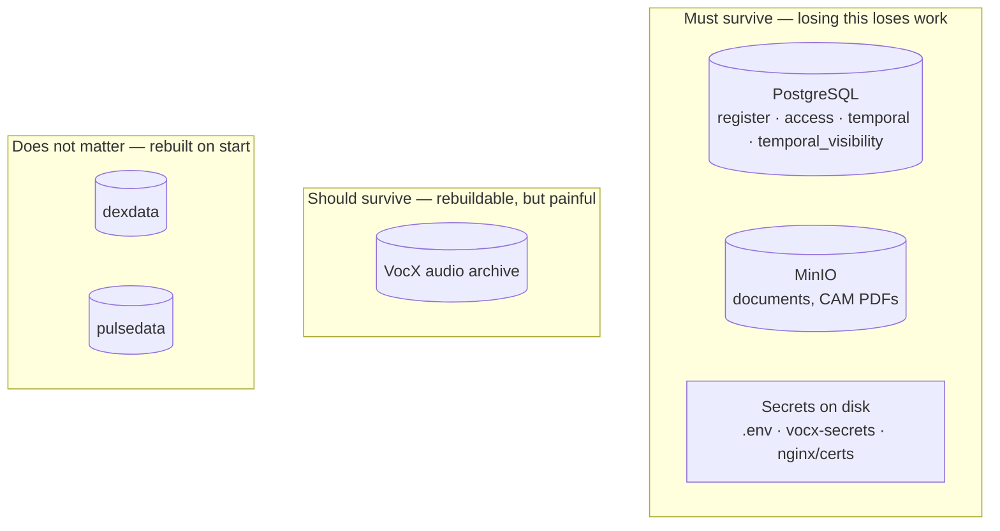
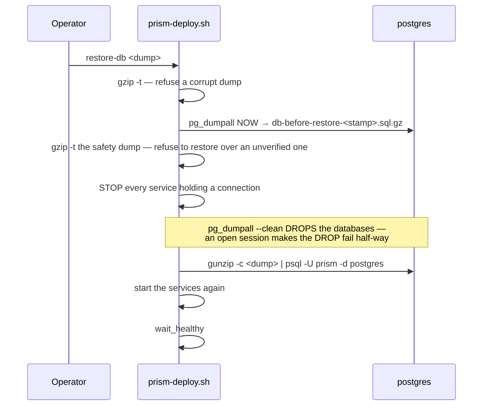

# 09 — Backup & Restore

> **Audience:** whoever is accountable for not losing the book.
> **Companion docs:** [10 Upgrade & rollback](10-UPGRADE-ROLLBACK.md) · [02 Deployment](02-DEPLOYMENT-ARCHITECTURE.md) · [13 Operations](13-OPERATIONS.md)

---

## 1. What has to survive



| Asset | Where | Backed up by | Losing it means |
| --- | --- | --- | --- |
| **PostgreSQL** | `pgdata` volume | `pgbackup` nightly **and** `prism-deploy.sh backup` | Total data loss |
| **MinIO objects** | `miniodata` volume | **volume snapshot only — no automatic job** | Documents gone; rows still reference them |
| **`deploy/compose/.env`** | bind mount | `prism-deploy.sh` secrets snapshot | Stack misconfigures; every secret lost |
| **`deploy/vocx-secrets/`** | bind mount | secrets snapshot | Every user must re-authorise Google |
| **`deploy/nginx/certs/`** | bind mount | secrets snapshot | The edge will not start |
| **VocX audio archive** | volume | volume snapshot only | Recordings unrecoverable; transcripts survive in the Register |
| `dexdata`, `pulsedata` | volumes | — | Rebuilt on next start |

> **The honest gap:** MinIO objects and the VocX audio archive have **no scheduled backup**
> today. The database does. If document bytes matter to you — and for a lender they do —
> add a volume snapshot or an `mc mirror` to off-box storage. §7 gives both.

---

## 2. The three secret paths — say them out loud

```
deploy/compose/.env
deploy/vocx-secrets/
deploy/nginx/certs/
```

These are **never in git and never in a delivery archive.** They live only on the VM. That
makes the secrets snapshot the *only* copy outside the running tree, and it makes verifying
any zip you produce mandatory:

```bash
unzip -l "$ZIP" | grep -Ei "client_secret|token\.json|vocx-secrets/.*json|vocx_tokens|compose/\.env"
# exit code 1 (no matches) = clean. Any output at all = do not send that file.
```

---

## 3. The automatic database backup

`pgbackup` runs under the `backup` compose profile:

```yaml
pgbackup:
  image: postgres:16-alpine
  profiles: ["backup"]
  environment:
    KEEP_DAYS: "${PGBACKUP_KEEP:-14}"
  volumes:
    - pgbackups:/backups
  command:
    - |
      while true; do
        ts=$(date +%Y%m%d-%H%M%S)
        pg_dumpall --clean --if-exists | gzip > "/backups/prism-$ts.sql.gz"
        find /backups -name 'prism-*.sql.gz' -mtime "+$KEEP_DAYS" -delete
        sleep 86400
      done
```

| Property | Value |
| --- | --- |
| Frequency | Every 24 h, counted from container start |
| Scope | `pg_dumpall` — **all four databases**, roles included |
| Retention | 14 days (`PGBACKUP_KEEP`) |
| Location | The `pgbackups` volume, **on the same host** |

Three things to be clear-eyed about:

1. **It is not a cron.** It is a `sleep 86400` loop, so a container restart moves the
   backup time. Do not expect it at a fixed hour.
2. **It stays on the same machine.** A host loss loses the backups with the data. Copy them
   off-box (§7).
3. **Nothing verifies restorability.** A dump that exists is not a dump that restores. Do
   the drill in §6.

```bash
# Confirm it is running and see what it has
docker compose -f deploy/compose/docker-compose.yml --profile backup ps pgbackup
docker compose -f deploy/compose/docker-compose.yml run --rm -v compose_pgbackups:/b \
  postgres:16-alpine ls -lh /b
```

---

## 4. The deploy-script backup (the one taken before every upgrade)

```bash
./prism-deploy.sh backup     # a dump + a secrets snapshot, and nothing else
```

This runs automatically as the **first step** of every `upgrade`. Rule 1 of the script:
*"NOTHING IS TOUCHED UNTIL A BACKUP EXISTS."*

### The database dump — and how it refuses to lie to you

```bash
dc "$LIVE" exec -T postgres pg_dumpall -U prism | gzip > "$dump"
gzip -t "$dump"                     || die "the dump is corrupt (gzip -t failed)"
(( bytes > 100000 ))                || die "the dump is only ${bytes} bytes — refusing to treat that as a backup"
```

Three checks, each closing a real failure: postgres not running at all, a truncated
gzip stream, and a dump that "succeeded" but is empty. **A backup that is not verified is
not a backup**, and this is what that principle looks like in code.

### The secrets snapshot

```bash
SECRET_PATHS=(deploy/compose/.env deploy/vocx-secrets deploy/nginx/certs)
tar -czf "$tarball" -C "$LIVE" "${present[@]}"
chmod 600 "$tarball"
```

If the tar fails — most commonly a root-owned `nginx/certs/tls.key` while running as
`ubuntu` — the script stops and names the file and both remedies. It does **not** proceed
with a partial snapshot.

### Where backups land

```
$PRISM_ROOT/backups/
├── db-20260819-041500.sql.gz              ← pre-upgrade dump
├── secrets-20260819-041500.tar.gz         ← chmod 600
├── images-20260819-041500.tsv             ← the rollback image map
├── db-before-restore-<stamp>.sql.gz       ← safety dump taken before any restore
└── deploy-20260819-041500.log
```

Retention: `PRISM_KEEP_BACKUPS` (default 10).

---

## 5. Restoring

### The full-database restore

```bash
./prism-deploy.sh restore-db ~/aug_11/backups/db-20260819-041500.sql.gz
```



Two design points worth keeping:

- **A restore replaces, so the present is captured first.** The step is itself reversible.
- **Connection holders are stopped explicitly** — `register access gateway atlas vocx pulse
  workflows notifier orchestrator temporal temporal-ui`. A half-applied `--clean` restore is
  a far worse state than a refused one.

### Restoring by hand

```bash
cd ~/aug_11/prism
docker compose -f deploy/compose/docker-compose.yml stop \
  register access gateway atlas vocx pulse workflows notifier orchestrator temporal

gunzip -c /path/to/prism-20260819.sql.gz | \
  docker compose -f deploy/compose/docker-compose.yml exec -T postgres psql -U prism -d postgres

docker compose -f deploy/compose/docker-compose.yml start \
  register access gateway atlas vocx pulse workflows notifier orchestrator temporal
docker compose -f deploy/compose/docker-compose.yml exec nginx nginx -s reload
```

That last line matters — see [13 Operations](13-OPERATIONS.md) on stale upstream IPs.

### Restoring the secrets

```bash
tar -xzf ~/aug_11/backups/secrets-20260819-041500.tar.gz -C ~/aug_11/prism
ls -l ~/aug_11/prism/deploy/compose/.env \
      ~/aug_11/prism/deploy/vocx-secrets \
      ~/aug_11/prism/deploy/nginx/certs
```

`upgrade` does this automatically into the new tree, and **hard-fails** if `.env` is absent
afterwards.

---

## 6. The restore drill — do this quarterly

An untested backup is a hope. The drill takes about twenty minutes and is the only thing
that converts it into a recovery position.

```bash
# 1. On a scratch machine (or a second compose project name), bring up postgres alone
docker run -d --name drill -e POSTGRES_USER=prism -e POSTGRES_PASSWORD=x postgres:16-alpine

# 2. Restore the newest dump
gunzip -c prism-20260819-041500.sql.gz | docker exec -i drill psql -U prism -d postgres

# 3. Prove the book is there
docker exec -i drill psql -U prism -d register -c \
  "select count(*) from entities;  select count(*) from deals;
   select count(*) from lending_tracker; select count(*) from interactions;"

# 4. Prove identity came too
docker exec -i drill psql -U prism -d access -c \
  "select count(*) from users; select count(*) from access_grants;"

# 5. Tear down
docker rm -f drill
```

Record the row counts. A dump whose counts have quietly collapsed is the failure you are
drilling for.

---

## 7. Getting backups off the box (recommended, not yet built)

Everything above keeps backups on the same host. Two additions close that:

```bash
# Database dumps → S3, nightly
aws s3 sync ~/aug_11/backups/ s3://evam-prism-backups/$(hostname)/ \
  --exclude '*' --include 'db-*.sql.gz' --include 'secrets-*.tar.gz'
```

```bash
# MinIO objects → S3 (or another MinIO), nightly
docker compose -f deploy/compose/docker-compose.yml exec -T minio \
  mc mirror --overwrite local/prism s3remote/evam-prism-documents
```

If you add the secrets tarball to an off-box location, that location now holds every secret
PRISM has. Encrypt it and restrict who can read it — this is not a place to be casual.

---

## 8. RPO and RTO, honestly stated

| | Today | With off-box sync |
| --- | --- | --- |
| **RPO** (data you can lose) | Up to **24 h** — the gap between nightly dumps. A pre-upgrade dump narrows it only around upgrades. | Same 24 h, but survives host loss |
| **RTO** (time to recover) | ~15–30 min from a local dump: restore, start, verify | Add transfer time |
| **Host loss** | **Total loss** — backups are on the same volume | Recoverable |
| **Document bytes** | **No backup** — MinIO is unprotected | Recoverable |

If a 24-hour RPO is not acceptable for the book, the honest fix is WAL archiving
(`archive_mode=on` plus `pg_receivewal` or a base-backup tool) rather than more frequent
`pg_dumpall`. That is a real change and it is not in place today.

---

## 9. What is *not* backed up, and why it is usually fine

| Not backed up | Why acceptable | When it is not |
| --- | --- | --- |
| Temporal history | It rides inside `pgdata`, so `pg_dumpall` **does** capture it | — |
| `dexdata` | Dex re-seeds on start; identities live upstream | If Dex is your only user store |
| `pulsedata` | Rebuilt by the next scan | Never |
| Container images | Rebuildable from source; `prism-deploy.sh` also tags them for rollback | If the source archive is lost too |
| VocX audio | Transcripts and structured data are in the Register | If recordings are evidence you must retain |

That last row is a policy question, not a technical one. If audio is retained evidence,
back the volume up.

---

## 10. Checklist

**Weekly**

- [ ] `docker compose --profile backup ps pgbackup` — still running?
- [ ] Newest dump is < 24 h old and > 100 KB
- [ ] Disk headroom on the backup volume

**Quarterly**

- [ ] Run the restore drill (§6) and record the row counts
- [ ] Confirm the secrets tarball opens and contains all three paths
- [ ] Confirm the TLS certificate in the snapshot is the current one

**Before anything risky**

- [ ] `./prism-deploy.sh backup`
- [ ] Note the dump path — `rollback --with-db` and `restore-db` both need it
