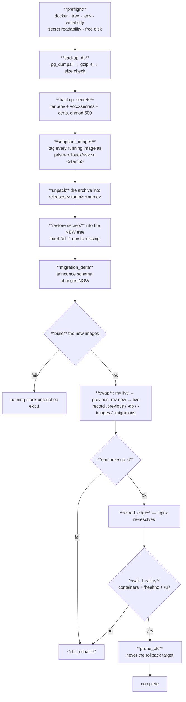
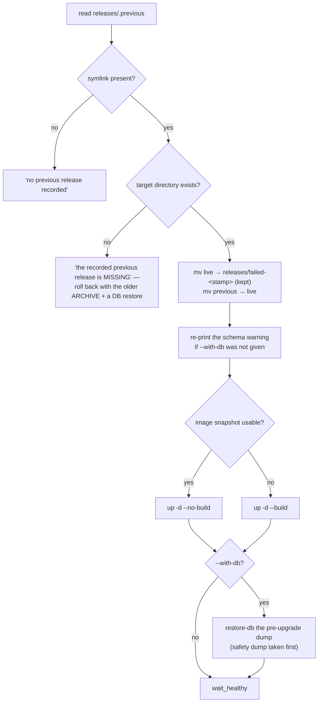

# 10 — Upgrade & Rollback

> **Audience:** whoever runs a production deploy.
> **Companion docs:** [09 Backup & restore](09-BACKUP-RESTORE.md) · [02 Deployment](02-DEPLOYMENT-ARCHITECTURE.md) · [13 Operations](13-OPERATIONS.md)
> **The tool:** `deploy/prism-deploy.sh`

---

## 1. The five rules the script exists to enforce

Read these before the commands. Every design decision below follows from one of them.

> 1. **Nothing is touched until a backup exists.** The database dump and the three secret
>    locations are captured, verified non-empty, and written **outside the release tree**
>    before a single container is stopped.
> 2. **The new release is built before the old one is disturbed.** A build failure — a bad
>    Dockerfile, a full disk, a network blip pulling a base image — leaves the running stack
>    untouched and exits non-zero. The swap happens only once every image exists.
> 3. **Failure rolls itself back.** If the stack does not come back healthy inside
>    `HEALTH_TIMEOUT`, the script restores the previous tree *and images* itself rather than
>    leaving a half-deployed platform for someone to find.
> 4. **The project name is pinned.** Compose derives it from the compose file's directory,
>    so it is stable across tree swaps — but it is passed explicitly anyway, because a
>    drifted project name would mean new containers pointed at new, *empty* volumes, and the
>    database would look wiped when it is merely orphaned.
> 5. **Volumes are never removed.** `down -v` appears nowhere in the file, and `down` itself
>    is not used — services are recreated in place.

And one deliberate non-goal:

> **It never restores the database automatically.** An upgrade that fails is a code problem;
> the data is fine, and silently rewinding it would destroy work the desk did between the
> backup and the failure. `rollback --with-db` exists for the rare case where you decide
> otherwise, and it dumps the current state first.

---

## 2. Commands

```bash
./prism-deploy.sh upgrade  ~/prism-b423fa2.zip   # backup → build → swap → verify
./prism-deploy.sh upgrade  ~/prism.tar.gz        # .zip .tar .tar.gz .tgz all accepted
./prism-deploy.sh rollback                       # back to the previous release
./prism-deploy.sh rollback --with-db             # …and the database with it
./prism-deploy.sh status                         # what is live, what can be rolled back to
./prism-deploy.sh backup                         # a dump + secrets snapshot, nothing else
./prism-deploy.sh verify                         # health-check the running stack
./prism-deploy.sh restore-db <file.sql.gz>       # a specific dump, on purpose
```

### Where to run it from

The script must live **outside** the tree it swaps — a copy inside the release is replaced
mid-run. Both placements are resolved automatically:

```
$PRISM_ROOT/prism-deploy.sh      ← the recommended home, and where `upgrade` installs it
$CHECKOUT/deploy/prism-deploy.sh ← works too; ROOT resolves two levels up
```

`PRISM_ROOT` overrides the detection. On Evam production, `$PRISM_ROOT = /home/ubuntu/aug_11`.

### Configuration

| Variable | Default | Meaning |
| --- | --- | --- |
| `PRISM_ROOT` | auto-detected | The deployment root |
| `PRISM_PROFILES` | `sso backup` | Compose profiles this deployment runs with |
| `PRISM_KEEP_RELEASES` | `3` | Old trees retained (the rollback target is *never* counted) |
| `PRISM_KEEP_BACKUPS` | `10` | Dumps retained |
| `PRISM_HEALTH_TIMEOUT` | `180` | Seconds to become healthy after a swap |
| `PRISM_MIN_FREE_GB` | `8` | Refuse to start without this much free disk |

---

## 3. What `upgrade` does, step by step



### Preflight — the checks, and why each exists

| Check | The failure it prevents |
| --- | --- |
| docker present, daemon reachable | An obvious failure discovered halfway through |
| `$LIVE` is a PRISM tree with a `.env` | Upgrading the wrong directory |
| `$ROOT`, `backups/`, `releases/` are **writable** | *"Swapping releases is two `mv`s inside `$ROOT`, so write permission there is as load-bearing as read permission on the secrets — and finding out at the swap means a full build was spent first."* |
| **Every secret file is readable by the current user** | A root-owned `tls.key` under an `ubuntu` run. Checked **first**, named precisely, with both remedies printed — because *"a snapshot that silently skipped a key would restore a tree that cannot serve TLS."* |
| ≥ `MIN_FREE_GB` free | A build that fills the disk mid-way |

If the secrets are unreadable you get the file names and two exact commands:

```
sudo ./prism-deploy.sh upgrade ~/prism-b423fa2.zip
# …or hand ownership over once:
sudo chown -R ubuntu:ubuntu ~/aug_11/prism/deploy/nginx/certs ~/aug_11/prism/deploy/vocx-secrets
```

### The image snapshot — why rollback is fast

```bash
docker tag "$img" "prism-rollback/$svc:$STAMP"
```

> *"A tagged image is not dangling, so `docker image prune` leaves it alone — which is the
> whole point: the rollback path must not depend on an untagged layer nobody promised to
> keep."*

Rollback re-points the compose image names at these tags and runs `up -d --no-build`. If a
snapshot image has gone missing, it falls back to rebuilding — slower, same result.

---

## 4. Schema changes

`migration_delta()` diffs the Alembic `versions/` directories of the live and new trees, for
**both** the register and access services, and prints the result **before anything moves**:

```
▸ This release carries SCHEMA CHANGES
    services/register: 20260812_add_reconciliation_items.py

  They apply automatically when the services start (alembic upgrade head).
  A plain rollback does NOT undo them — it puts the old code on the new
  schema. That is safe for an added column and unsafe for a dropped one.
  If you need the old schema back too: ./prism-deploy.sh rollback --with-db
```

Or, when there are none:

```
  No schema changes in this release — rollback is fully symmetric.
```

**This is the single most important line of output in an upgrade.** It tells you, before
the build, whether your rollback is symmetric.

| Change type | Plain `rollback` | Verdict |
| --- | --- | --- |
| Added table / added nullable column | Old code ignores it | **Safe** |
| Added NOT NULL column with a default | Old code ignores it | **Safe** |
| Renamed column | Old code queries a name that is gone | **Needs `--with-db`** |
| Dropped column / table | Old code queries something gone | **Needs `--with-db`** |
| Changed a type or constraint | Depends | Read the migration |

The delta is recorded in `releases/.previous-migrations`, and `do_rollback` re-prints the
warning at rollback time if you did not pass `--with-db`.

---

## 5. The health gate — both doors

```bash
health_once() {
  # every container that declares a healthcheck must not be unhealthy/starting
  (( unhealthy == 0 )) || return 1
  curl -sf -m 10 "http://127.0.0.1:${port}/healthz" >/dev/null || return 1
  curl -sf -m 10 -o /dev/null "http://127.0.0.1:${port}/ui/" || return 1
}
```

The second curl was added after a real production incident:

> *"`/healthz` proves the GATEWAY lane. It says nothing about the UI, which nginx reaches
> through a different upstream — and a stranded `ui` upstream passed this gate happily while
> every page in the browser answered 502."*

Container state alone would call a stack healthy that answers 502 at the door. Both lanes
must answer.

## 6. The edge reload — the 502 that looks like a healthy stack

```bash
reload_edge() {
  dc "$LIVE" ps --status running --services | grep -qx nginx || return 0
  dc "$LIVE" exec -T nginx nginx -s reload || dc "$LIVE" restart nginx
}
```

The root cause, in the script's own words:

> *"nginx.conf declares static upstreams (`upstream ui { server ui:80; }`), and nginx
> resolves those names ONCE at startup, for the life of the worker. An upgrade recreates the
> ui and gateway containers, Docker hands them new addresses, and nginx — whose own image
> did not change, so it was never recreated — keeps dialling the old ones. Every page then
> 502s with 'connect() failed (111: Connection refused)' against a container that no longer
> exists, while every container reports perfectly healthy."*

A reload re-reads the config and re-resolves without dropping a connection; a restart is
the fallback if the reload is refused.

**If you ever recreate `ui` or `gateway` by hand, reload nginx yourself.**

---

## 7. Rollback

```bash
./prism-deploy.sh rollback              # code only — the recommended default
./prism-deploy.sh rollback --with-db    # code AND data
```



Two details that matter:

- **The failed release is kept**, at `releases/failed-<stamp>`, for inspection. It is not
  deleted.
- **A recorded-but-missing target is a distinct message.** *"The tree is gone, so the way
  back is the release archive plus a database restore, not this command."* This exists
  because `prune_old` used to delete the very tree `.previous` pointed at — found by running
  five upgrade/rollback cycles at `KEEP_RELEASES=1`, and fixed:

```bash
prune_old() {
  # THE ROLLBACK TARGET IS NEVER PRUNED. … the failure is silent until the day someone
  # needs it, when rollback reports "nothing to roll back to" while the symlink sits
  # there pointing at a directory that no longer exists.
  local keep; keep="$(readlink -f "$RELEASES/.previous" 2>/dev/null || true)"
  ...
}
```

---

## 8. A production upgrade, start to finish

```bash
# 0. On your machine: build the release archive and PROVE it carries no secrets
zip -r ~/prism-b423fa2.zip prism/ -x '*/node_modules/*' '*/.git/*'
unzip -l ~/prism-b423fa2.zip | \
  grep -Ei "client_secret|token\.json|vocx-secrets/.*json|vocx_tokens|compose/\.env"
# exit 1 (no output) = clean. ANY output = do not upload that file.

# 1. Copy it up
scp ~/prism-b423fa2.zip ubuntu@prod:~/

# 2. On the box — see where you stand first
cd ~/aug_11
./prism-deploy.sh status

# 3. Upgrade
./prism-deploy.sh upgrade ~/prism-b423fa2.zip

# 4. Read the SCHEMA CHANGES section of the output. Note the db backup path.

# 5. Verify beyond the script's own gate
./prism-deploy.sh verify
# then in a browser: sign in, open Deals, record a short VocX capture

# 6. Hard-refresh the browser (Ctrl+Shift+R) — the UI is a cached bundle
```

If step 5 looks wrong:

```bash
./prism-deploy.sh rollback           # code only — start here
./prism-deploy.sh rollback --with-db # only if the release dropped or renamed schema
```

---

## 9. Helm upgrades

```bash
helm upgrade --install prism deploy/helm/prism -n prism -f prod-values.yaml
helm history prism -n prism
helm rollback prism <revision> -n prism
```

Differences from the compose path that will surprise you:

- **Helm does not back up your database.** Take a dump yourself first. There is no rule 1
  here — you are rule 1.
- **Migrations still run on service start.** The same asymmetry applies: `helm rollback`
  restores manifests, not schema.
- **`stt` has `limits.cpu: 2`**, so `STT_CPU_THREADS=2` is correct there. On compose there
  is **no** CPU limit and 2 may be a throttle — derive it from `nproc`.
- **Two Ingresses.** The slow-path Ingress carries the long timeouts; set
  `gateway.ingress.slowPaths` from a **values file**, not `--set` (`--set` mis-parses the
  list).

---

## 10. Failure playbook

| Symptom | Cause | Do this |
| --- | --- | --- |
| "cannot write to … as ubuntu" | Ownership of `$ROOT` | `sudo ./prism-deploy.sh …`, or `chown` the root |
| "these secret files cannot be read" | root-owned `tls.key` | Use `sudo`, or `chown` the two directories it names |
| "only 3G free" | Disk | Clear old releases/images; `docker image prune` (tagged rollback images are safe) |
| Build fails | Code or network | **Nothing was touched.** Fix and re-run |
| "did not become healthy" then auto-rollback | New release is broken | Read `backups/deploy-<stamp>.log`; the failed tree is at `releases/failed-<stamp>` |
| Everything healthy but the browser 502s | Stale nginx upstream | `docker compose exec nginx nginx -s reload` |
| UI shows the old version | Cached bundle | Ctrl+Shift+R |
| Rollback says "nothing to roll back to" | Never upgraded with this script | Deploy the older archive with `upgrade` |
| Rollback says the previous release is "MISSING" | The tree was removed | Re-run `upgrade` with the older archive, then `restore-db` if needed |
| Database looks empty after an upgrade | Compose project name drifted → new empty volumes | Check `docker volume ls`; the data is in `compose_pgdata`. Rule 4 exists for this |

---

## 11. Hard-won lessons encoded in this script

Each of these was a real failure, and each is now a line of code. They are listed so nobody
re-learns them.

| Lesson | Where it lives |
| --- | --- |
| A health check on one lane passes while the other is broken | the `/ui/` probe in `health_once` |
| nginx caches upstream IPs across a container swap | `reload_edge` |
| Pruning by age deletes your own rollback target | the `keep` exclusion in `prune_old` |
| A failed `exec 9>` redirection kills a non-interactive shell **silently** | the writability test runs *before* `exec 9>"$LOCK"` |
| `say()` pipes through `tee`, so an unwritable log kills the script on line one | `LOG` falls back to `/dev/null` |
| `local tree="$1" out=(-f "$tree/…")` evaluates the array before `tree` is assigned | `compose_files()` uses two separate `local` statements |
| Discovering unreadable secrets *after* the database dump wastes the operator's nerve | the readability check is in preflight, first |
| A dump that exists is not a dump that restores | `gzip -t` + a 100 KB floor |
