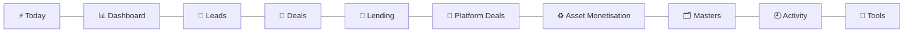
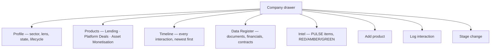
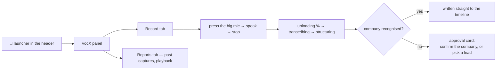

# 11 — ATLAS: the desk's day

> **Audience:** end users, trainers, support — and engineers who need to know what a screen is *for*.
> **Companion docs:** [04 Running flows](04-RUNNING-FLOWS.md) · [07 RBAC](07-USER-MANAGEMENT-RBAC.md) · [12 VocX](12-VOCX-STT.md)

ATLAS is the web dashboard. It works on a laptop and on a phone — the desk genuinely uses
it in the field.

---

## 1. The ten tabs

| Tab | What it is for |
| --- | --- |
| **⚡ Today** | Your work queue: due and overdue lead actions, lender chases awaiting response, covenants due, and **everything awaiting your approval** |
| **📊 Dashboard** | The whole book summarised — counts by stage, amounts in ₹ Cr, open intel by signal |
| **🧲 Leads** | Opportunities before they become deals. "Push to Deals" starts here |
| **🤝 Deals** | The company-centric view. The **company drawer** is where most day-to-day work happens |
| **🏦 Lending** | The credit pipeline, plus the LMS sub-view for serviced loans |
| **🔗 Platform Deals** | Syndication mandates, the lender matrix, chases and responses |
| **♻️ Asset Monetisation** | Asset sale mandates: teaser → discussion → offers → close |
| **🗂️ Masters** | Clients · FI Master · Employees · **Reconciliation** |
| **🕘 Activity** | Activity log and Audit (**Admin only**) |
| **🧰 Tools** | Ledger import/export, News Radar, schedules, email |

Not every tab is visible to every person — see §8.

---

## 2. Today — start here

The one screen a person should be able to work from all morning.

| Section | Source |
| --- | --- |
| Lead actions due / overdue | Leads with a follow-up date |
| Lender chases awaiting a response | Syndication lender rows |
| Covenants due | The covenant monitor |
| **Awaiting your decision** | `GET /orchestrator/v1/workflows/pending` |

That last one deserves emphasis: **the parked workflow run *is* the work item.** There is no
separate task table to drift out of sync with reality. If a run is waiting for you, it is
on your Today page; when you decide, the run moves.

The approval queue speaks the desk's language — a stage-change request shows the business
words, not workflow ids.

---

## 3. Deals and the company drawer

Click a company row and the drawer opens. This is where most work happens.

### Add product

Choose **Lending**, **Platform Deals** or **Asset Monetisation**, and give an amount in ₹ Cr.

- **Amount is mandatory and has no default.** A default of 2 was removed in v2.1 precisely
  to prevent silent data pollution.
- The row is created at a **starting status** — refine everything else in the drawer.
- If the company has no deal record yet, one is created automatically and the product flag
  set on it.

### Log interaction

Files a timeline entry against the company, deal or line. VocX writes to the same timeline —
a dictated interaction and a typed one are the same kind of record.

### Stage change

The Target dropdown offers **only legal moves** from the current stage, read from the same
transition map the server enforces. You cannot be offered a move that will be refused.

The lane is per-desk: an AM RM sees no lending stage-change button.

---

## 4. The three product boards

Each is a grid with the same shape: filters, a search box, an export bar, and row click →
the company drawer.

| Board | Stage/status vocabulary |
| --- | --- |
| **Lending** | Data Awaited → Diligence → Note Circulated → Sanctioned → CP/CS Completed → Ready for Disbursement → Disbursed · plus Rejected / On Hold |
| **Platform Deals** | Deal Sourced → Docs Pending → IM in Prep → IM Circulated → Queries Received → IP Received → Sanctioned → Disbursed · plus On Hold / Withdrawn / Rejected / Dropped |
| **Asset Monetisation** | Teaser Prepared → Teaser Shared → In Discussion → NBO Received → BO Received → SPA / Documentation → Closed · plus Dropped |

> Platform Deals has **no Diligence stage** — that is Lending's vocabulary. The two are
> separate by design.

### The lender matrix (Platform Deals)

A company × bank grid showing where each lender stands on each mandate.

- **Full lender master by default**, with an "Engaged lenders" toggle to narrow to banks
  actually in play.
- A find-company box and a collapsible banks-in-play panel, so it scales past a demo book.
- Moves are **forward-only** with remarks; the bank's yes is called **"Approved"** in every
  view, consistently.
- The `Un-Assigned` state exists so a bank in the master is not implicitly "in the deal".

### LMS (inside Lending)

For loans that have been booked: ledger entries, conditions, accrual and interest preview.
`LMS Operator` posts routine events; `LMS Management` holds the hard-to-reverse verbs —
booking approval, classification, closure, waiver authority.

---

## 5. VocX — recording an interaction

The mic in the header opens the VocX panel.

What a user should know:

- **Recording stops automatically at 3 minutes** and keeps everything recorded so far.
  Nothing is thrown away.
- **A new company creates a company and a lead.** Recording three separate conversations
  about a genuinely new company legitimately creates three leads — they are three
  opportunities, not a duplicate bug.
- **Speak the company name clearly and early.** Matching keys off it, and the priming
  vocabulary is built from the register's own names.
- **"VocX did not answer in time" does not mean the recording is lost.** The audio is
  archived before transcription begins. Retry.
- **A capture can be logged to a specific subject.** The "Log to" picker targets a lead,
  deal, lending line, syndication mandate or AM mandate.

---

## 6. Masters

| Sub-tab | Contents |
| --- | --- |
| **👥 Clients** | The company master — every entity, its code, sector, lens, state, lifecycle |
| **🏦 FI Master** | Banks, NBFCs, DFIs, funds — the counterparty master feeding the lender matrix |
| **🧑‍💼 Employees** | The people directory **and** where roles are granted |
| **🧾 Reconciliation** | The import quarantine queue |

### Employees — granting a role

1. Open the person, or **Add**.
2. The **Role** field is a multi-select — a person may hold several roles, and access is the
   maximum across them.
3. Save.

If a role change does not appear to take:

- The dialog now **reports a failure** rather than silently doing nothing. If you see no
  error, the change was applied.
- Allow up to the permission cache TTL (~30 s), or have the person sign out and in.
- Check the email matches their sign-in identity **exactly** — a mismatch means they sign in
  as a different identity with no grants.

### Reconciliation

Rows the import could not write correctly land here rather than being written wrong or
dropped.

| Action | Who | Requires |
| --- | --- | --- |
| Work the queue, view items | Admin **or** Management | — |
| **Mark corrected** | Admin or Management | The record must now actually pass validation — the system re-checks |
| **Waive** | **Management only** | A **ticket reference** |

The asymmetry is intentional. An Admin may close an item that has been *fixed*; deciding
that a record stays incomplete on the book is a Management call, and it leaves a ticket
behind.

Each card shows the row **"as imported"** so you can see what the spreadsheet actually said.

---

## 7. Tools

| Tool | What it does |
| --- | --- |
| **Ledger** | Import the desk's Excel, and export it back — a full round trip with no loss |
| **News Radar** | PULSE results: RED / AMBER / GREEN items per company, and a sweep trigger |
| **Schedules** | Recurring jobs |
| **Email** | Digest and notification settings |

### Importing a workbook

1. **Tools → Ledger → Import**, upload the `.xlsx` (up to 64 MB).
2. Read the result summary: rows written, rows updated, rows **quarantined**.
3. Go to **Masters → Reconciliation** and clear the quarantine.

Before importing, three things save a lot of time:

- **Company names must be spelled consistently.** The importer is entity-centric and matches
  by name — a typo creates a second company. Brackets and suffixes are fine; *inconsistency*
  is not.
- **Use the right vocabulary per sheet.** A Lending stage on the Syndication sheet will not
  map (`Diligence` does not exist there).
- **A stage with mandatory data needs that data.** A `Ready for Disbursement` lending row
  without a proposed disbursement amount and date will be quarantined, correctly.

---

## 8. What each role sees

`F` full · `S` scoped (your own rows) · `R` read-only · `—` hidden

| Tab | Admin | Mgmt | BD Head | BDRM | Credit Head | Deal Analyst | Syn Head | Syn RM | AM Head | AM RM | LMS Op | LMS Mgmt |
| --- | --- | --- | --- | --- | --- | --- | --- | --- | --- | --- | --- | --- |
| Today | F | F | S | S | S | S | S | S | S | S | S | S |
| Dashboard | F | F | S | — | S | — | S | — | S | — | — | — |
| Leads | F | F | F | S | — | — | — | — | — | — | — | — |
| Deals | F | F | F | S | S | S | S | S | S | S | R | R |
| Lending | F | F | R | R | F | S | R | R | R | R | R | R |
| Platform Deals | F | F | R | R | R | S | F | S | R | R | — | — |
| Asset Mon | F | F | R | R | R | S | R | R | F | S | — | — |
| FI Master | F | F | R | R | R | R | F | R | R | R | — | — |
| Clients | F | F | R | — | R | — | R | — | R | — | R | R |
| Employees | F | F | R | R | R | R | R | R | R | R | R | R |
| Audit | F | — | — | — | — | — | — | — | — | — | — | — |
| Activity | F | — | — | — | — | — | — | — | — | — | — | — |
| Tools | F | R | R | R | R | R | R | R | R | R | R | R |

The guiding principle: **write follows the vertical, read follows the deal.**

Two consequences that look like bugs and are not:

- **A Deal Analyst has no Leads access at all.** They can therefore *own* a lead they cannot
  see. That is the matrix working as specified.
- **Audit and Activity are Admin-only** — not even Management.

---

## 9. On a phone

The layout adapts: a bottom navigation bar replaces the top tabs, cards stack vertically,
and action buttons fall **below** the content rather than beside it — so a reconciliation
card reads *"company · what is missing · then the decision buttons"*, not decision-first.

VocX is fully usable on a phone; that is the point of it.

---

## 10. Common tasks — quick index

| I want to… | Where |
| --- | --- |
| See what needs me today | **Today** |
| Approve something | **Today** → the item → Approve |
| Add a new company | **Masters → Clients → Add**, or let a VocX capture create it |
| Add a lead | **Leads → Add** |
| Turn a lead into a deal | **Leads** → the row → **Push to Deals** (an approval follows) |
| Add a product line | **Deals** → company → **Add product** |
| Move a stage | **Deals** → company → **Stage change** (only legal moves are offered) |
| Record a conversation | 🎤 in the header |
| Log a typed interaction | **Deals** → company → **Log interaction** |
| Upload a document | **Deals** → company → **Data Register** |
| Add a bank to a mandate | **Platform Deals** → mandate → **Add lender** |
| Chase a bank / record a response | **Platform Deals** → the lender row |
| Grant someone a role | **Masters → Employees** |
| Import a spreadsheet | **Tools → Ledger → Import** |
| Fix a failed import row | **Masters → Reconciliation** |
| Export the book | The export bar on any grid, or **Tools → Ledger → Export** |
| See who changed what | **Activity** (Admin) |

---

## 11. When something looks wrong

| Symptom | Likely explanation |
| --- | --- |
| A tab is missing | Your role does not have that view — §8 |
| A button 403s | The view is visible but the *operation* is not permitted, or the row is outside your scope |
| A stage will not move | Not a legal transition, or the stage's mandatory data is missing — the error names the field |
| The Company column is blank on a grid | The row has no deal record; recent builds resolve the company from the row's own entity |
| A row I imported is not in the grid | It was quarantined — **Masters → Reconciliation** |
| I see the old version after a deploy | The UI is a cached bundle — hard-refresh (Ctrl+Shift+R) |
| An approval I gave did nothing | The workflow worker may be down — tell an operator ([05](05-TEMPORAL-WORKFLOWS.md) §10) |
| Every page shows 502 | Edge-level, not you — an operator needs to reload nginx ([13](13-OPERATIONS.md)) |
