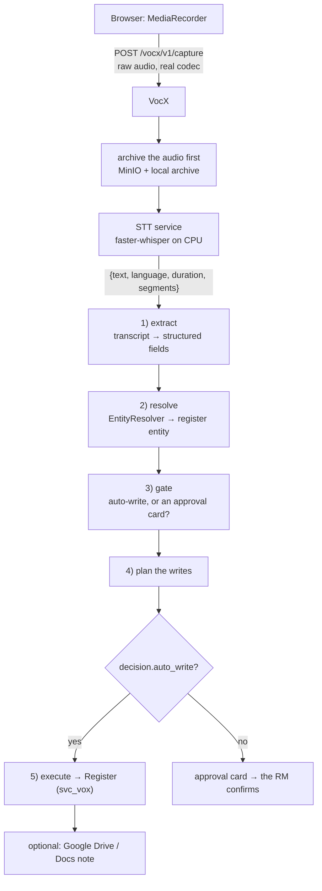
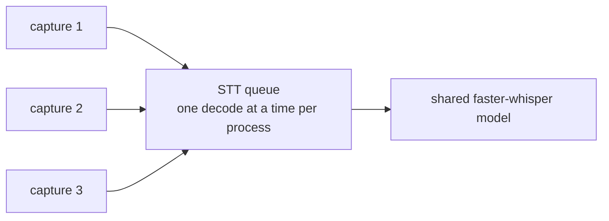

# 12 — VocX & STT (voice capture)

> **Audience:** engineers on the voice path; operators sizing the box; anyone asked "why did my recording fail?"
> **Companion docs:** [04 Running flows](04-RUNNING-FLOWS.md) · [03 Module interaction](03-MODULE-INTERACTION.md) · [13 Operations](13-OPERATIONS.md)
> **Code:** `services/vocx/`, `services/stt/`, `services/atlas/ui/src/components/vocx/`

---

## 1. What VocX is for

An RM finishes a site visit, opens PRISM on their phone, presses record and talks for two
minutes. By the time they are back in the car, the company is matched, an interaction is on
the timeline, a lead exists if one did not, and the follow-up is scheduled.

That is the whole product claim, and everything below is in service of two constraints it
creates:

1. **The user must never lose a recording they have already made.** Once the audio exists,
   losing it is unacceptable — so it is archived *before* anything else can fail.
2. **Transcription accuracy cannot be traded away for speed.** The transcript feeds a
   credit file.

---

## 2. The pipeline



`services/vocx/app/vocx/core/pipeline.py::process_capture` is the whole thing in one
function. The capture-side facts (`language`, `gps_lat`, `gps_lng`, `location`) ride on
`_meta` into the interaction's structured columns and are, in the code's own words,
**"never trusted for routing — only recorded."**

### English at rest

Whisper is run with `task="translate"`, which makes it emit **English text for any spoken
language** (identity for English input). The detected original language still comes back and
lands in the interaction's `language` column. So a conversation in Hindi or Gujarati becomes
an English record with the original language on the row.

---

## 3. Recording length

`services/atlas/ui/src/components/vocx/useRecorder.ts`:

```ts
const _envCap = Number(import.meta.env.VITE_VOCX_MAX_SECONDS);
export const MAX_SECONDS = Number.isFinite(_envCap) && _envCap > 0
  ? Math.min(600, Math.max(30, Math.round(_envCap)))
  : 180;
```

| Property | Value |
| --- | --- |
| Default | **180 s (3 minutes)** |
| Configurable by | `VITE_VOCX_MAX_SECONDS` — **build-time**, via `deploy/ui-image/Dockerfile` |
| Clamped to | 30–600 s |
| At the cap | The recorder auto-stops and **keeps the clip so far** |

Nothing is discarded at the cap — a one-second timer checks `secondsRef.current >=
MAX_SECONDS` and calls `rec.stop()`. The user gets the recording they made up to that
point, transcribed normally.

### Changing it

```dockerfile
# deploy/ui-image/Dockerfile
ARG VITE_VOCX_MAX_SECONDS="180"
ENV VITE_VOCX_MAX_SECONDS=$VITE_VOCX_MAX_SECONDS
```

```bash
docker compose -f deploy/compose/docker-compose.yml build ui
docker compose -f deploy/compose/docker-compose.yml up -d ui
docker compose -f deploy/compose/docker-compose.yml exec nginx nginx -s reload   # ← don't skip
```

Then hard-refresh the browser — the bundle is cached.

> Raising the cap beyond ~180 s means longer synchronous decodes. Check the timeout chain
> in §4 before going much past 300 s, and remember that transcription time scales with clip
> length **and** with how many captures are running at once.

---

## 4. The timeout chain

Four budgets on one request. They only work if they are ordered.

| Hop | Budget | Set in |
| --- | --- | --- |
| **Browser** (`CAPTURE_TIMEOUT_MS`) | **300 s** | `services/atlas/ui/src/api/vocxClient.ts` |
| nginx `/vocx/v1/capture` | 305 s | `deploy/nginx/nginx.conf` |
| gateway `_SLOW_PATHS` | 600 s | `services/gateway/app/main.py` |
| VocX → STT total budget | 240 s | `stt.api.budget_s` |

**The browser is deliberately the shortest.** The user's own client gives up first, with a
message it can explain, rather than the edge returning an opaque 504.

For Helm, the equivalent of the nginx line is `gateway.ingress.slowPaths` on the second
Ingress (`ingress-slow.yaml`) — annotations are per-Ingress, not per-path.

### The STT retry budget

`services/vocx/app/vocx/speech/stt.py`:

```python
deadline = time.monotonic() + self.budget_s
for attempt in range(self.attempts):
    remaining = deadline - time.monotonic()
    if attempt and remaining < self.MIN_ATTEMPT_S:   # MIN_ATTEMPT_S = 15.0
        break                                        # the FIRST attempt is ALWAYS made
    remaining = max(remaining, 1.0)
    resp = httpx.post(..., timeout=min(float(self.timeout), remaining))
```

Three properties:

- The **total** budget is bounded, not just each attempt. A per-attempt timeout with three
  retries can silently take three times as long as anyone intended.
- **The first attempt is always made**, even if the budget is nearly gone. A capture is not
  abandoned without trying.
- A retry is only started if at least 15 s remain — starting one that cannot finish just
  burns the remaining budget.

On exhaustion, `SttTimeoutError` → VocX answers `504 {"ok": false, "error": …, "ref": ref}`,
and the UI says: *"VocX did not answer in time. The recording is safe — try again in a
moment."* Which is true: the audio was archived before transcription started.

---

## 5. The stage strip

The UI shows `uploading → transcribing → structuring → done`. Getting this honest took
care, because the upload and the transcription have very different shapes.

`services/atlas/ui/src/components/vocx/RecordTab.tsx`:

```tsx
let heard = false; let uploaded = false; let quietPolls = 0;
const uploadCeiling = setTimeout(() => { uploaded = true; }, 60_000);
pollRef.current = setInterval(() => {
  void vocxService.captureStatus(cid).then((s) => {
    if (s !== 'unknown') { heard = true; setStage(s); return; }
    if (!heard && uploaded && ++quietPolls >= 12) { setStage(''); stopPoll(); }
  });
}, 700);
const r = await vocxService.captureAudio(blob, rm, gps, cid, (pct) => {
  if (!heard) setSent(pct);
  if (pct >= 100) uploaded = true;
});
```

The rule: **the patience window starts when the upload finishes, not when it starts.** On a
slow mobile connection the upload itself can take a minute, and a server that has not yet
*received* the clip cannot be reporting a stage for it. Counting "quiet" polls during the
upload made the strip give up on captures that were succeeding.

Upload progress is surfaced as a percentage on the `uploading` chip via axios
`onUploadProgress`, wired through `postAudio(..., onUpload)`.

---

## 6. The STT service

`services/stt/` — a dedicated container so that **one shared faster-whisper model serves
every capture** rather than each VocX worker loading its own.

```python
# services/stt/app/config.py
model_size: str = "small"
device: str = "cpu"
compute_type: str = "int8"
beam_size: int = 5
vad_filter: bool = True
cpu_threads: int = 0
model_dir: str = "/opt/models"
preload: bool = True                      # readiness gates on the model being loaded
max_audio_bytes: int = 25 * 1024 * 1024   # matches VocX's inbound cap
```

**The model is baked into the image at build time** and the container runs with
`HF_HUB_OFFLINE=1`. Serving never depends on huggingface.co, and a `STT_MODEL_SIZE` that is
not in `model_dir` **fails fast at startup** instead of quietly downloading half a gigabyte
in production.

Decoding is **serialised per process**: ctranslate2 inference is not guaranteed thread-safe
on one model instance, and concurrent CPU decodes would thrash anyway.

### `STT_CPU_THREADS` — the setting people get wrong

```python
# CPU parallelism for the decoder. 0 hands the choice to CTranslate2, which reads the
# HOST's core count and knows nothing about the container's CPU quota — so a container
# limited to 2 cores can spawn a thread per host core, and those threads then fight
# each other for the 2 it actually has and decode SLOWER than 2 threads would.
cpu_threads: int = 0
```

| Value | Behaviour |
| --- | --- |
| `0` | CTranslate2 chooses, based on the **host's** core count |
| `N` | Exactly N decoder threads |

**Accuracy is untouched by this setting — only scheduling.** The model, the beam width and
the transcript are identical.

| Deployment | CPU limit on `stt` | Correct value |
| --- | --- | --- |
| **Helm** | `limits.cpu: 2` | **`2`** — match the limit |
| **Compose** | **none** | Derive from `nproc`; `0` is often right, and `2` on a 4-core box is a *throttle* |

> This distinction caused a wrong recommendation once in this project's history: `2` is the
> Helm answer, given for a compose box. On compose, run `nproc` and decide from that.

### Tuning accuracy vs speed

| Knob | Effect on accuracy | Effect on speed |
| --- | --- | --- |
| `STT_MODEL_SIZE` (`tiny`→`small`→`medium`→`large-v3`) | **Large effect** | Large cost — must also be baked into the image |
| `STT_BEAM_SIZE` (default 5) | Moderate | Roughly linear |
| `STT_COMPUTE_TYPE` (`int8`, `int8_float16`, `float16`) | Small | Noticeable |
| `STT_VAD_FILTER` | Removes silence — usually helps | Helps |
| `STT_CPU_THREADS` | **None** | Real, when matched to the actual quota |

If transcription is too slow, reach for `cpu_threads` and `vad_filter` **before** dropping
the model size. Only the last one costs you accuracy.

---

## 7. Concurrency and sizing

Because a decode is serialised per process and CPU-bound, concurrent captures queue.



Rules of thumb for the single-VM deployment:

| Cores | Sensible `STT_CPU_THREADS` | Comfortable concurrent captures |
| --- | --- | --- |
| 2 | `2` | 1–2 |
| 4 | `0` or `4` | 2–3 |
| 8 | `0` | 4–6 |

"Comfortable" means the third user is not waiting past the 300-second browser budget.
Empirically, three concurrent two-minute captures on the current production box all
completed successfully.

To scale beyond that, **add STT replicas** — the service is stateless and the model is in
the image. It is the one component in PRISM where more replicas directly buys more
throughput.

---

## 8. Storage, retention and secrets

| Thing | Where | Notes |
| --- | --- | --- |
| Audio bytes | **MinIO**, bucket `prism-vocx-captures` | Same platform rule as Register documents. The `s3://bucket/key` reference rides on the committed interaction |
| Playback URLs | presigned against `VOCX_S3_PUBLIC_ENDPOINT_URL` | Signed for the **browser's** view of MinIO, not the container's |
| Retention | `VOCX_AUDIO_RETENTION_DAYS` (default `0` = keep) | |
| Local state | `vocx_state:/data/vocx` | Drafts, PKCE verifiers |
| Google OAuth client | `deploy/vocx-secrets/client_secret.json`, mounted read-only | **git-ignored**. Absent = Google integration off; register writes still work |
| Per-user Google tokens | `VOCX_TOKENS_DIR=/data/vocx` | **Never in the repo or a delivery archive** |

> `deploy/vocx-secrets/` is one of the three paths that must never enter git or a zip. See
> [09 Backup & restore](09-BACKUP-RESTORE.md) §2 for the verification command.

---

## 9. Google Workspace integration

Per-user OAuth, so notes are written as the RM, not as a service account.

```
Redirect URI (must match Google Cloud Console exactly):
  https://<host>/vocx/v1/auth/callback
```

Set as `VOCX_OAUTH_REDIRECT_URI` — **as the browser reaches it**, through the edge. This is
the commonest misconfiguration: an internal URL here produces a `redirect_uri_mismatch` at
Google.

`/vocx/v1/auth/callback` is in `GATEWAY_AUTH_EXEMPT_PATHS` — Google calls it without a
PRISM bearer.

If the Google integration is off or fails, **the capture still completes**: the Register
write is the part that matters, and the Drive/Docs write is skipped.

---

## 10. Intelligence switches

Each independently switchable, all defaulting **on**:

| Variable | What it does |
| --- | --- |
| `VOCX_STT_PRIMING` | Primes Whisper with expected vocabulary — client names, finance terms — so "Mecpower" is not heard as "make power" |
| `VOCX_EXTRACT_GLOSSARY` | A domain glossary for the extraction step |
| `VOCX_EXTRACT_FEW_SHOT` | Few-shot examples for extraction |
| `VOCX_EXTRACT_STRUCTURED` | Structured (rather than free-form) extraction output |

`VOCX_ANTHROPIC_API_KEY` empty ⇒ the **offline stub** runs. Typed transcripts still work end
to end, which is what makes dev and CI able to exercise the whole lifecycle without a vendor
account.

---

## 11. Configuration reference (VocX)

| Variable | Default (compose) | Meaning |
| --- | --- | --- |
| `VOCX_REGISTER_BASE_URL` | `http://register:8000` | The book |
| `VOCX_REGISTER_API_KEY` | `${SVC_VOX_KEY}` | The **named** `svc_vox` principal |
| `VOCX_API_KEYS` | `${VOCX_FRONT_KEY}` | VocX's own front door — only the gateway's injected key is accepted |
| `VOCX_INTERNAL_SIGNING_SECRET` | shared | Verify + re-mint the caller's context so the **human** authorises Register writes |
| `VOCX_ORCHESTRATOR_URL` / `_API_KEY` | orchestrator | Company-name captures with no resolved subject run as durable workflows |
| `VOCX_STT_BACKEND` | `api` | `api` (the STT service) · `faster_whisper` (in-process fallback) · `stub` |
| `VOCX_STT_API_URL` | `http://stt:8000/v1/audio/transcriptions` | |
| `VOCX_STT_API_KEY` | `${STT_API_KEY}` | |
| `VOCX_S3_*` | MinIO | Endpoint, public endpoint, bucket, credentials |
| `VOCX_AUDIO_RETENTION_DAYS` | `0` | `0` = keep forever |
| `VOCX_GOOGLE_CLIENT_SECRET_FILE` | `/run/vocx-secrets/client_secret.json` | Absent = Google off |
| `VOCX_OAUTH_REDIRECT_URI` | — | **As the browser sees it** |
| `VOCX_TOKENS_DIR` | `/data/vocx` | Per-user Google tokens |
| `VOCX_DEV_UI` | `true` in dev | The `/vocx/v1/dev-ui` console. **Pinned off by the prod-posture overlay** |

---

## 12. Troubleshooting

| Symptom | Cause | Fix |
| --- | --- | --- |
| *"VocX did not answer in time"* | STT exceeded the 240 s budget — usually queued behind other captures | Check `docker compose logs stt`; raise `STT_CPU_THREADS` to the real quota; add an STT replica |
| Stage strip reverts to blank mid-capture | Historically: the patience window started before the upload finished | Fixed in `RecordTab.tsx`. If it recurs, check `captureStatus` polling |
| Recording stops at 3 minutes | Working as designed — `MAX_SECONDS` | Raise `VITE_VOCX_MAX_SECONDS`, rebuild `ui`, reload nginx, hard-refresh |
| 413 on capture | Clip exceeds `max_audio_bytes` (25 MB) or nginx's 64 m | Shorten the clip, or raise both |
| Transcript quality poor | Model size, or priming off | Check `STT_MODEL_SIZE` and `VOCX_STT_PRIMING`. Do **not** touch `cpu_threads` — it changes nothing about accuracy |
| Company matched to the wrong entity | Name similarity | The approval card exists for this. Confirm the company; consider an alias |
| Google notes not written | Client secret absent, or `redirect_uri_mismatch` | Check the mount and that `VOCX_OAUTH_REDIRECT_URI` matches Google Console **exactly** |
| STT will not start | Baked model does not match `STT_MODEL_SIZE` | Deliberate fail-fast — rebuild the image with the matching `ARG STT_MODEL_SIZE` |
| Capture succeeded, no interaction on the timeline | The gate raised an approval card | Open the VocX panel; the draft is waiting |
