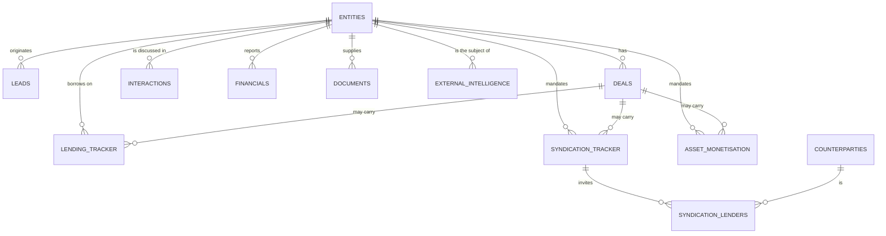
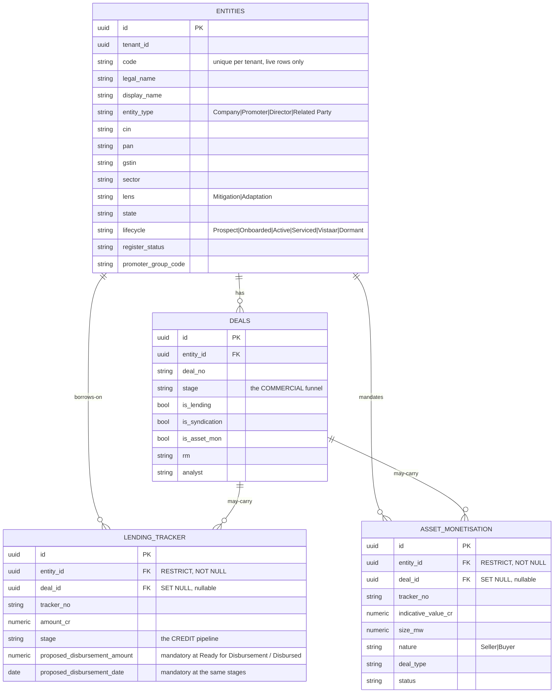
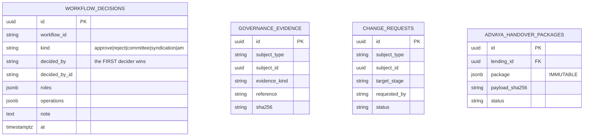
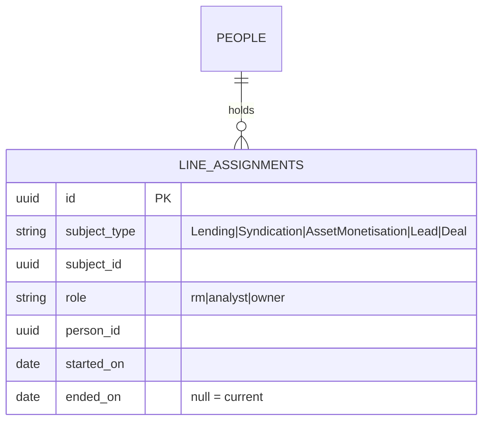

# 15 — Data Model & ERD

> **Audience:** anyone writing a query, a migration, or a report.
> **Companion docs:** [08 Register](08-REGISTER.md) · [04 Running flows](04-RUNNING-FLOWS.md) · [09 Backup](09-BACKUP-RESTORE.md)
> **Code:** `services/register/app/models/` · `docs/SCHEMA.md` for the column-level detail

---

## 1. The one commitment: entity-centric

> *"A single legal entity, CIN-anchored where possible. The spine everything links to: one
> company appears once and every deal/financial/touchpoint links back to it. This is the
> entity-centric (not deal-centric) commitment at the heart of the Register."*
> — `models/registry.py`

Deal-centric systems duplicate the company for every transaction, and then nobody can answer
"what is our total exposure to this promoter group?" without a reconciliation exercise. Here,
`entities` is the spine.



Note the word **"may"** on the deal → tracker edges. `deal_id` is **nullable**; `entity_id`
is **not**. A mandate always belongs to a company; it does not always belong to a deal
record. That is deliberate, and it is why imported mandates with no Deals-sheet row are
valid data rather than orphans.

---

## 2. Every table, by domain

~43 tables across 20 model modules.

### Master data

| Table | Contents |
| --- | --- |
| `entities` | **The spine.** Companies, promoters, directors, related parties |
| `people` | The internal directory — RMs, analysts, heads |
| `counterparties` | Banks, NBFCs, DFIs, funds, investors, advisors |
| `ref_values` | Every dropdown vocabulary, served from `/v1/ref` |
| `tenants`, `tenant_settings` | Tenant registry and per-tenant configuration |

### Origination

| Table | Contents |
| --- | --- |
| `leads` | Opportunities before conversion |
| `deals` | The commercial funnel record, with the three product flags |

### The three product books

| Table | Contents |
| --- | --- |
| `lending_tracker` | The credit pipeline line |
| `syndication_tracker` | One mandate per company |
| `syndication_lenders` | One row per bank per mandate — the lender matrix |
| `asset_monetisation` | One row per **mandate** (a company may have several) |

### Company file

| Table | Contents |
| --- | --- |
| `interactions` | The timeline. Typed *and* VocX-dictated |
| `financials` | Statements: audited, provisional, projections, GST, CMA |
| `contracts_assets` | PPA, EPC, O&M, offtake, security charge |
| `documents`, `document_checklist` | Files and the required-set checklist |
| `external_intelligence` | PULSE items and other intel, RED/AMBER/GREEN |
| `monitoring_reporting` | Covenant compliance, security creation, periodic submissions |

### Credit governance

| Table | Contents |
| --- | --- |
| `sanction_terms` | The sanctioned terms |
| `cam_reports`, `cam_turns` | The CAM workbench: the memo and its drafting turns |
| `cp_cs_checklists` | The authoritative CP/CS checklist (maker-checker) |
| `governance_evidence`, `governance_evidence_status` | Evidence gating a stage |
| `workflow_decisions`, `workflow_decision_outbox` | **The single-winner decision record** |
| `change_requests` | Stage-change requests awaiting approval |

### Servicing (LMS) — present, but `LMS_ENABLED=false` today

| Table | Contents |
| --- | --- |
| `loan_accounts` | The booked account |
| `loan_ledger_entries` | Ledger postings |
| `loan_account_conditions` | Post-disbursement conditions |
| `disbursement_tranches` | Tranche booking |
| `covenants` | Covenant definitions and observations |
| `ews_cases` | Early-warning cases |

### Handover

| Table | Contents |
| --- | --- |
| `advaya_handover_packages` | The **immutable** package, sha256 recorded |
| `advaya_handoffs` | The boundary record and acknowledgement |

### Platform plumbing

| Table | Contents |
| --- | --- |
| `line_assignments` | **Who owns which row** — the basis of every SCOPED decision |
| `import_reconciliation_items` | The import quarantine queue |
| `notifications`, `notification_deliveries` | Outbox and delivery attempts |
| `calendar_events` | Scheduled follow-ups and meetings |
| `idempotency_keys` | Replay protection |
| `number_series` | Tracker numbering |
| `audit_log` | **Append-only.** Never updated, never soft-deleted |

---

## 3. What every business row carries

Every table inheriting `RecordBase` gets the same spine:

```python
class RecordBase(Base, TimestampMixin, SoftDeleteMixin):
    """Concrete base for every tenant-aware, versioned, auditable business table."""
    id: Mapped[uuid.UUID] = mapped_column(primary_key=True, default=uuid.uuid4,
                                          server_default=func.gen_random_uuid())
    tenant_id: Mapped[uuid.UUID] = mapped_column(nullable=False, index=True)
    version: Mapped[int] = mapped_column(nullable=False, default=1, server_default="1")
    __mapper_args__ = {"version_id_col": version}
```

| Column | Purpose |
| --- | --- |
| `id` | UUID, generated in the database (`gen_random_uuid()`) as well as in Python |
| `tenant_id` | **Never null.** Indexed. The RLS policy key |
| `version` | Optimistic-locking counter — SQLAlchemy bumps and checks it on every UPDATE |
| `created_at`, `updated_at` | `TimestampMixin` |
| `deleted_at` | `SoftDeleteMixin` — non-null means deleted |

So: **every business row is tenant-scoped, versioned, timestamped and soft-deletable, by
construction.** You do not opt in.

### Soft delete and unique constraints

A soft-deleted row must not hold its unique key hostage:

```python
Index("entities_tenant_code", "tenant_id", "code", unique=True,
      postgresql_where=text("deleted_at IS NULL"))
```

Partial unique indexes over live rows only. If you add a unique constraint to a
soft-deletable table, do the same.

### The audit log is different

`audit_log` inherits plain `Base`, not `RecordBase` — *"append-only. Never updated, never
soft-deleted."* Columns: `at`, `actor`, `action`, `resource_type`, `resource_id`,
`request_id`, `changes` (JSONB). The `request_id` is the same `X-Request-ID` nginx stamps, so
an audit entry can be tied back to a specific HTTP request in the logs.

---

## 4. Referential integrity — the `ondelete` choices are a policy

```python
# lending_tracker, syndication_tracker, asset_monetisation
entity_id = mapped_column(ForeignKey("entities.id", ondelete="RESTRICT"), nullable=False, index=True)
deal_id   = mapped_column(ForeignKey("deals.id",    ondelete="SET NULL"),                  index=True)

# syndication_lenders
syndication_id  = mapped_column(ForeignKey("syndication_tracker.id", ondelete="CASCADE"))
counterparty_id = mapped_column(ForeignKey("counterparties.id",      ondelete="SET NULL"))
```

Each choice says something:

| Rule | Meaning |
| --- | --- |
| `entity_id … RESTRICT`, `nullable=False` | **A company with a book cannot be deleted.** Every mandate belongs to a company, always |
| `deal_id … SET NULL` | Deleting a deal record leaves the mandate standing. The mandate is the real thing; the deal record is an origination wrapper |
| lenders `CASCADE` from the mandate | A lender row has no meaning without its mandate |
| lenders `SET NULL` to counterparty | The bank leaving the master must not erase the history of it being invited |

---

## 5. The three lifecycle fields

Only five subjects carry an enforced lifecycle. They key off different columns, which is a
frequent source of confusion:

| Subject | Table | Field |
| --- | --- | --- |
| Lead | `leads` | **`status`** |
| Deal | `deals` | **`stage`** |
| Lending | `lending_tracker` | **`stage`** |
| Syndication | `syndication_tracker` | **`status`** |
| AssetMonetisation | `asset_monetisation` | **`status`** |

Lending uses `stage`; syndication and AM use `status`. `policy.py::_STAGE_FIELD` is the map,
and a key that does not match the API subject string **silently disables every lifecycle
rule for that resource**.

Deals also carry `credit_stage_legacy` — historical values parked there when the deal-level
credit stage was deprecated in favour of the lending line's. **Do not use it for new work.**

---

## 6. Entity relationships in detail



### Why grids join client-side

A tracker row carries `entity_id` and `deal_id` — **not** a company name. The API keeps rows
normalised, and `services/atlas/ui/src/services/nameResolver.ts` fetches two small lookup
maps (entity → name+code, deal → number+entity), caches them 60 s and joins in the browser.

It **fails soft**: a resolver outage leaves the joined columns blank rather than failing the
grid. And it falls back to the row's own `entity_id` when the deal lookup yields nothing —
which is what makes deal-less imported mandates display correctly.

---

## 7. Governance and decisions



`workflow_decisions` is the **single-winner** record and the sole authority for a workflow
decision. A Temporal signal is only a nudge; the worker reads identity, note and outcome
from this row. Two approvers submitting the same outcome produce one record naming the
first, and the run and the database can never disagree.

`governance_evidence` carries a `sha256` because "the committee approved this" must name
*which document* — an evidence reference without a hash can be swapped after the fact.

---

## 8. Scoping and assignment



This one table is the basis of every `SCOPED` authorization decision. When the gateway says
`X-Authz-Decision: SCOPED`, the Register asks: *is this row assigned to this person, or in
their vertical?* Assignments are **time-bounded** (`ended_on`), so history is preserved when
ownership moves — you can answer "who owned this in March?".

---

## 9. Tenant isolation in the schema

Every business table has `tenant_id NOT NULL, index`. With `REGISTER_ENFORCE_RLS=true`,
`app/db/apply_rls.py` applies and force-converges a row-level-security policy per table at
startup.

```sql
-- the shape (see apply_rls.py for the real thing)
ALTER TABLE entities ENABLE ROW LEVEL SECURITY;
ALTER TABLE entities FORCE ROW LEVEL SECURITY;
CREATE POLICY tenant_isolation ON entities
  USING (tenant_id = current_setting('prism.tenant_id')::uuid);
```

**Fail-closed:** if the policy cannot be established, the service refuses to serve rather
than serving everything. A forgotten `WHERE tenant_id = …` in application code becomes a
non-event instead of a cross-tenant leak.

> **Adding a table means adding its RLS policy.** A new tenant-scoped table without one is a
> hole, and it will not announce itself.

---

## 10. Indexing conventions

| Pattern | Example |
| --- | --- |
| Every FK is indexed | `entity_id`, `deal_id`, `syndication_id` |
| `tenant_id` is always indexed | `RecordBase.tenant_id` |
| Composite `(tenant_id, <filter>)` for common filters | `ix_entities_tenant_sector`, `ix_entities_tenant_cin` |
| Partial unique over live rows | `entities_tenant_code … WHERE deleted_at IS NULL` |
| Naming convention is centralised | `NAMING_CONVENTION` in `evam_backend_core/db/base.py` |

Filters exposed on the API are whitelisted per resource and should have a matching composite
index. An unindexed filterable column is a latent full scan on a growing table.

---

## 11. Migrations

Alembic, per service:

```
services/register/migrations/versions/
services/access/migrations/versions/
```

Applied automatically as services start (`alembic upgrade head`).

`prism-deploy.sh` diffs both directories between the live and new trees and **announces the
delta before the upgrade builds anything** — see [10](10-UPGRADE-ROLLBACK.md) §4.

### Writing a migration that can be rolled back

| Change | Rollback-safe? | Guidance |
| --- | --- | --- |
| Add a table | **Yes** | Old code ignores it |
| Add a nullable column | **Yes** | |
| Add NOT NULL **with a default** | **Yes** | |
| Add NOT NULL **without a default** | No | Old code's INSERTs fail |
| Rename a column | **No** | Two steps: add new + backfill + dual-write, then drop in a later release |
| Drop a column or table | **No** | Deprecate first, drop a release later |
| Change a type | Depends | Widening is usually fine; narrowing is not |

**Expand/contract is the rule.** A release should be rollback-safe on its own; the
destructive half comes one release later, once you are sure.

---

## 12. Querying the book directly

```bash
DC="docker compose -f deploy/compose/docker-compose.yml"
$DC exec postgres psql -U prism -d register
```

```sql
-- the book at a glance
select 'entities' t, count(*) from entities where deleted_at is null
union all select 'deals',        count(*) from deals              where deleted_at is null
union all select 'lending',      count(*) from lending_tracker    where deleted_at is null
union all select 'syndication',  count(*) from syndication_tracker where deleted_at is null
union all select 'asset_mon',    count(*) from asset_monetisation where deleted_at is null
union all select 'interactions', count(*) from interactions       where deleted_at is null;

-- lending pipeline by stage
select stage, count(*), round(sum(amount_cr)::numeric, 2) as cr
from lending_tracker where deleted_at is null group by stage order by 2 desc;

-- mandates with no deal record (legal — usually imported)
select 'lending' src, count(*) from lending_tracker      where deal_id is null and deleted_at is null
union all select 'syndication', count(*) from syndication_tracker where deal_id is null and deleted_at is null
union all select 'asset_mon',   count(*) from asset_monetisation  where deal_id is null and deleted_at is null;

-- the import quarantine
select subject_type, status, count(*) from import_reconciliation_items group by 1, 2;

-- who owns what, currently
select p.name, la.subject_type, count(*)
from line_assignments la join people p on p.id = la.person_id
where la.ended_on is null group by 1, 2 order by 3 desc;
```

Two habits worth keeping: **always filter `deleted_at is null`** (soft delete means rows
stay), and **always scope by `tenant_id`** in a multi-tenant deployment — a `psql` session
is not going through the application's tenant scoping.
