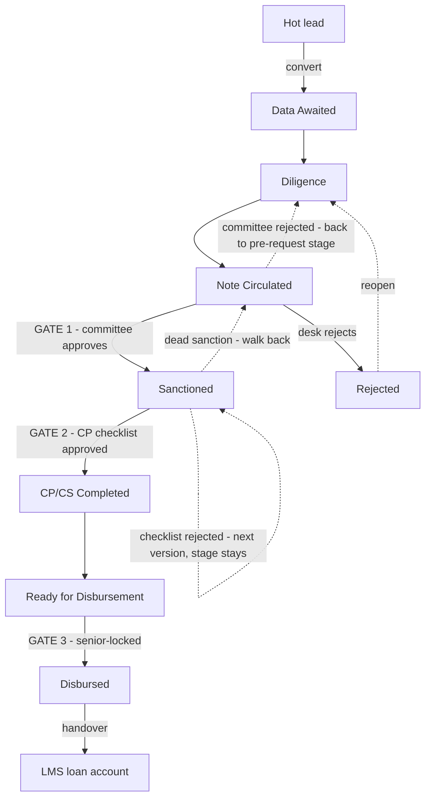

# The credit pipeline — gates, verdicts and conclusions

How a lending line travels from a hot lead to money moving, exactly as the platform
enforces it: three gates, what each verdict does, and the only ways a line — and the
deal above it — can conclude. Every rule here is the code's rule, not a convention:
the file that enforces each one is named beside it.

The short version:

* Three gates stand between a lead and a disbursement: the **credit committee**, the
  **CP checklist** (maker–checker), and **Disburse** itself.
* Every rejection is recoverable and permanently on record. Nothing concludes silently.
* Stages only move by committee decision or desk action — never as a side effect of a
  checklist verdict.
* Only two stages conclude a lending line: `Disbursed` and `Rejected`.

---

## The map

The dotted edges are the recovery paths. `On Hold` (not drawn) parks any working stage
and resumes to any pipeline stage — parking, never a conclusion.

The stage graph itself lives in one place and is enforced everywhere:
`packages/evam-backend-core/evam_backend_core/lifecycle.py` (`_CREDIT_PIPELINE`).
Two consequences worth reading directly off it:

* `Sanctioned` **cannot** move to `Rejected` directly — its legal moves are
  `CP/CS Completed`, back to `Note Circulated`, or `On Hold`.
* `Rejected` is not a tomb: `Rejected → Data Awaited / Diligence` reopens the same
  line with its history intact.

---

## Before the gates

A lead converts only when it is rated **Hot** and linked to a client — the register
refuses anything else, loudly ("Lead is unrated; only a HOT lead converts").
Conversion is one transaction (`POST /v1/leads/{id}/convert`): it creates the deal,
the client, and the product lines that were ticked. A new lending line opens at
`Data Awaited` — the entry allowlist (`INITIAL_STATUS`) refuses a line born mid-pipeline.

The desk then works the stage dropdown forward: `Diligence` when the file is being
worked, `Note Circulated` when the credit note (CAM) exists. From `Note Circulated`
onward, **the buttons do the moving** — a manual stage edit past a gate is refused with
the allowed moves named.

---

## Gate 1 — the credit committee (at Note Circulated)

The maker prepares the CAM in the workbench and hits **Send to credit committee**.
While the run is in flight the line's workflow buttons lock — the file is with the
committee. The decision arrives through the Today queue (Review → Approve / Reject,
note required to reject). Enforced in
`services/workflows/app/workflows.py` (`DealStructuringWorkflow`).

| | On approval | On rejection (note mandatory) |
| --- | --- | --- |
| Evidence | Committee reference **and** sanction letter reference filed as verified evidence on each approved line. Conditional approvals carry their conditions as evidence too. | `credit_committee_rejection` filed permanently, with the committee reference and the note. |
| Stage | Moves to `Sanctioned`. | Restored to the **pre-request stage** automatically — the workflow rolls each line back, so nobody hand-edits stages backwards. |
| Who hears | — | The RM gets an inbox notification with the decision note. |
| Next | The CP checklist opens. | **File a revised credit note** (a new version) → send to committee again. The loop repeats until approved, or the desk rejects the line itself. |

**The validity window.** If the committee set `valid_days`, a monitor starts: a
reminder fires 7 days before expiry, and a lapse files `sanction_expired` evidence
with a critical alert — but the monitor **never moves the stage**. What happens to a
lapsed sanction (re-table, extend, close) is a committee/RM call, made on the record
the monitor created (`SanctionExpiryMonitorWorkflow`).

---

## Gate 2 — the CP checklist (at Sanctioned)

**Enter sanction terms** seeds checklist v1 from the sanction letter. The maker
decides every CP — the checklist will not submit with a required CP still `Pending`:

| CP decision | What it requires | What it means |
| --- | --- | --- |
| `Completed` | An evidence reference | The condition is satisfied and the record shows what satisfied it. |
| `Waived` | A reason | The condition is set aside, on the record. |
| `Deferred as CS` | An expiry date | The CP becomes a post-disbursement obligation, chased on the CS half. |

The checker — **a different person**, on every verb (`services/register/app/api/cpcs.py`
refuses self-approval, self-rejection and self-return alike) — sees the submitted
checklist in the Today queue with two verbs. Two by design: the field decision was to
keep Approve / Reject-with-a-note and let the maker amend from the note; the softer
"return for revision" verb exists in the register's API but is deliberately not
surfaced (`WorkflowDecisionDialog.tsx`).

| | On approval | On rejection (note mandatory) |
| --- | --- | --- |
| The checklist | Frozen as the decision record. The Conditions Precedent button locks — re-opening a settled checklist is how a settled condition gets re-typed. | Terminal **for that version** — it can be neither approved nor re-rejected, and it leaves the checker's queue. The note stays forever. |
| The evidence | The approved checklist **is** the evidence: the move to `CP/CS Completed` and the disbursement itself must cite it (`evidence.py::_verify_cpcs_checklist`). | None minted. `CP/CS Completed` stays unreachable until some version is approved. |
| Stage | Unmoved — still `Sanctioned`. The stage never moves on a checklist verdict. | Unmoved — still `Sanctioned`. Nothing to roll back, because nothing advanced. |
| Next | The CS half opens: receipts save straight onto the approved checklist — no new version, no second approval round, even after disbursement. | The CP button re-opens on the **next version, prefilled with all prior work**. Fix what the checker objected to, resubmit. Versions accumulate on the record. |

**When the CPs are genuinely unsatisfiable** — rejected twice, the client cannot meet
the conditions — the line does not stay parked at `Sanctioned` forever. The desk
concludes it with the two-step walk-back (below).

---

## Gate 3 — Disburse (after the CP approval)

One verb for the desk. It requires the proposed drawdown amount and date, moves the
line to `Ready for Disbursement` **by citing the approved checklist** (the register's
evidence gate refuses the move without it — the gate is the evidence, not the label),
and sends the disbursement request with every CP *not* `Completed` (waived / deferred)
spelled out in its note, so the partner sees exactly what is outstanding
(`services/workflows/app/api.py::disburse`).

* The button is deliberately available from `Sanctioned`: a line whose CPs are
  approved but whose CS items are still being chased never reaches `CP/CS Completed`,
  and it must still disburse. The server-side evidence gate is what actually decides.
* Finalising for disbursement and the move to `Disbursed` are **senior-locked**:
  Admin, Management or Credit Head (`lifecycle.py::ROW_LOCKS`).
* On confirmation the line reaches `Disbursed` — the book's happy terminal. Later
  tranches (T2, T3, …) are recorded through the same dialog until the facility is
  fully drawn, at which point the button closes itself ("Fully disbursed").
* The CS chase keeps running on the approved checklist — Today keeps reminding —
  until the **loan account opens in the LMS**. At handover the checklist freezes as a
  decision record and receipts move to the account's own register.

---

## How a line concludes

| Outcome | When | How |
| --- | --- | --- |
| `Disbursed` | Money moved. | Gate 3, senior-approved. Terminal for the pipeline; servicing continues in the LMS. |
| `Rejected` (pre-sanction) | The proposal dies at `Data Awaited` / `Diligence` / `Note Circulated`. | One stage edit, reason in Remarks. |
| `Rejected` (post-sanction) | The sanction is dead: the client refuses it, the CPs are unsatisfiable after repeated rejections, the validity window lapsed. | The **two-step walk-back**: `Sanctioned → Note Circulated` (remark first), then `Note Circulated → Rejected`. A sanction is never "rejected" directly — rejection is a verdict on the *proposal*, so the file returns to the note stage and is rejected there, honestly. |
| `On Hold` | Stalled, outcome genuinely undecided. | Parking, not a terminal — resumes to any pipeline stage. |
| Reopened | The client comes back. | `Rejected → Data Awaited / Diligence`: same line, full history. |

### Closing the deal above the line

A deal closes only when its record owes no answers
(`services/register/app/api/closure.py`): every product line at a terminal
(`Disbursed` / `Rejected` for lending), no open EWS cases, no unresolved covenant
breaches — `GET /v1/deals/{id}/open-items` lists anything still blocking. Then the
close records the commercial verdict with a mandatory note:

| Verdict | Funnel stage | Meaning |
| --- | --- | --- |
| Won | `Closed Won` | The mandate was delivered. |
| Lost | `Closed Lost` | Evam wanted the deal and did not get it. |
| Dropped | `Dropped` | Evam walked away. |

The third verb is deliberate: without it, the only governed way to record a walk-away
would be to file it as a competitive loss — precisely the distortion the funnel
exists to avoid.

---

## The three rules that hold everywhere

1. **The stage never moves on a checklist verdict.** Committee decisions move stages;
   checklist decisions mint or refuse evidence. That is why a checklist rejection
   needs no rollback — nothing advanced.
2. **Every gate is four-eyed.** Maker and checker must be different people, and
   self-approval is refused server-side — on the committee decision, on every
   checklist verb, and on the disbursement handover.
3. **Every rejection is written down.** Mandatory notes, immutable evidence, versions
   that stay on the record. A revival is always a new version with its own cycle,
   never a resurrection.
