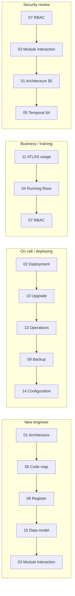

# The PRISM Handbook

Fifteen documents covering how PRISM is built, deployed, operated and used. Every claim
here was read out of the code it cites, and code excerpts are quoted rather than
paraphrased so they stay checkable.

---

## The documents

| # | Document | What it answers |
| --- | --- | --- |
| 01 | [Architecture](01-ARCHITECTURE.md) | What PRISM is, the three design commitments, the service catalogue, the request path, trust boundaries |
| 02 | [Deployment architecture](02-DEPLOYMENT-ARCHITECTURE.md) | Compose and Helm topologies, the edge, ports, volumes, the production posture, sizing |
| 03 | [Module interaction](03-MODULE-INTERACTION.md) | Who calls whom, how identity travels, timeout chains, what happens when a dependency is down |
| 04 | [Running flows](04-RUNNING-FLOWS.md) | Capture, conversion, stage change, import, reconciliation, intel, handover — traced end to end |
| 05 | [Temporal workflows](05-TEMPORAL-WORKFLOWS.md) | The fourteen workflows, why a signal is untrusted, retry tiers, SLA and escalation |
| 06 | [Code map](06-CODE-MAP.md) | Directory by directory, plus a "where do I change X?" index |
| 07 | [User management & RBAC](07-USER-MANAGEMENT-RBAC.md) | The authority model, twelve roles, two matrices, scoping, provisioning |
| 08 | [The Register](08-REGISTER.md) | The CRUD factory, concurrency, lifecycle enforcement, reconciliation, seeding |
| 09 | [Backup & restore](09-BACKUP-RESTORE.md) | What must survive, what is actually backed up, the restore drill, RPO/RTO |
| 10 | [Upgrade & rollback](10-UPGRADE-ROLLBACK.md) | `prism-deploy.sh` in full, schema-change asymmetry, the failure playbook |
| 11 | [ATLAS usage](11-ATLAS-USAGE.md) | The ten tabs as the desk meets them, what each role sees, common tasks |
| 12 | [VocX & STT](12-VOCX-STT.md) | The capture pipeline, timeout chain, recording cap, sizing, tuning |
| 13 | [Operations](13-OPERATIONS.md) | Health checks, logs, symptom → cause → fix, routine checks |
| 14 | [Configuration](14-CONFIGURATION.md) | Every variable, compose vs Helm, the production checklist |
| 15 | [Data model & ERD](15-DATA-MODEL.md) | Every table, the shared row spine, FK policy, RLS, migrations |
| — | [Publishing](PUBLISHING.md) | Building the PDF and mirroring the handbook into Confluence |

---

## Reading paths

| If you are… | Read, in order |
| --- | --- |
| **A new backend engineer** | 01 → 06 → 08 → 15 → 03 |
| **A new front-end engineer** | 11 → 06 → 07 → 04 |
| **Deploying for the first time** | 02 → 14 → 10 → 09 |
| **On call** | 13 → 10 → 02 |
| **Adding a business process** | 05 → 04 → 08 |
| **Training the desk** | 11 → 04 |
| **Doing a security review** | 07 → 03 → 01 §5 → 05 §4 |
| **Sizing the box** | 02 §7 → 12 §7 |

---

## The five things everyone should know

Whatever your role, these five come up constantly.

1. **The Register is the only service that owns data.** Everything else is stateless and
   goes through its API. ([01](01-ARCHITECTURE.md))
2. **Authorization is decided once at the gateway and carried in a signed token.** Nothing
   downstream trusts a plaintext identity header. ([03](03-MODULE-INTERACTION.md))
3. **A Temporal signal is not authority.** The durable decision record in the Register is.
   ([05](05-TEMPORAL-WORKFLOWS.md))
4. **nginx caches upstream IPs.** Recreate a container by hand and you must reload the edge,
   or every page 502s while everything reports healthy. ([13](13-OPERATIONS.md))
5. **Three paths never enter git or a delivery archive:** `deploy/compose/.env`,
   `deploy/vocx-secrets/`, `deploy/nginx/certs/`. ([09](09-BACKUP-RESTORE.md))

---

## Known gaps, stated plainly

These are real and worth knowing before you rely on something that is not there.

| Gap | Where it is discussed |
| --- | --- |
| **MinIO objects and the VocX audio archive have no scheduled backup.** The database does. | [09](09-BACKUP-RESTORE.md) §1, §7 |
| **RPO is up to 24 hours**, and backups sit on the same host. | [09](09-BACKUP-RESTORE.md) §8 |
| **The ATLAS UI has no automated test suite and no working eslint config.** Verification is `tsc --noEmit` plus browser checks. | [06](06-CODE-MAP.md) §10 |
| **`POST /v1/{subject}/{id}/interactions` is not idempotency-keyed** — a retried write can duplicate a timeline row. | [03](03-MODULE-INTERACTION.md) §7, [08](08-REGISTER.md) §7 |
| **A VocX-created lead is assigned to the capturer**, not the company's BD owner. | [04](04-RUNNING-FLOWS.md) §1 |
| **Dev ports (5432, 8000–8002, 9000/9001) are published by the same compose file used in production.** Bind them to loopback or close them at the security group. | [02](02-DEPLOYMENT-ARCHITECTURE.md) §1 |
| **LMS servicing is deferred** (`LMS_ENABLED=false`). The book ends at `Disbursed`. | [14](14-CONFIGURATION.md) §2 |

---

## Related documents outside the handbook

The handbook explains the system. These go deeper on specific subjects.

| Document | Subject |
| --- | --- |
| [`docs/FOUNDATION_SPEC.md`](../FOUNDATION_SPEC.md) | The product specification |
| [`docs/SCHEMA.md`](../SCHEMA.md) | Column-level schema detail |
| [`docs/ARCHITECTURE.md`](../ARCHITECTURE.md) | The earlier architecture note |
| [`docs/adr/`](../adr/) | Architecture decision records (register-first, entity-centric, optimistic concurrency, monorepo, self-hosted Postgres, transient retry) |
| [`docs/STAGES_AND_APPROVALS.md`](../STAGES_AND_APPROVALS.md) | Stage and approval rules |
| [`docs/LENDING_WORKFLOW_DESIGN.md`](../LENDING_WORKFLOW_DESIGN.md) | The lending workflow in depth |
| [`docs/MIS_IMPORT.md`](../MIS_IMPORT.md) | The spreadsheet import contract, sheet by sheet |
| [`docs/VOCX_API.md`](../VOCX_API.md) | The VocX API surface |
| [`docs/USER_PROVISIONING.md`](../USER_PROVISIONING.md) · [`docs/GOOGLE_SSO.md`](../GOOGLE_SSO.md) | Provisioning and SSO setup |
| [`docs/DEPLOYMENT.md`](../DEPLOYMENT.md) · [`docs/PRODUCTION_DEPLOYMENT.md`](../PRODUCTION_DEPLOYMENT.md) · [`docs/DEPLOY_RUNBOOK.md`](../DEPLOY_RUNBOOK.md) | Deployment guides |
| [`docs/E2E_RUNBOOK.md`](../E2E_RUNBOOK.md) · [`docs/E2E_MASTER_FLOW.md`](../E2E_MASTER_FLOW.md) · [`docs/UI_E2E_FLOW.md`](../UI_E2E_FLOW.md) | End-to-end test journeys |
| [`docs/ATLAS_TAB_DB_API_MAP.md`](../ATLAS_TAB_DB_API_MAP.md) · [`docs/ATLAS_UI_FIELD_MAP.md`](../ATLAS_UI_FIELD_MAP.md) | Tab → table → endpoint, and field-level maps |
| [`docs/openapi/`](../openapi/) | Exported OpenAPI specs |
| [`postman/`](../../postman/) | API collections and environments |
| [`BACKEND_STANDARDS.md`](../../BACKEND_STANDARDS.md) · [`CONTRIBUTING.md`](../../CONTRIBUTING.md) | Coding conventions |

---

## Keeping this accurate

A handbook that drifts is worse than none, because people trust it. Two habits:

- **When you change something a document describes, update the document in the same commit.**
  Each document names the files it draws from; the "where do I change X?" table in
  [06](06-CODE-MAP.md) is the fastest way to find the affected page.
- **Quote code rather than paraphrasing it.** A quoted excerpt that has drifted is visibly
  wrong; a paraphrase just quietly becomes false.

Diagrams are Mermaid, so they render on GitHub and diff as text.
